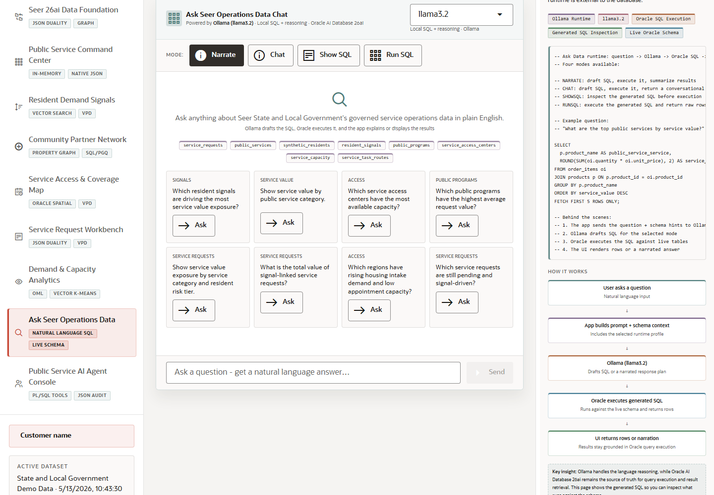

# Scene 9 Ask Seer Operations Data

## Introduction

This scene lets the user ask natural-language questions over the live Oracle schema. It shows generated SQL or a narrated response plan, then grounds answers in Oracle query execution.

Estimated Time: 10 minutes

### Objectives

In this lab, you will:
- Ask a natural-language operations question.
- Inspect generated SQL when available.
- Compare narrated answers with returned rows.
- Explain how the query remains grounded in the live schema.

## Task 1: Ask an operations question

1. Open **Ask Seer Operations Data**.
2. Select a runtime profile or keep the default profile.
3. Enter a question such as `Which public services have the highest urgent demand?` or `Show service value by public service category`.
4. Click **Ask** or **Send**.

Expected result:
- The app sends the question to the Select AI or Ollama-backed query workflow.
- The response includes either generated SQL, returned rows, or a narrated answer grounded in Oracle data.

## Task 2: Inspect the SQL evidence

1. If generated SQL is visible, review the tables and filters.
2. Compare the response with the row results or summary table.
3. Click **Clear** and ask a second question about capacity, demand, or resident signals.

Expected result:
- The user can explain how plain-language questions become governed database queries.
- The scene demonstrates natural-language access without bypassing Oracle as the source of truth.

## Task 3: Why this matters?

Operations leaders often need answers before a report exists. Natural-language SQL gives them a faster path while preserving transparency: the generated query, result rows, and live schema context remain visible to the demo user.

## Credits & Build Notes
- **Author** - Oracle LiveStack Team
- **Last Updated By/Date** - Oracle LiveStack Team, 2026-05-13
- **Screenshot** - Captured from `http://158.178.146.34:8505/?page=askdata`.
