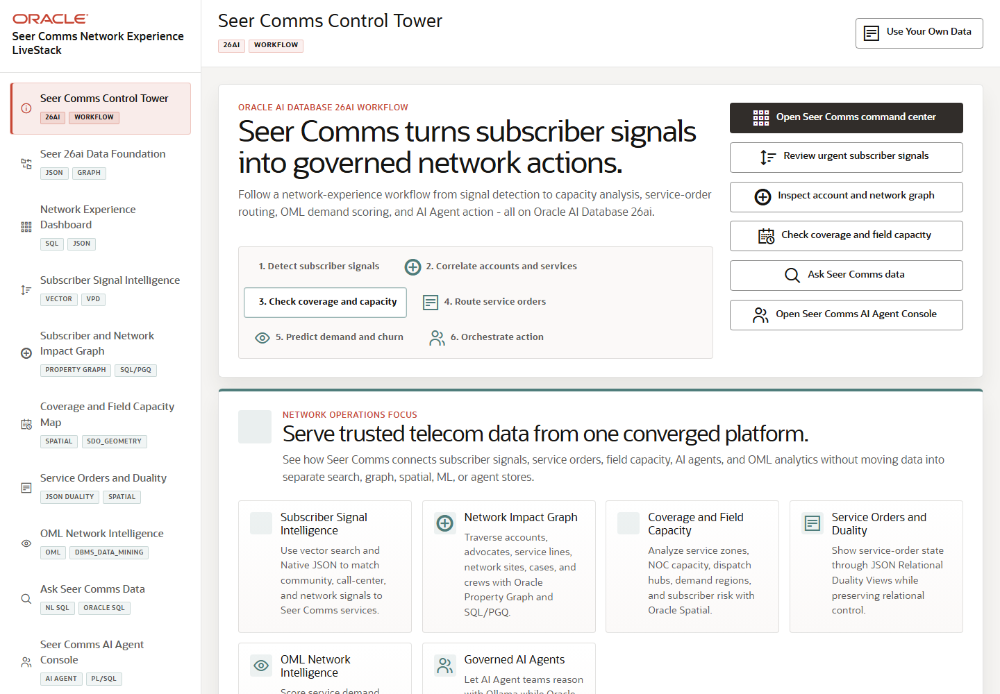

# Scene 1: Seer Comms Control Tower

## Introduction

This opening scene frames the telecom operations story. Seer Comms is tracking subscriber signals, network capacity, service orders, OML scoring, and AI Agent action from one Oracle-backed application.

Estimated Time: 8 minutes

### Objectives

In this lab, you will:
- Open the control tower scene.
- Review the workflow stages and quick actions.
- Use the control tower to choose the next operational workflow.

## Task 1: Open the control tower

1. Open the application at `http://localhost:8505`.
2. Click **Seer Comms Control Tower** in the sidebar if another page is active.
3. Review the workflow stages: detect subscriber signals, correlate accounts and services, check coverage and capacity, route service orders, predict demand and churn, and orchestrate action.

Expected result:
- The landing scene explains the network-experience workflow.
- The quick-action buttons show the main demo paths for dashboard, signals, graph, coverage, Ask Data, and AI Agents.

## Task 2: Start a guided path

1. Click **Open Seer Comms command center**.
2. Confirm that the sidebar moves to **Network Experience Dashboard**.
3. Return to **Seer Comms Control Tower** and click **Review urgent subscriber signals**.

Expected result:
- Each quick action opens a matching application scene.
- The control tower works as the demo launch point rather than a static introduction page.

## Task 3: Why this matters?

The control tower gives business audiences the operating model before the technical proof begins. It shows that the LiveStack is not a set of isolated Oracle features; it is a single telecom response workflow that starts with subscriber experience pressure and ends in governed network action.

## Credits & Build Notes
- **Author** - LiveLabs Team
- **Last Updated By/Date** - LiveLabs Team, 2026-05-13
