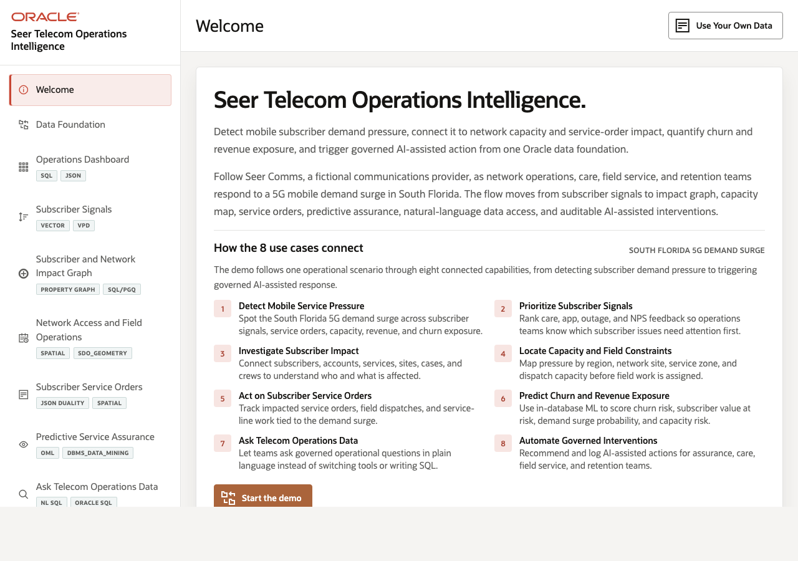
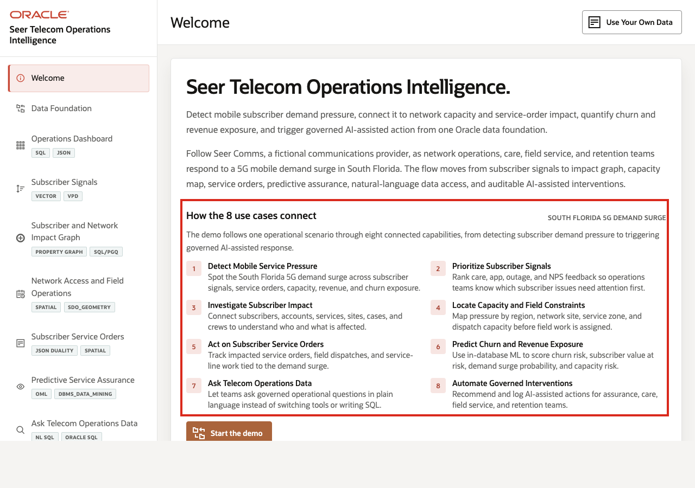

# Scene 1 Welcome and Demo Orientation

## Introduction

This opening scene orients users to the Seer Comms Telecom Operations Intelligence LiveStack Demo. The welcome page summarizes the eight active use cases in the top panel and connects each one to the South Florida 5G demand-surge scenario, then uses a carousel to preview the same use cases in more detail.

Estimated Time: 5 minutes

### Objectives

In this scene, you will:
- Review how the top panel connects the eight use cases to the South Florida 5G demand-surge story.
- Review the use case carousel on the welcome page.
- Learn which eight telecom use cases are available to explore in the LiveStack Demo.
- Use the carousel controls to move through the use case tiles.
- Click **Start the demo** to continue to the next page.

## Task 1: Review the South Florida 5G demand-surge story

1. Review **How the 8 use cases connect** in the top panel. It connects each page to the same operational journey: demand pressure appears, subscriber signals explain urgency, graph and spatial views show impact, service orders and field work respond, predictive assurance scores risk, and AI-assisted teams act.
2. Read the eight numbered use case summaries. The point is to make the demo easy to tell as one connected telecom service-assurance story rather than eight disconnected pages.
3. Read the three visible use case tiles in **Core Mobile Service Assurance Use Cases**.
4. Click the right carousel arrow to move forward.
5. Continue until you have reviewed all eight use cases.
6. Use the left carousel arrow if you want to return to earlier tiles.

## Task 2: Continue the demo

1. Click **Start the demo**.
2. Confirm the demo moves to **Data Foundation**.

## Credits & Build Notes
- **Author** - Oracle LiveLabs Team
- **Last Updated By/Date** - Oracle LiveLabs Team, 2026-05-28
