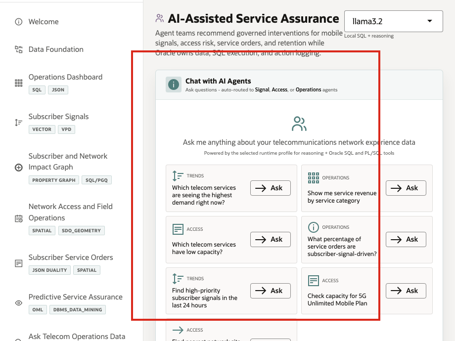
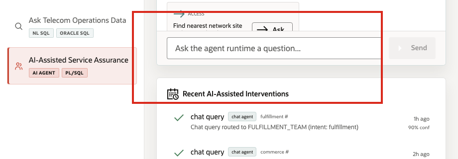

# Scene 10 AI-Assisted Service Assurance

## Introduction

A service assurance leader, care operations manager, field operations coordinator, or AI platform owner uses this page to see how agentic assistance can support day-to-day telecom decisions. This persona is not only interested in whether an AI agent can answer a question. They need to know which team handled the request, which tools were called, what data was used, and whether the action was recorded for later review.

This is difficult to implement when AI agents operate as black boxes outside the operational data platform. Telecom teams may get a recommendation, but not the routing decision, SQL or PL/SQL tool path, confidence, or audit record behind it. That makes it hard to trust agent output in service assurance, network access, care, field operations, or retention workflows.

Oracle AI Database helps address these challenges by keeping the source data, SQL execution, PL/SQL tools, and durable action logging in the database. In this LiveStack Demo, the app orchestrates the agent workflow, Ollama provides reasoning, and Oracle AI Database 26ai executes the governed data operations. Agent actions are written back to `agent_actions`, while the UI shows the response, tool badges, and recent audit trail.

Estimated Time: 10 minutes

### Objectives

In this scene, you will:
- Review the **AI-Assisted Service Assurance** workspace and runtime profile.
- Select a concrete telecom service-assurance agent question.
- Inspect the agent response and SQL/PLSQL tool badges.
- Review the **Recent AI-Assisted Interventions** audit trail.
- Understand why observable agent behavior matters for enterprise telecom workflows.

## Task 1: Review the agent console workspace

1. Click **AI-Assisted Service Assurance** in the sidebar.
2. Review the runtime profile selector in the top right. The current demo uses **llama3.2** through an Ollama-backed runtime profile.
3. Review the example questions in the chat panel.
4. Review **Recent AI-Assisted Interventions** below the chat panel.
5. Focus on a capacity example such as **Check capacity for 5G Unlimited Mobile Plan** or **Which telecom services have low capacity?**

Use this opening view to explain the role of the page. The user is not looking at a generic chatbot. They are looking at an operational agent surface where telecom questions are routed to specialist teams such as signal analysis, network access, or subscriber operations.

## Task 2: Run a network access capacity question

1. Click **Ask** on **Which telecom services have low capacity?** or enter **Check capacity for Fixed Wireless Home Internet**.
2. Review the agent response at the top of the chat output.
3. Review the capacity or site list returned by the agent.
4. Review the tool badges below the response.

In the current demo dataset, the capacity question for **Fixed Wireless Home Internet** routes to the **Network Access Agent** path and returns capacity across **11** centers with **1,911** total units. The response identifies lower-capacity sites such as **Chicago Midwest NOC**, **Miami Connected Life Hub**, **Boston Family Plan Support Center**, and **Seattle Customer Experience Center**.

This is the data point to emphasize during the demo. The agent did more than answer a text question. It routed the request to the network access path, called Oracle-backed tools, inspected service capacity, and returned operational context for the service under demand pressure.

## Task 3: Interpret the operational story

Use the capacity result to explain the decision:

1. The service request narrows the search to a telecom service.
2. Oracle data identifies network sites with available capacity.
3. The agent summarizes center-level capacity and reserved quantities.
4. The business user can compare whether capacity is deep enough to support the demand story from earlier scenes.
5. The audit trail records that the question was handled by the appropriate agent path.

The important story is operational visibility. A network access manager can see whether capacity exists across the network, whether reserved quantities are starting to matter, and whether the South Florida demand-surge story should trigger field dispatch, capacity relief, or customer outreach.

## Task 4: Review the agent action audit trail

1. Scroll to **Recent AI-Assisted Interventions**.
2. Review the top action row.
3. Confirm that the row shows a completed chat query routed to a specialist agent path.
4. Review the confidence value.

In the current demo dataset, the completed chat action is logged with **90%** confidence. This is the governance point of the scene: agent decisions should be observable after the conversation. The page shows that agent interactions are not just transient chat messages. They are written into the action history so an operator, architect, or auditor can understand what happened.

The value of Oracle AI Database is that the agent workflow stays connected to governed operational data. The AI runtime can reason and orchestrate, while Oracle remains responsible for data access, SQL and PL/SQL execution, spatial calculations, and durable audit records.

You have completed the LiveStack Demo.

## Credits & Build Notes
- **Author** - Oracle LiveLabs Team
- **Last Updated By/Date** - Oracle LiveLabs Team, 2026-05-28
