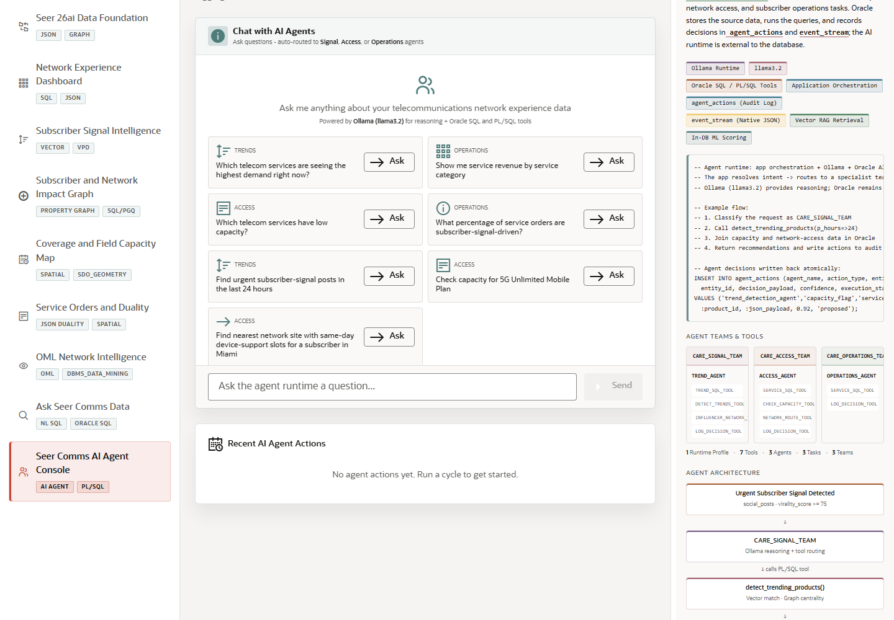

# Scene 10: Seer Comms AI Agent Console

## Introduction

The final application scene shows governed AI Agent orchestration for subscriber operations. It exposes care teams, runtime profile context, example questions, tool routing, PL/SQL actions, JSON events, and durable action logs.

Estimated Time: 12 minutes

### Objectives

In this lab, you will:
- Open the AI Agent console.
- Review the agent teams.
- Ask a question or run an example prompt.
- Inspect the audit and orchestration evidence.

## Task 1: Review agent teams

1. Click **Seer Comms AI Agent Console** in the sidebar.
2. Review the visible teams: signal analysis, network access, and subscriber operations.
3. Inspect the Oracle panel badges for Ollama runtime, Oracle SQL and PL/SQL tools, application orchestration, audit log, event stream, vector retrieval, and in-database ML.

Expected result:
- The scene shows that agent reasoning is connected to governed database tools and audit records.

## Task 2: Ask an agent question

1. Click an example question or type a question such as `Which subscriber signals require action today?`.
2. Click **Ask** or **Send**.
3. Review the response and any visible action history.

Expected result:
- The AI Agent console returns a response grounded in Seer Comms operational context.
- If the full runtime is active, the scene can log actions and events through the backend APIs.

## Task 3: Trace the action flow

1. Review the diagram that starts with an urgent subscriber signal.
2. Follow the flow through signal, access, and operations teams.
3. Inspect how the flow ends in `agent_actions` and `event_stream`.

Expected result:
- The user can explain how agent decisions become governed actions, not untracked chat output.

## Task 4: Why this matters?

AI Agents are most credible when their recommendations are auditable and connected to enterprise controls. This scene closes the demo by showing how Seer Comms can combine LLM reasoning with Oracle SQL, PL/SQL tools, JSON events, vector retrieval, ML scoring, and durable audit history.

## Credits & Build Notes
- **Author** - LiveLabs Team
- **Last Updated By/Date** - LiveLabs Team, 2026-05-13
