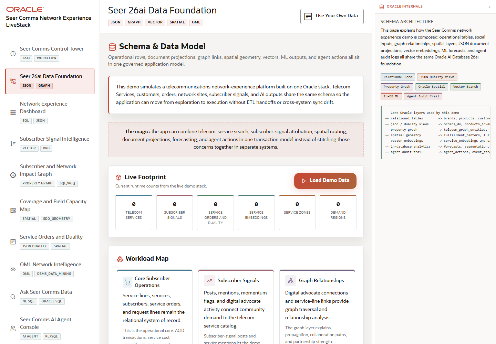

# Scene 2: Seer 26ai Data Foundation

## Introduction

This scene shows the data model that supports the demo: subscriber signals, telecom services, service orders, spatial capacity, vector embeddings, ML views, and agent audit tables all live in the Oracle AI Database foundation.

Estimated Time: 10 minutes

### Objectives

In this lab, you will:
- Open the data foundation scene.
- Inspect the converged data domains and status cards.
- Use the scene links to jump into downstream workflows.

## Task 1: Review the foundation

1. Click **Seer 26ai Data Foundation** in the sidebar.
2. Review the Oracle capability badges for relational, JSON duality views, property graph, spatial, vector search, in-database ML, and agent audit trail.
3. Inspect the data-domain flow that connects subscriber signals, telecom services, service orders, spatial/vector/ML assets, and agent history.

Expected result:
- The scene presents Oracle AI Database as the common system of record for the demo.
- The visible foundation explains why the later scenes can work without separate specialty stores.

## Task 2: Use the workflow jump buttons

1. Click **Open dashboard**.
2. Return to the data foundation scene.
3. Click **Inspect service orders** or **Open OML analytics**.

Expected result:
- The data foundation scene acts as a map of the LiveStack.
- Each button opens the matching operational scene while preserving the same application shell and customer context.

## Task 3: Why this matters?

Telecom teams often struggle when customer care, network operations, ML scoring, and field service each use separate data copies. This scene makes the architectural point visible: Seer Comms can run the full workflow from one governed Oracle data foundation.

## Credits & Build Notes
- **Author** - LiveLabs Team
- **Last Updated By/Date** - LiveLabs Team, 2026-05-13
