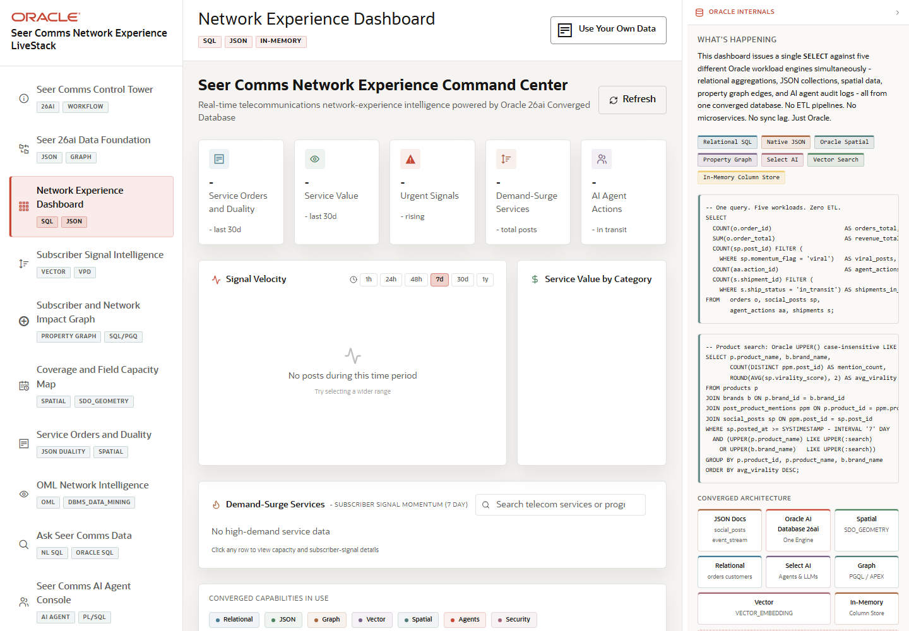

# Scene 3: Network Experience Dashboard

## Introduction

The dashboard is the command center for Seer Comms. It summarizes service orders, service value, urgent subscriber signals, demand-surge services, and AI Agent actions, then lets the operator search telecom services and inspect Oracle-backed evidence.

Estimated Time: 10 minutes

### Objectives

In this lab, you will:
- Open the dashboard.
- Review KPI cards and trend controls.
- Search telecom services or programs.
- Use the Oracle evidence panel to explain the technical backing.

## Task 1: Inspect executive KPIs

1. Click **Network Experience Dashboard** in the sidebar.
2. Review the KPI cards for service orders, service value, urgent signals, demand-surge services, and AI Agent actions.
3. Click a time-window control such as **24h**, **7d**, or **30d** in the demand signal area.

Expected result:
- The dashboard frames the current operational state for Seer Comms.
- The time-window control changes the analysis lens for signal and demand context.

## Task 2: Search the service catalog

1. Find the search box labeled for telecom services or programs.
2. Search for a service term such as `fiber`, `5G`, or `home internet`.
3. Review the matching service cards or table results.

Expected result:
- The dashboard narrows the visible services to the search term.
- The operator can connect subscriber demand to specific services and programs.

## Task 3: Inspect Oracle evidence

1. Open or review the right-side Oracle information panel.
2. Inspect the badges for SQL, native JSON, spatial, graph, vector search, Select AI, and In-Memory.
3. Compare those badges with the dashboard panels on screen.

Expected result:
- The demo user can explain the dashboard as a converged Oracle application, not just a visualization layer.

## Task 4: Why this matters?

The dashboard gives leaders a concise operating picture while preserving traceability to database-backed evidence. It is the bridge between business pressure and the deeper scenes that explain why those signals matter.

## Credits & Build Notes
- **Author** - LiveLabs Team
- **Last Updated By/Date** - LiveLabs Team, 2026-05-13
