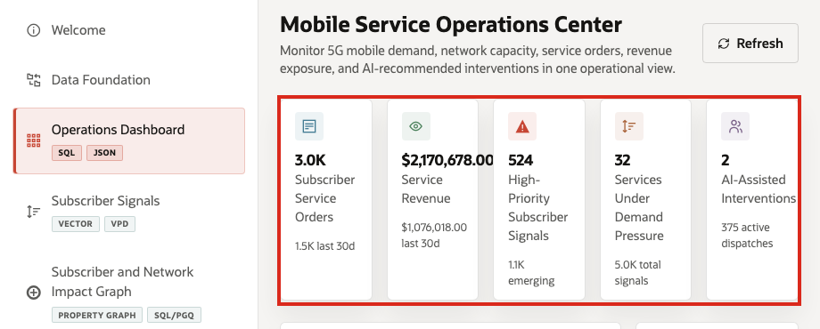
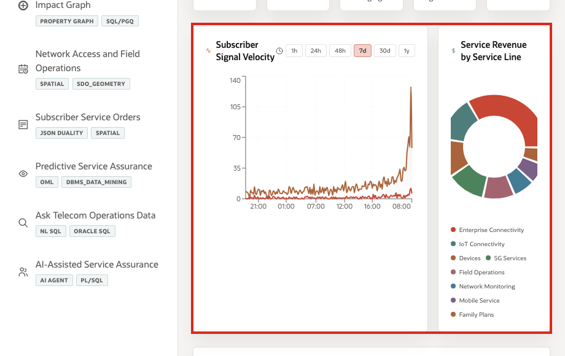
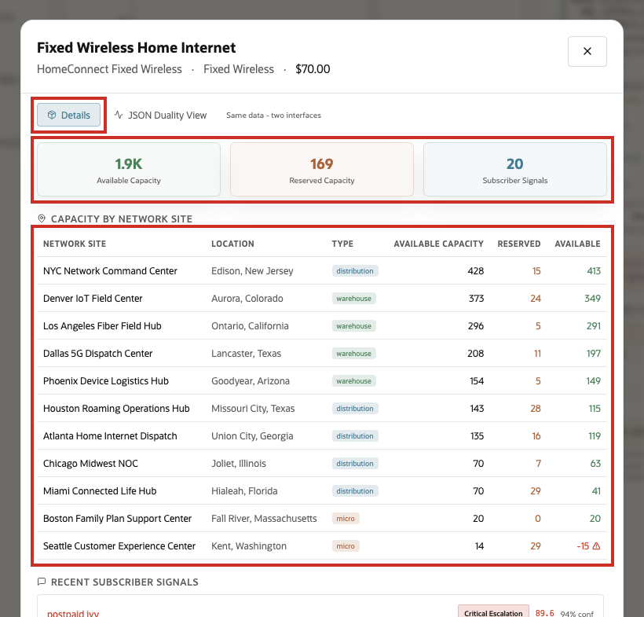
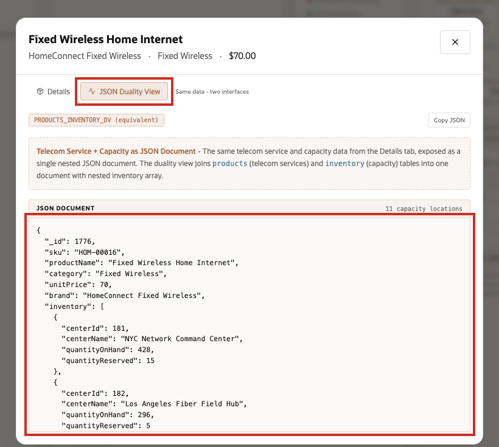

# Scene 3 Network Experience Operations Center

## Introduction

A network operations leader, service assurance manager, care operations lead, or retention analyst uses this page to understand the operating picture during a mobile demand surge. This persona is watching service orders, subscriber value at risk, high-priority signals, demand-pressure services, field dispatches, and AI-assisted interventions at the same time. The goal is to spot where subscriber demand, network capacity, and service-order impact are starting to move before they become separate escalations.

Dashboards like this are difficult to implement when telecom data is split across OSS, BSS, NOC tools, care systems, outage portals, field dispatch systems, and analytics pipelines. Teams often need copied data, ETL jobs, separate search indexes, and reconciliation logic before a dashboard can show a trustworthy view.

Oracle AI Database helps address that challenge by keeping operational, analytical, JSON, in-memory, and AI-ready data close to the same governed data foundation. In this scene, the dashboard brings together live telecom KPIs, subscriber signal velocity, service revenue, and service-level demand pressure without sending the user to a different application. The **Fixed Wireless Home Internet** row gives the seller a clear opening example: service pressure is visible at the operations-center level and then traceable down to signals, service orders, capacity, and predictive risk.

Estimated Time: 10 minutes

### Objectives

In this scene, you will:
- Review the **Network Experience Operations Center** as a network, care, or service assurance user.
- Interpret the KPI cards, subscriber signal velocity chart, service revenue chart, and service demand pressure table.
- Click a service row to inspect capacity and subscriber-signal details.
- Compare the operational detail view with the **JSON Duality View** to see how the same data can serve multiple application needs.

## Task 1: Review the operations-center dashboard

1. Click **Operations Dashboard** in the sidebar.
2. Review the KPI cards across the top of the page. These summarize the current operating picture: subscriber service orders, service revenue, high-priority subscriber signals, services under demand pressure, active dispatches, and AI-assisted interventions.
3. Review **Subscriber Signal Velocity**. This chart measures the rate and intensity of subscriber activity across care, app, outage, and NPS-style signal sources.
4. Review **Service Revenue by Service Line** to see which service categories are contributing most to revenue.

Use the dashboard as a triage view. In the current demo dataset, the opening KPI row is backed by **3,000** service orders, about **$2.17M** in service revenue, **524** high-priority subscriber signals, **32** services under demand pressure, **375** active dispatches, and the current AI-assisted intervention count.

## Task 2: Review service demand pressure

1. Scroll to **Service Demand Pressure**.
2. Review the service rows. The table ranks telecom services by signal count, affected subscriber reach, urgency score, and risk level.
3. Use the search field or service-line chips if you want to narrow the table.
4. Focus on **Fixed Wireless Home Internet**.

In the current demo dataset, **Fixed Wireless Home Internet** appears as a leading service-pressure item with **57** signal mentions, more than **45M** affected subscriber reach, an urgency score of **77**, and **High** risk. That row gives the seller a concrete way to connect the home-page South Florida demand-surge story to live operating data.

## Task 3: Inspect the service detail modal

1. Click **Fixed Wireless Home Internet**.
2. Review the default details view.
3. Inspect capacity, service-line context, subscriber signals, and operational evidence.

This view is useful for network operations and care because it moves from dashboard-level pressure to service-level evidence. The user can see which service is under pressure, which signals are driving it, and which operational data should be checked before acting.

## Task 4: Review the JSON Duality View

1. In the service modal, click **JSON Duality View**.
2. Review the JSON document generated for the same service and operational data.

The point of this view is to show that the same data can support different application needs. The **Details** tab presents the data as an operational user interface for business users. The **JSON Duality View** presents the same service and capacity information as a nested JSON document that is useful for APIs and application developers. Oracle JSON Relational Duality lets the application expose document-style access without copying the data into a separate document store.

You can move to the next scene.

## Credits & Build Notes
- **Author** - Oracle LiveLabs Team
- **Last Updated By/Date** - Oracle LiveLabs Team, 2026-05-28
