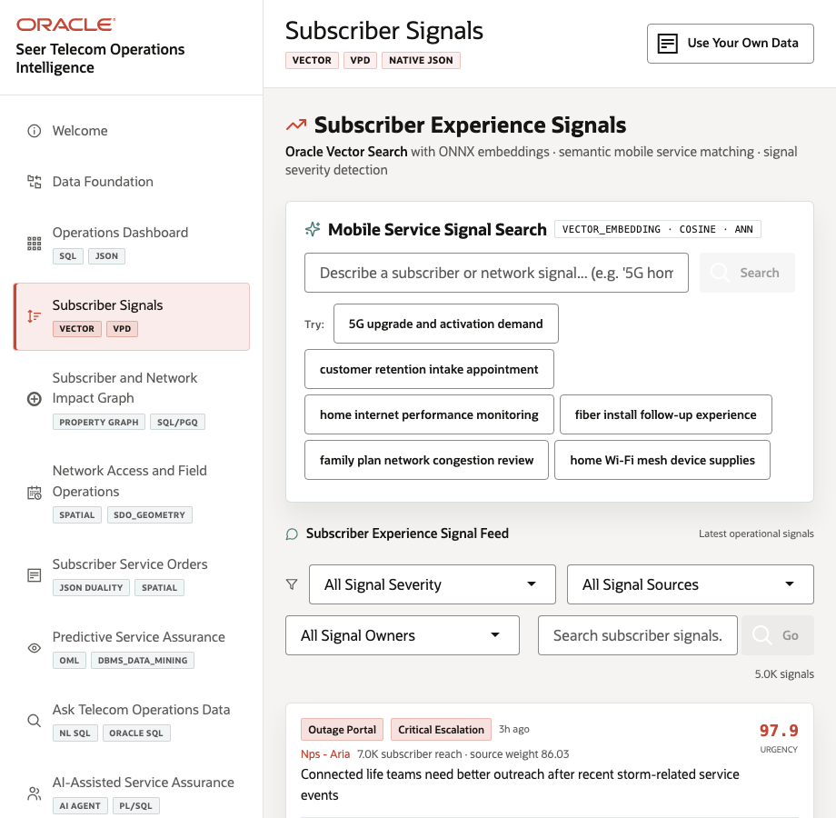
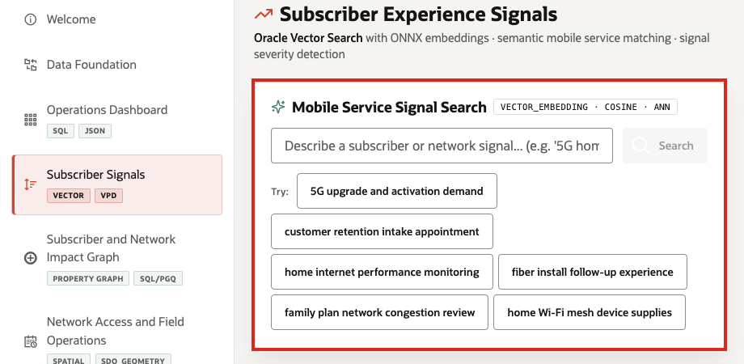
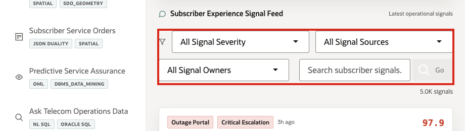

# Scene 4 Subscriber Experience Signal Feed

## Introduction

**Subscriber Experience Signal Feed** helps care and network teams understand what subscribers are reporting before the issue is fully visible in traditional network KPIs. The page connects care chats, app feedback, outage reports, call-center notes, NPS comments, community posts, and field observations to services, regions, and emerging demand pressure quickly enough to act.

Secure semantic search is difficult to implement when service data, subscriber conversations, embeddings, search indexes, and security policies live in separate systems. Telecom teams often have to move sensitive text into external AI services, synchronize vector indexes, duplicate service catalogs, and then rebuild access control outside the database.

Oracle AI Database helps address these challenges by keeping vector search, SQL, row-level security, and operational telecom data together. The system compares subscriber and service text by meaning, with embeddings being the representation that makes this possible.

In this scene, Oracle AI Database can create embeddings inside the database, so sensitive subscriber-signal data does not need to be sent to external AI services or exposed through another processing layer. Oracle Vector Search can embed a business query, compare it against service or signal embeddings, and return ranked matches while Oracle security policies continue to govern which data the user can see.

Estimated Time: 10 **minutes**

### Objectives

In this scene, you will learn what telecom decision the page supports, what evidence the user should inspect, and what action the team may take next.

## Task 1: Review the Subscriber Signals page

Review the **Subscriber Signals** page to see how subscriber language from care, app, outage, and community sources becomes an operational signal feed.

1. Click **Subscriber Signals** in the sidebar.
2. Review **Mobile Service Signal Search** at the top of the page. This section searches the telecom service catalog by meaning, not only by exact keywords.
3. Review **Subscriber Experience Signal Feed** below it. This section searches and filters subscriber signals across operational signal sources such as mobile app feedback, care chat, call-center notes, outage portal, and community forum.
4. Review the filters for **All Signal Severity**, **All Signal Sources**, and **All Signal Owners**.

## Task 2: Search telecom service intent

Search telecom service intent to show how teams can find related services by meaning, not only by exact service names or keywords.

1. In **Mobile Service Signal Search**, click one of the demo query buttons or enter a query such as **5G coverage and fixed wireless capacity pressure**.
2. Review the returned service matches.
3. Compare the service name, service line, category, and similarity score.

The demo query is embedded at runtime and compared against service embeddings stored in Oracle AI Database. This helps care and network teams search by subscriber intent instead of relying only on exact service names.

## Task 3: Review high-priority subscriber signals

Review high-priority subscriber signals to identify the subscriber pain, affected reach, urgency, and escalation activity that may require care, network, or field follow-up.

1. In the feed filters, select **Critical Escalation** or **High Priority**.
2. Review the visible signal cards.
3. Focus on a high-priority signal such as **Connected life teams need better outreach after recent storm-related service events**.

In this example, the guide mentions values such as **5,000 subscriber signals**, a signal urgency of *97.9*, and **3M** affected reach.

**Note:** These are sample values from the current demo dataset and may change after a refresh, seed update, or custom dataset import. Treat these numbers as an example of the current operating pattern. Verify the live values in the UI before presenting, then explain the business takeaway: what demand, subscriber impact, capacity, revenue, dispatch, or risk pattern the values reveal.

**Important:** This page is not a social-media wall. It is an operational signal feed that helps service assurance teams detect urgent subscriber pain before it becomes churn.

## Task 4: Explain the governance pattern

Explain the governance pattern as meaningful search with control: subscriber signals stay in Oracle, embeddings support semantic matching, access policies scope what users can see, and business teams can triage without copying sensitive signal text into a separate vector-only system.

1. Subscriber signal text is stored in Oracle AI Database.
2. Embeddings are generated and stored with governed operational data.
3. Semantic search finds similar services and signals by meaning.
4. VPD-aware access keeps data scoped to the active demo user.
5. Business users can triage subscriber experience without copying the signal corpus into a separate vector-only system.

Access controls help ensure users see only the telecom data they are allowed to see, which matters for subscribers, service orders, network regions, enterprise accounts, and AI governance.

You can move to the next scene.

## Credits & Build Notes
- **Author** - Oracle LiveLabs Team
- **Last Updated By/Date** - Oracle LiveLabs Team, 2026-05-28
