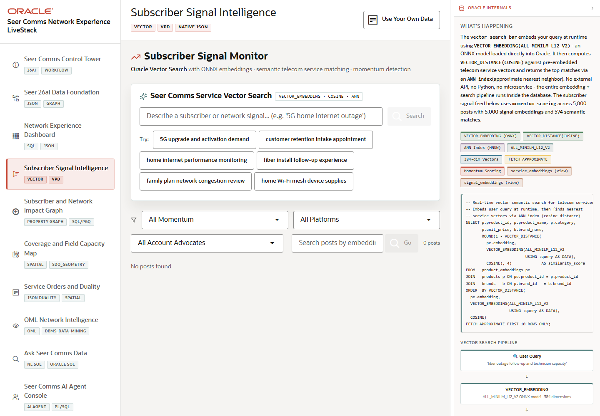

# Scene 4: Subscriber Signal Intelligence

## Introduction

This scene uses subscriber posts, momentum filters, and vector search to connect unstructured experience signals to telecom services. It demonstrates how Seer Comms can move from noisy feedback to ranked service relevance.

Estimated Time: 10 minutes

### Objectives

In this lab, you will:
- Open the subscriber signal scene.
- Filter urgent and rising signal posts.
- Run a service vector search.
- Explain how vector embeddings support signal-to-service matching.

## Task 1: Filter subscriber signals

1. Click **Subscriber Signal Intelligence** in the sidebar.
2. Select a momentum filter such as **Urgent**, **Rising**, or **Mega Momentum**.
3. Optionally choose a platform or account advocate filter.
4. Review the post list and signal labels.

Expected result:
- The visible feed narrows to the selected signal context.
- The operator can identify which experience topics need attention first.

## Task 2: Run service vector search

1. In **Seer Comms Service Vector Search**, enter a natural-language signal such as `5G home internet outage` or `fiber outage follow-up and technician capacity`.
2. Click **Search**.
3. Review the ranked services and similarity scores.

Expected result:
- The app returns semantically relevant telecom services, not only exact keyword matches.
- The scene shows how `VECTOR_EMBEDDING`, `VECTOR_DISTANCE(COSINE)`, and approximate nearest-neighbor search support the operator workflow.

## Task 3: Compare search results to feed context

1. Compare the ranked services with the current signal feed.
2. Click **Clear** and run a second search using a different subscriber issue.
3. Review how the ranked service list changes.

Expected result:
- The operator can move from unstructured signal language to service candidates that can be investigated or acted on.

## Task 4: Why this matters?

Customer-care teams cannot manually read every subscriber post, ticket, and network complaint. Vector search gives Seer Comms a governed way to turn language into service relevance while keeping the data and scoring path inside Oracle.

## Credits & Build Notes
- **Author** - LiveLabs Team
- **Last Updated By/Date** - LiveLabs Team, 2026-05-13
