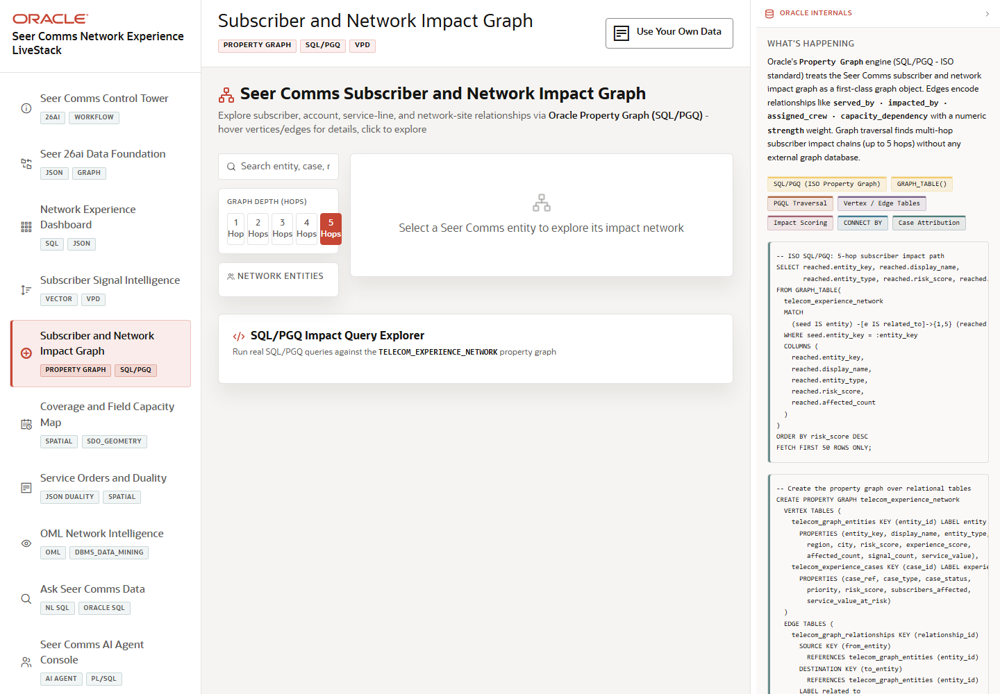

# Scene 5: Subscriber and Network Impact Graph

## Introduction

This scene shows account, advocate, service, case, region, and network-site relationships as an interactive impact graph. It helps Seer Comms explain which subscribers and services are connected to a network issue.

Estimated Time: 10 minutes

### Objectives

In this lab, you will:
- Open the impact graph.
- Search or select an entity.
- Explore one-hop and multi-hop relationships.
- Review the SQL/PGQ and VPD explanation in the Oracle panel.

## Task 1: Select an impact entity

1. Click **Subscriber and Network Impact Graph** in the sidebar.
2. Search for an entity, case, or region using the search box.
3. Select one of the visible network entities.

Expected result:
- The graph centers on the selected entity.
- The detail panel shows affected count, risk, experience, hop level, and relationship context.

## Task 2: Explore relationship depth

1. Use the depth controls to switch between available hop levels.
2. Click **Explore Impact Network** from a node detail panel.
3. Review the updated graph, node counts, edge counts, and connected context.

Expected result:
- The graph expands or refocuses around the selected entity.
- The operator can explain how an account, service, region, or network site connects to wider subscriber impact.

## Task 3: Review graph query evidence

1. Open the graph query explorer area if it is visible.
2. Select a prepared graph query.
3. Click the run control and inspect the returned results or SQL evidence.

Expected result:
- The scene demonstrates Oracle Property Graph and SQL/PGQ as part of the same application workflow.

## Task 4: Why this matters?

Network incidents rarely affect only one subscriber. The graph view helps Seer Comms find relationship blast radius and prioritize response using connected context while VPD keeps access aligned to user scope.

## Credits & Build Notes
- **Author** - LiveLabs Team
- **Last Updated By/Date** - LiveLabs Team, 2026-05-13
