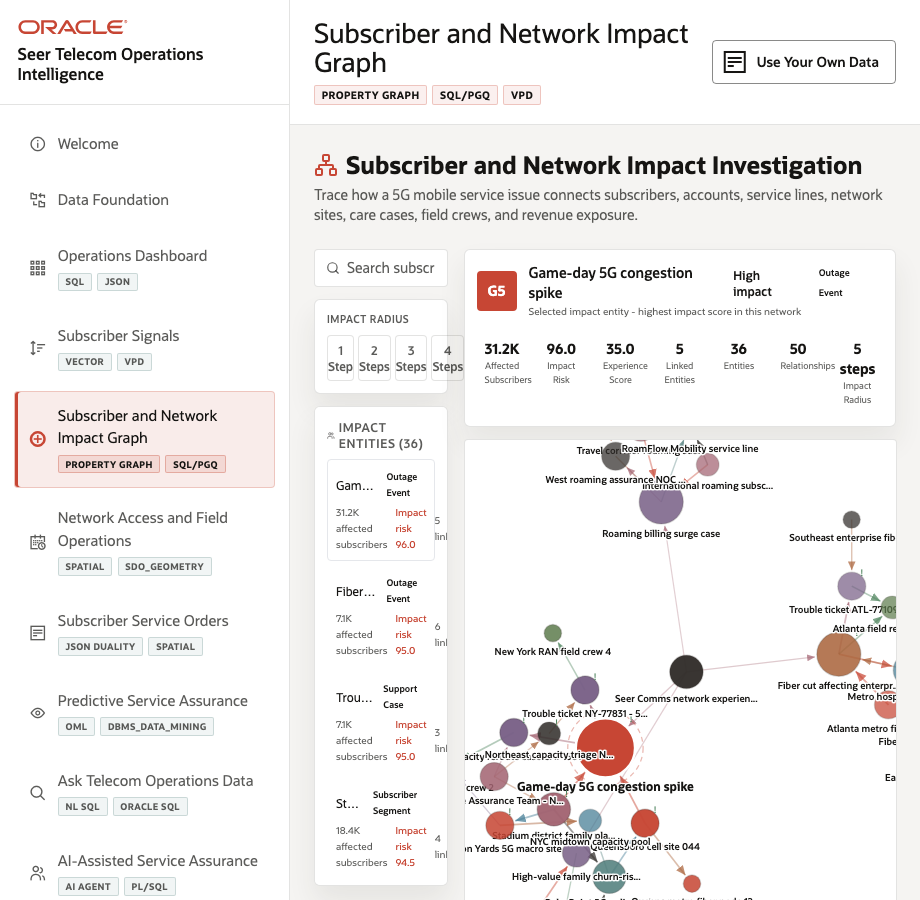
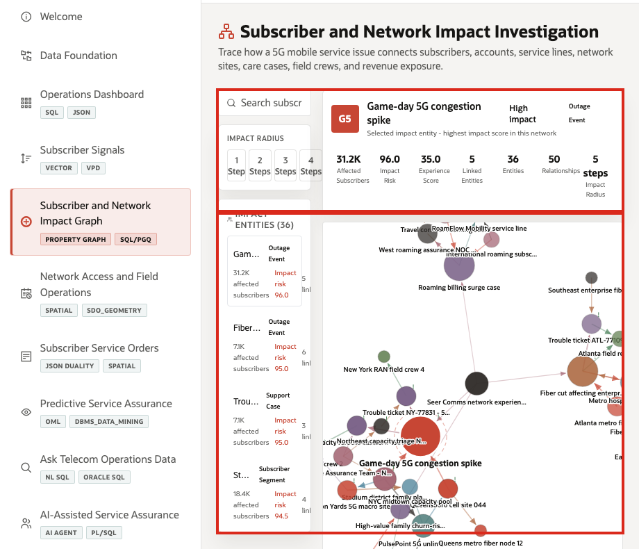
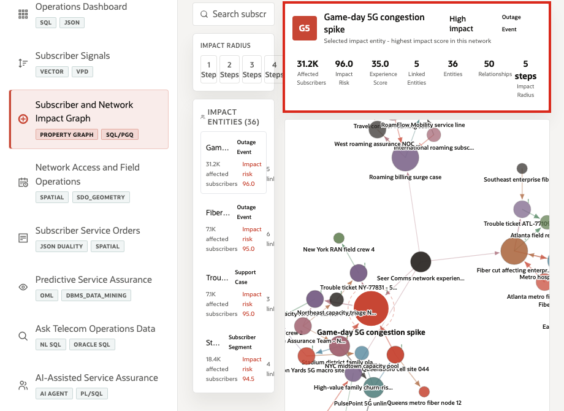
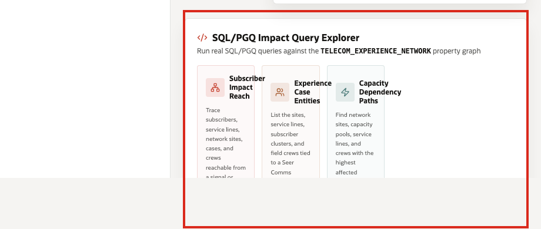

# Scene 5 Subscriber and Network Impact Graph

## Introduction

A network operations analyst, service assurance investigator, enterprise account lead, or care escalation manager uses this page to understand how a subscriber-impact event propagates through services, sites, tickets, accounts, and field crews. This persona is not only asking which incident exists. They need to know which subscribers are affected, which network dependencies matter, which cases are related, and where intervention will reduce the most impact.

This is difficult when subscriber, service, case, site, and crew relationships are split across OSS, BSS, CRM, NOC, and field-service systems. Teams may know that an outage exists, but not how it connects to enterprise accounts, mobile service lines, shared network sites, and open trouble tickets.

Oracle AI Database helps address these challenges with property graph and SQL/PGQ on top of the same governed operational data. In this scene, the graph uses telecom impact entities and relationships to let users explore connected impact and run business-facing graph queries without moving the data into a separate graph-only platform.

Estimated Time: 10 minutes

### Objectives

In this scene, you will:
- Review the **Subscriber and Network Impact Graph** workspace.
- Search for impact entities such as outage events, subscriber clusters, support cases, service lines, and crews.
- Explore the graph radius around a selected entity.
- Run SQL/PGQ examples in the **Impact Query Explorer**.
- Connect the graph result to service assurance investigation.

## Task 1: Review the graph workspace

1. Click **Subscriber and Network Impact Graph** in the sidebar.
2. Review the search field, **Impact Radius** control, **Impact Entities** list, relationship legend, and graph canvas.
3. Review the metric labels in the selected entity panel: **Affected Subscribers**, **Impact Risk**, **Experience Score**, and **Impact Radius**.

In the current demo dataset, the graph contains **36** telecom impact entities and **50** telecom graph relationships. The top entities include **Game-day 5G congestion spike**, **Fiber cut affecting enterprise corridor**, and trouble tickets such as **ATL-77109** and **NY-77831**.

## Task 2: Investigate a high-impact outage event

1. Search for or select **Game-day 5G congestion spike**.
2. Review the entity detail panel.
3. Note the affected subscribers, impact risk, experience score, region, and connected relationships.
4. Click **Explore** if the graph is not already centered on that entity.

In the current demo dataset, **Game-day 5G congestion spike** affects **31,200** subscribers, carries **96** impact risk, and has a low **35** experience score. That is the data point to emphasize: the graph lets the operator move from a named event to subscriber impact and connected operational dependencies.

## Task 3: Run a SQL/PGQ impact query

1. Scroll to **SQL/PGQ Impact Query Explorer**.
2. Select **Subscriber Impact Reach**.
3. Keep the seed entity **OUT-EVENT-501** and the default max hops.
4. Click **Run Query**.
5. Review the query result table.

The query traces subscribers, service lines, network sites, cases, and crews reachable from a signal or outage seed. This is useful because the seller can show property graph value in business terms: service assurance teams can identify where an incident touches subscribers, sites, and response teams without leaving Oracle AI Database.

## Task 4: Explain the investigation pattern

Use the completed graph exploration to explain the pattern:

1. Impact entities are stored as governed telecom data.
2. SQL/PGQ traverses relationships among subscribers, service lines, sites, cases, and crews.
3. The UI turns graph results into operational labels such as affected subscribers and impact risk.
4. The graph helps teams prioritize response based on connected impact, not only ticket order.

You can move to the next scene.

## Credits & Build Notes
- **Author** - Oracle LiveLabs Team
- **Last Updated By/Date** - Oracle LiveLabs Team, 2026-05-28
