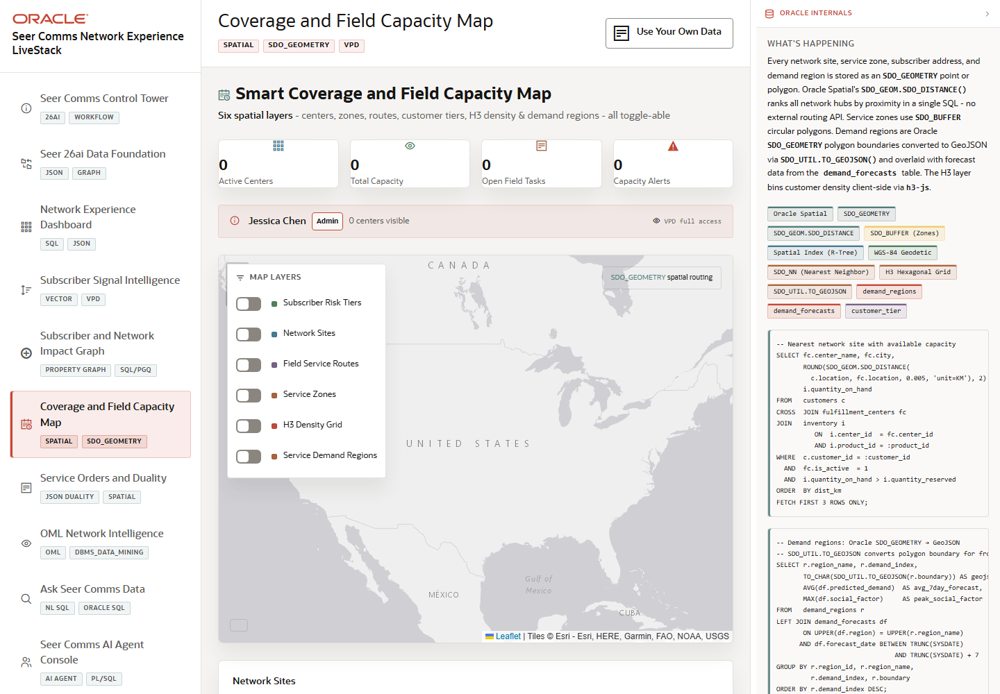

# Scene 6: Coverage and Field Capacity Map

## Introduction

This scene uses Oracle Spatial to show network sites, service zones, field-service routes, H3 density, subscriber risk tiers, and service-demand regions. It helps operators decide where capacity is constrained and where action should be routed.

Estimated Time: 10 minutes

### Objectives

In this lab, you will:
- Open the coverage and capacity map.
- Toggle spatial layers.
- Inspect network site and demand-region details.
- Explain how spatial evidence supports network operations.

## Task 1: Toggle map layers

1. Click **Coverage and Field Capacity Map** in the sidebar.
2. In the layer panel, toggle layers such as **Subscriber Risk Tiers**, **Network Sites**, **Field Service Routes**, **Service Zones**, **H3 Density Grid**, and **Service Demand Regions**.
3. Review how the map changes as each layer is enabled or disabled.

Expected result:
- The map updates with the selected spatial overlays.
- The operator can compare subscriber risk, network-site coverage, demand regions, and route context in one view.

## Task 2: Inspect a network site

1. Click a network site or review the **Network Sites** list.
2. Inspect service-zone, route, or capacity details.
3. Compare the selected site with the visible demand overlays.

Expected result:
- The scene connects geographic context to operational capacity.
- The operator can identify which site or region may need attention.

## Task 3: Review Oracle Spatial evidence

1. Open or review the Oracle information panel.
2. Inspect the feature badges for `SDO_GEOMETRY`, `SDO_GEOM.SDO_DISTANCE`, `SDO_BUFFER`, spatial index, WGS-84, nearest-neighbor search, H3, and GeoJSON.
3. Compare those features with the map layers.

Expected result:
- The demo user can explain how the map is backed by Oracle Spatial capabilities rather than static images.

## Task 4: Why this matters?

Subscriber-impact response is location-sensitive. This scene lets Seer Comms connect experience risk to network sites, service zones, dispatch routes, and demand forecasts so the next action is grounded in geography and capacity.

## Credits & Build Notes
- **Author** - LiveLabs Team
- **Last Updated By/Date** - LiveLabs Team, 2026-05-13
