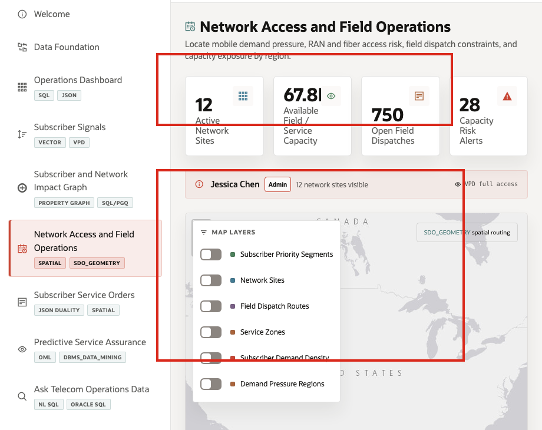
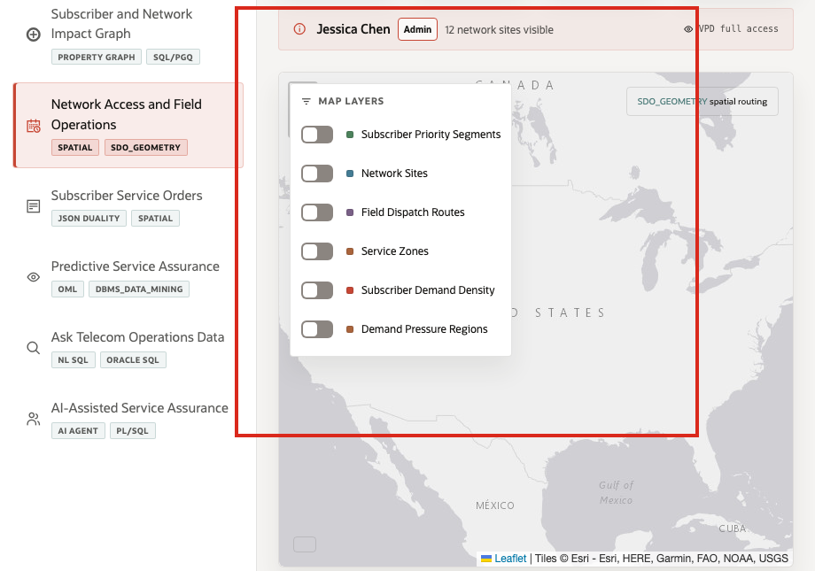

# Scene 6 Network Access and Field Operations

## Introduction

A field operations manager, network access planner, regional service leader, or NOC dispatcher uses this page to understand where demand pressure intersects with network sites, service zones, field dispatch routes, and subscriber priority segments. This persona needs a map that connects subscriber demand to operational capacity, not a generic geography view.

This is difficult when demand forecasts, service orders, network-site locations, dispatch routes, and subscriber geography live in separate systems. Field teams may know that a region is hot, but not which network sites have capacity, which demand regions are critical, or which dispatch routes are already carrying work.

Oracle AI Database helps address these challenges by keeping spatial data, service orders, capacity forecasts, subscriber locations, and operational metrics together. In this scene, Oracle Spatial supports service-zone visualization, proximity analysis, demand density, and field dispatch routing from the same data foundation used by the rest of the LiveStack Demo.

Estimated Time: 10 minutes

### Objectives

In this scene, you will:
- Review the **Network Access and Field Capacity Map**.
- Interpret active network sites, available field capacity, open field dispatches, and capacity risk alerts.
- Toggle map layers for subscriber priority segments, network sites, dispatch routes, service zones, demand density, and demand pressure regions.
- Review capacity risk alerts and connect them to field operations.

## Task 1: Review the field operations map

1. Click **Network Access and Field Operations** in the sidebar.
2. Review the top metric tiles: **Active Network Sites**, **Available Field / Service Capacity**, **Open Field Dispatches**, and **Capacity Risk Alerts**.
3. Review the map legend and active layers.
4. Toggle the layer controls if you want to isolate **Network Sites**, **Field Dispatch Routes**, **Service Zones**, **Subscriber Demand Density**, or **Demand Pressure Regions**.

Use this opening view to explain the role of the page. The map is not only showing points. It connects network access, field capacity, demand regions, and subscriber demand density to the same service assurance story.

## Task 2: Inspect network sites and field capacity

1. Review the active network site markers on the map.
2. Focus on sites such as **Atlanta Home Internet Dispatch**, **Dallas 5G Dispatch Center**, and **Miami Connected Life Hub**.
3. Compare current load, products stocked, total units, and pending dispatches.

In the current demo dataset, the page uses **12** active network sites. Examples include **Atlanta Home Internet Dispatch** with **5,850** total capacity units and **76** pending dispatches, **Dallas 5G Dispatch Center** with **5,500** units and **60** pending dispatches, and **Chicago Midwest NOC** with **4,295** units and **56** pending dispatches.

## Task 3: Review capacity risk alerts

1. Scroll to **Capacity Risk Alerts**.
2. Review the services, network sites, available capacity, forecast demand, and subscriber signal factor.
3. Focus on a service such as **Gigabit Fiber Install** at **Houston Roaming Operations Hub**.

In the current demo dataset, **Gigabit Fiber Install** at **Houston Roaming Operations Hub** shows **55** available capacity units against **141** forecast demand and is marked low capacity. **Number Port-In Activation** appears as a critical example in the NYC Network Command Center, with **37** units on hand and **62** predicted demand. This turns spatial context into operational action: field teams can see where capacity and demand are misaligned.

## Task 4: Explain the spatial pattern

Use the map to explain the pattern:

1. Network site and subscriber locations are stored with spatial coordinates.
2. Demand forecasts and subscriber signals add operational pressure to geography.
3. Field dispatch routes show how the business responds.
4. Oracle Spatial keeps the map, proximity, route, and zone context connected to transactional service data.

You can move to the next scene.

## Credits & Build Notes
- **Author** - Oracle LiveLabs Team
- **Last Updated By/Date** - Oracle LiveLabs Team, 2026-05-28
