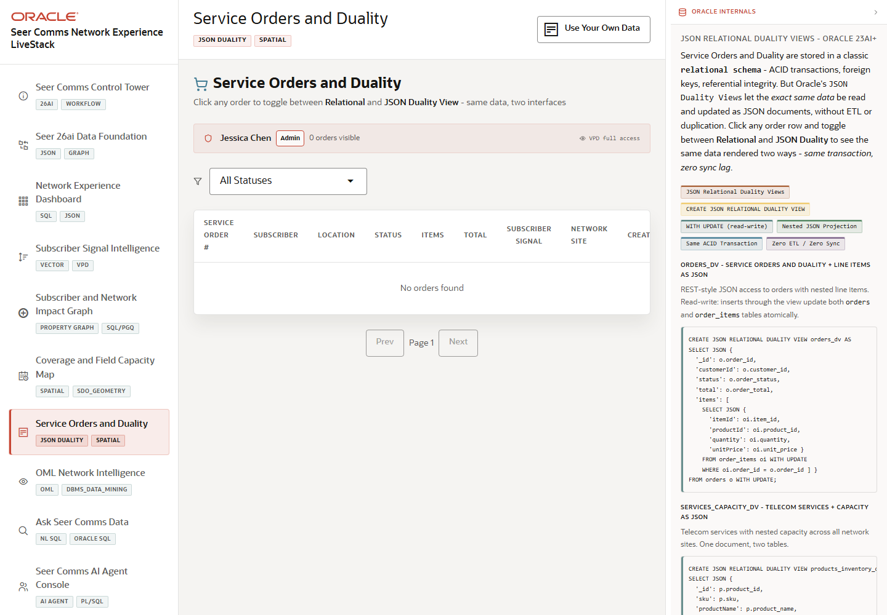

# Scene 7: Service Orders and Duality

## Introduction

This scene shows telecom service orders through both relational controls and JSON Relational Duality Views. It also exposes field-service route context so operators can connect order state with dispatch activity.

Estimated Time: 10 minutes

### Objectives

In this lab, you will:
- Open service orders.
- Filter and inspect order status.
- Compare relational, JSON duality, and route detail tabs.
- Explain how JSON document access and relational integrity coexist.

## Task 1: Filter service orders

1. Click **Service Orders and Duality** in the sidebar.
2. Select a status filter such as **Routed**, **Completed**, or **Pending**.
3. Review the service-order table and status timeline.

Expected result:
- The table narrows to the selected order status.
- The operator can focus on orders that need routing, completion, or exception review.

## Task 2: Open order detail

1. Click a visible service order row.
2. Review the **Relational** tab for subscriber, location, order total, and dispatch cost.
3. Click **JSON Duality View** and inspect the JSON document projection.
4. Click **Field Service Route** and review route distance, field time, dispatch cost, and status.

Expected result:
- The same operational order can be inspected as relational data, JSON document data, and route context.
- The JSON duality view supports app-friendly document access without abandoning transactional control.

## Task 3: Copy or compare JSON evidence

1. In the JSON duality tab, click **Copy** if available.
2. Compare the copied JSON with the relational fields in the order detail.
3. Close the detail panel.

Expected result:
- The user can show how the app presents document-shaped order data while Oracle keeps the relational model authoritative.

## Task 4: Why this matters?

Telecom service orders must satisfy app developer needs and operational control needs at the same time. JSON Relational Duality Views let Seer Comms serve document-shaped APIs while preserving ACID transactions, keys, constraints, and security policy enforcement.

## Credits & Build Notes
- **Author** - LiveLabs Team
- **Last Updated By/Date** - LiveLabs Team, 2026-05-13
