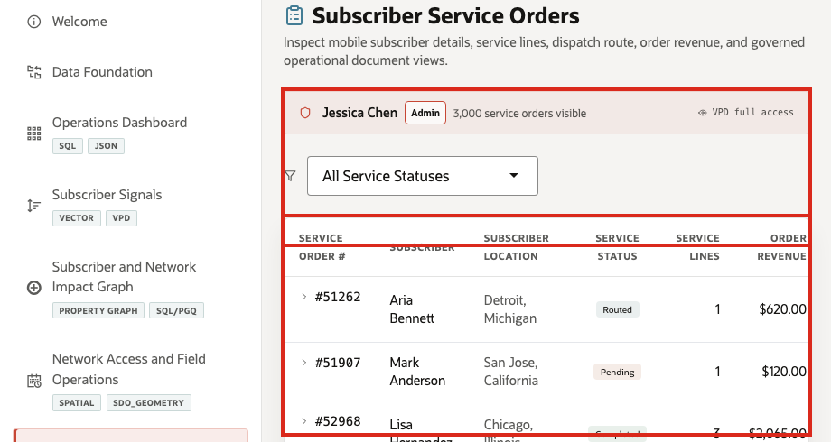
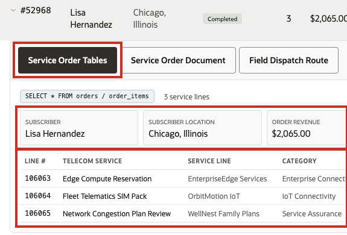
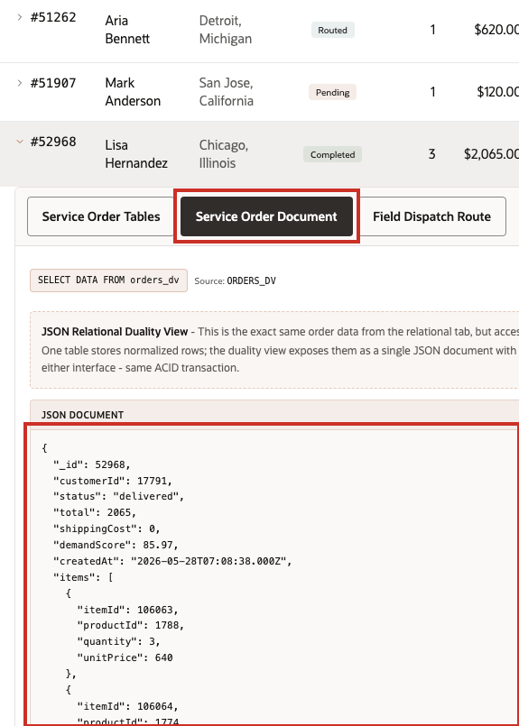
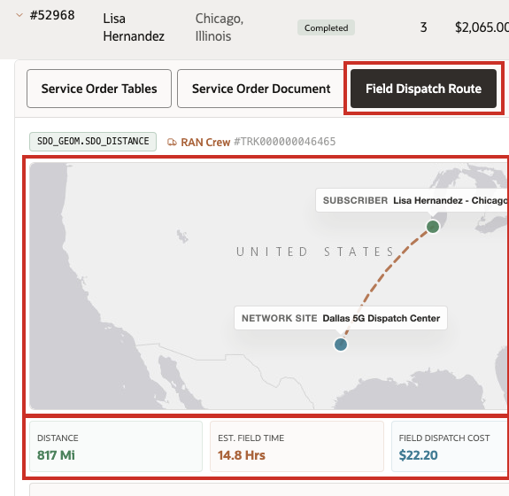

# Scene 7 Subscriber Service Orders

## Introduction

**Subscriber Service Orders** shows how one service order can support several telecom workflows at once. Care teams need operational detail, service operations teams need transactional accuracy, application teams need document-shaped access, and field teams need dispatch context.

Telecom teams struggle when the information needed for one service-assurance decision lives in separate OSS, BSS, care, NOC, field, and analytics tools. That separation slows action, increases reconciliation work, and makes it harder to trust the result.

Oracle AI Database helps address these challenges by keeping the service order in one governed data platform while exposing it through the shape each workflow needs. Relational tables provide ACID transactions, foreign keys, and operational SQL.

**JSON Relational Duality Views** expose the same service order as a nested JSON document for application and API use cases. Oracle Spatial adds dispatch and distance context for field visibility, and VPD policies can control which orders each user can see.

Access controls help ensure users see only the telecom data they are allowed to see, which matters for subscribers, service orders, network regions, enterprise accounts, and AI governance.

Estimated Time: **10 minutes**

### Objectives

In this scene, you will learn what telecom decision the page supports, what evidence the user should inspect, and what action the team may take next.

## Task 1: Review the service-order workspace

Review the service-order workspace to establish the operational context: who the order is for, what status it is in, what value is involved, and which dispatch center is responsible.

1. Click **Subscriber Service Orders** in the sidebar.
2. Review the VPD banner below the page subtitle. It shows the active demo user and whether the user has full access or a region-filtered order view.
3. Review the status filter and the service-order table.
4. Focus on service order **#52968**.

In the current demo dataset, service order **#52968** is for **Lisa Hernandez** in **Chicago, Illinois**. It is marked **Completed**, contains **3** line items, totals **$2,065**, and is fulfilled by **Dallas 5G Dispatch Center**. This service order will be the data point used through the rest of the scene.

**Note:** These are sample values from the current demo dataset and may change after a refresh, seed update, or custom dataset import. Treat these numbers as an example of the current operating pattern. Verify the live values in the UI before presenting, then explain the business takeaway: what demand, subscriber impact, capacity, revenue, dispatch, or risk pattern the values reveal.

## Task 2: Inspect the relational service-order detail

Inspect the relational service-order detail to validate the subscriber, location, order total, dispatch cost, line items, quantities, and pricing that care and service operations teams need for follow-up.

1. Click service order **#52968**.
2. Confirm the **Service Order Tables** tab is selected.
3. Review the subscriber, location, total, dispatch cost, and line-item table.
4. Review the services in the order, such as **Edge Compute Reservation**, **Fleet Telematics SIM Pack**, and **Network Congestion Plan Review**.

This view is useful for service operations and customer care because it shows normalized transactional data in a format that is easy to validate. The order header, subscriber, service, brand, category, quantity, unit price, and line total are connected through relational joins while preserving ACID consistency.

## Task 3: Compare the Service Order Document

Compare the Service Order Document to show that the same governed service order can support both operations users and application teams without creating separate copies of the record.

1. Click **Service Order Document** in the expanded order panel.
2. Review the source label for the JSON Duality View.
3. Review the JSON document for service order **52968**.
4. Notice that the document contains order identity, subscriber identity, status, total, dispatch cost, demand score, created date, and nested line items.

The key point is that the service order is not copied into a separate document store. The same governed order can appear as operational detail or as a document shape for applications.

## Task 4: Review field dispatch context

Review field dispatch context to connect the service order to the dispatch center, subscriber location, distance, transit time, dispatch cost, and progress timeline.

1. Click **Field Dispatch Route** in the expanded order panel.
2. Review the network site and subscriber locations on the map.
3. Review the dispatch context below the map: distance, estimated transit time, dispatch cost, and status.
4. Review the dispatch progress timeline.

The business value is that teams can make the decision from connected, governed data. Oracle AI Database provides the shared foundation that keeps operational data, analytics, and AI workflows aligned.

For order **#52968**, the page connects **Dallas 5G Dispatch Center** to **Lisa Hernandez** in Chicago. The operational detail includes a spatial distance of about **817 miles** and a dispatch cost of **$22.20**. This connects the service-order record to field visibility, not just API payloads or order totals.

**Note:** These are sample values from the current demo dataset and may change after a refresh, seed update, or custom dataset import. Treat these numbers as an example of the current operating pattern. Verify the live values in the UI before presenting, then explain the business takeaway: what demand, subscriber impact, capacity, revenue, dispatch, or risk pattern the values reveal.

You can move to the next scene.

## Credits & Build Notes
- **Author** - Oracle LiveLabs Team
- **Last Updated By/Date** - Oracle LiveLabs Team, 2026-05-28
