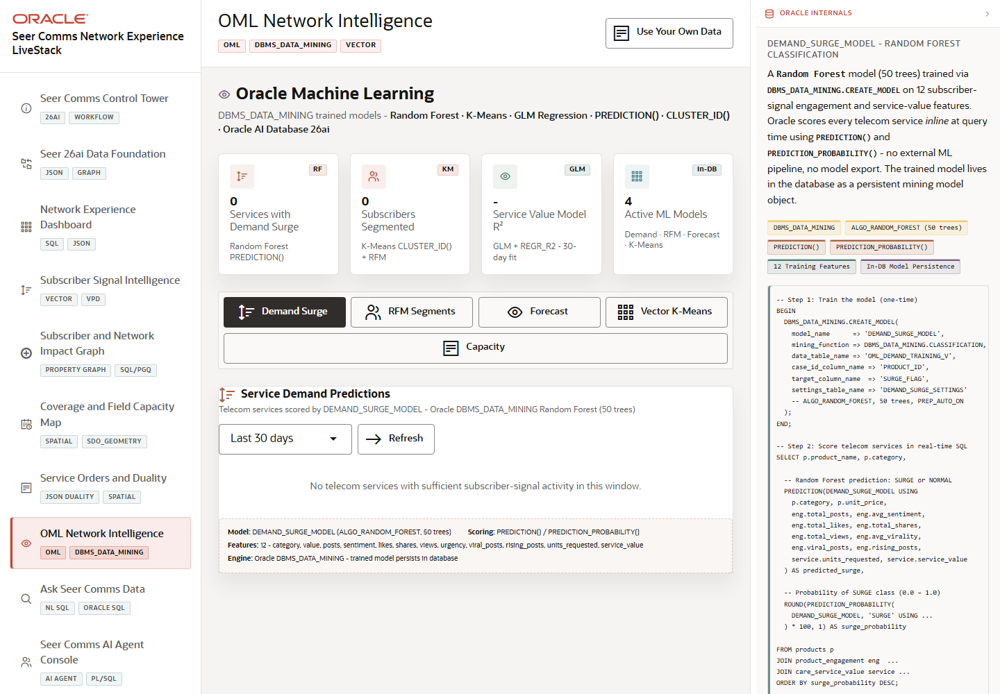

# Scene 8: OML Network Intelligence

## Introduction

This scene demonstrates Oracle Machine Learning inside the network-experience workflow. Seer Comms can review demand-surge prediction, subscriber segmentation, service-value forecast, vector clustering, and capacity intelligence without exporting data to a separate ML store.

Estimated Time: 12 minutes

### Objectives

In this lab, you will:
- Open OML Network Intelligence.
- Switch between the five OML tabs.
- Refresh scoring or forecasting views.
- Explain how in-database ML supports network operations.

## Task 1: Review OML summary cards

1. Click **OML Network Intelligence** in the sidebar.
2. Review the summary cards for demand surge, subscriber segmentation, service-value model quality, and active ML models.
3. Note which operational question each card answers.

Expected result:
- The scene frames ML as operational intelligence for subscriber demand, churn risk, service value, and capacity pressure.

## Task 2: Switch OML tabs

1. Click **Demand Surge** and review service demand predictions.
2. Click **RFM Segments** and inspect subscriber segmentation.
3. Click **Forecast**, **Vector K-Means**, and **Capacity** to compare the available OML views.

Expected result:
- Each tab changes the visible model output and business question.
- The user can connect demand prediction, customer segmentation, forecast, clustering, and capacity analysis to the same telecom workflow.

## Task 3: Refresh a model view

1. On a tab with a **Refresh** control, click **Refresh**.
2. Review the updated chart, table, or scoring output.
3. If the runtime shows a fallback or unavailable state, explain that the full stack requires the Oracle database bootstrap and ML assets.

Expected result:
- The UI demonstrates a repeatable path for scoring or retrieving OML output.
- The operator understands which model supports the visible recommendation.

## Task 4: Why this matters?

ML becomes more useful when it is close to the governed operational data. This scene shows Seer Comms scoring demand, value, segments, clusters, and capacity with Oracle Machine Learning rather than pushing sensitive telecom data into a disconnected prediction pipeline.

## Credits & Build Notes
- **Author** - LiveLabs Team
- **Last Updated By/Date** - LiveLabs Team, 2026-05-13
