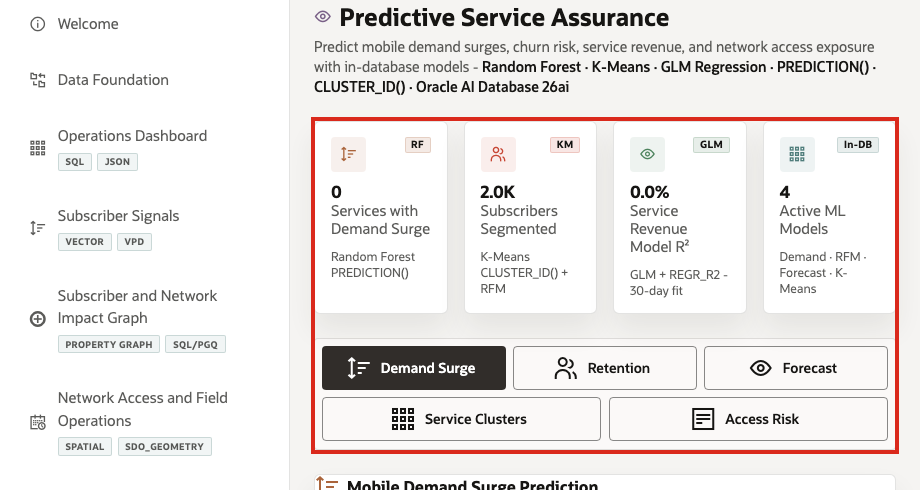
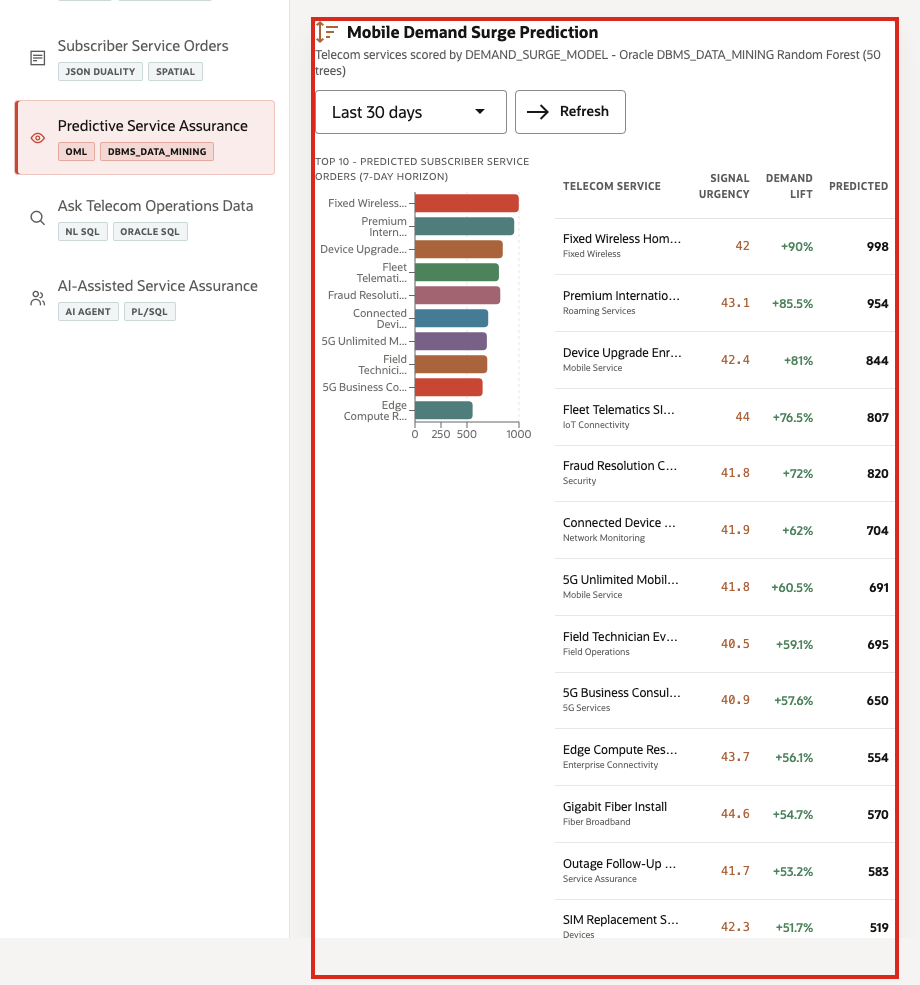
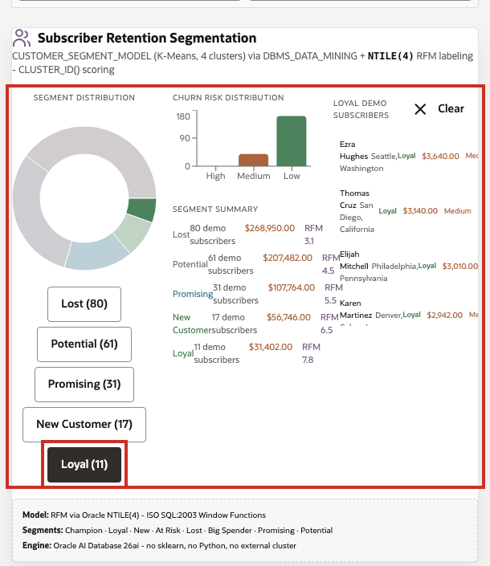
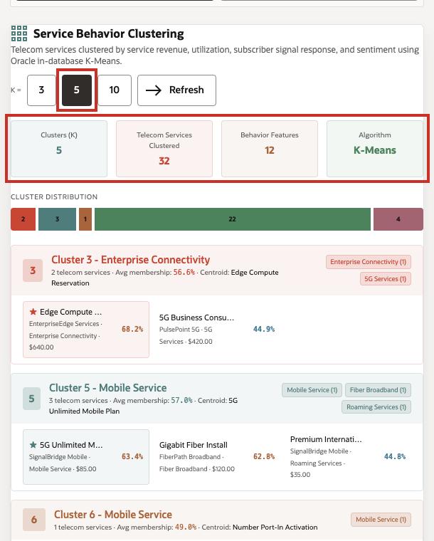
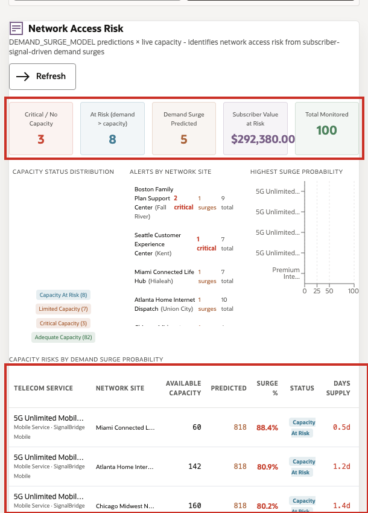

# Scene 8 Predictive Service Assurance

## Introduction

A service assurance analytics manager, churn-risk analyst, network capacity planner, or telecom data science lead uses this page to understand which predictive signals should drive action. This persona needs to know which services are surging, which subscriber groups need different engagement, how service revenue is trending, which services behave alike, and where forecasted demand may create network access risk.

This is difficult when predictive work is split across notebooks, exported CSV files, BI extracts, external ML services, and separate operational systems. Telecom teams can lose trust in predictions when model features are stale, scoring jobs run away from the live data, or the explanation behind a forecast is disconnected from the service orders, subscribers, services, and capacity records that business users rely on.

Oracle AI Database helps address these challenges by keeping machine learning close to governed telecom data. Oracle Machine Learning models can be trained, persisted, and scored in the database with `DBMS_DATA_MINING`, `PREDICTION()`, `PREDICTION_PROBABILITY()`, and `CLUSTER_ID()`. Demand surge prediction, retention segmentation, service revenue forecasting, service behavior clustering, and network access risk scoring can run from the same connected data foundation that powers the rest of the LiveStack Demo.

Estimated Time: 10 minutes

### Objectives

In this scene, you will:
- Review the **Predictive Service Assurance** workspace and summary cards.
- Inspect the **Demand Surge** results and interpret the demand surge percentage for a telecom service.
- Filter **Retention** segments and review the subscribers behind a selected segment.
- Change the **Forecast** horizon and interpret the model quality cards and chart.
- Change the **Service Clusters** cluster count and review service cluster assignments.
- Review **Access Risk** and connect predicted demand to capacity exposure.

## Task 1: Review the predictive assurance workspace

1. Click **Predictive Service Assurance** in the sidebar.
2. Review the four summary cards at the top of the page: services with demand surge, subscribers segmented, revenue model R2, and active ML models.
3. Review the mode tabs: **Demand Surge**, **Retention**, **Forecast**, **Service Clusters**, and **Access Risk**.

Use this opening view to set the scene: this page is not a separate data science notebook. It is a business-facing analytics surface backed by in-database scoring and SQL.

## Task 2: Inspect mobile demand surge prediction

1. Stay on the **Demand Surge** tab.
2. Use the scoring window selector if you want to change the time window, then click **Refresh**.
3. Review the bar chart and service table.
4. Focus on the first row, such as **Fixed Wireless Home Internet**.

In the current demo dataset, **Fixed Wireless Home Internet** shows **131** recent mentions, **290** recent service orders, **1,008** predicted demand, **90%** demand surge, and about **$70.6K** service revenue opportunity. The same table also shows services such as **Premium International Roaming Pass**, **Device Upgrade Enrollment**, and **Fleet Telematics SIM Pack**. This gives the service assurance user a concrete question to answer: should the provider add capacity, adjust field dispatch, prioritize outreach, or prepare care teams before demand pressure turns into churn?

## Task 3: Filter retention segments

1. Click **Retention**.
2. Review the segment distribution and segment summary.
3. Click **Loyal (10)**, **Potential (59)**, or another segment button.
4. Review the filtered subscriber list on the right.

In the current demo dataset, the visible segment distribution includes **Lost (79)**, **Potential (59)**, **Promising (34)**, **New Customer (18)**, and **Loyal (10)**. Selecting a segment filters the subscriber list so the user can inspect the people behind that score, including spend, location, churn risk, and predicted lifetime value.

This is useful for retention and care teams because segmentation becomes operational. The team can move from a model result to the subscriber records that need a campaign, retention action, plan optimization, or service follow-up without exporting the data to another tool.

## Task 4: Change the service revenue forecast horizon

1. Click **Forecast**.
2. Change the forecast horizon to **+14 day forecast**.
3. Click **Refresh** if the page does not update automatically.
4. Review the model quality cards and the forecast chart.

In the current demo dataset, the 14-day forecast view shows a low trend R2 of **0.01%**, a daily slope of about **+$9.63/day**, mean daily service revenue of about **$30.6K**, and **31** observations. The low R2 is an important demo talking point: the page is not hiding model quality. It shows when a simple 30-day revenue trend is weak, so a planner can treat the forecast as directional context instead of over-trusting it.

## Task 5: Review service behavior clusters

1. Click **Service Clusters**.
2. Change the **K =** control if you want to compare cluster counts.
3. Review the cluster summary cards and distribution bar.
4. Review one cluster card and its service assignments.

In the current demo dataset, **K = 5** clusters group **32** telecom services. One visible cluster has **5G Unlimited Mobile Plan**, **Gigabit Fiber Install**, and **Premium International Roaming Pass** in the same behavior group. This helps a telecom analyst understand how AI-assisted grouping can support service bundling, plan optimization, recommendation design, and lookalike service exploration.

## Task 6: Review network access risk

1. Click **Access Risk**.
2. Review the access-risk summary cards.
3. Scroll to **Capacity Risks by OML Surge Probability**.
4. Focus on a high-risk service and site combination.

The value of Oracle AI Database is that the access-risk signal combines demand forecasts, service-order patterns, inventory or capacity, subscriber signals, and service data in one governed system. The same data foundation supports predictive scoring, operational joins, and business-facing workflow decisions.

You can move to the next scene.

## Credits & Build Notes
- **Author** - Oracle LiveLabs Team
- **Last Updated By/Date** - Oracle LiveLabs Team, 2026-05-28
