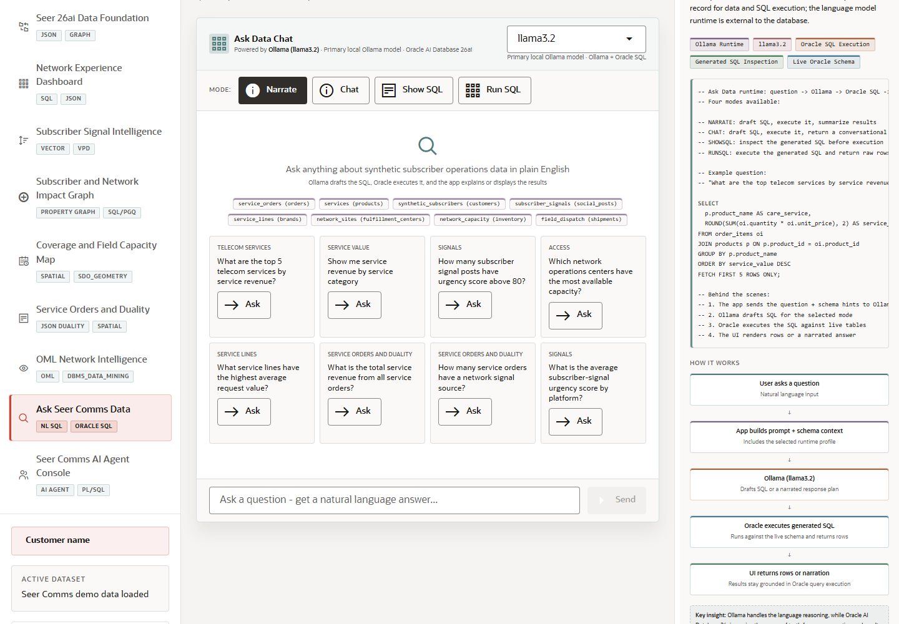

# Scene 9: Ask Seer Comms Data

## Introduction

This scene lets a user ask telecom operations questions in natural language. Ollama drafts the response path, Oracle executes SQL when needed, and the UI can show narration, chat, generated SQL, or query results.

Estimated Time: 10 minutes

### Objectives

In this lab, you will:
- Open Ask Seer Comms Data.
- Try the available answer modes.
- Ask a guided telecom question.
- Inspect how natural language is grounded in Oracle query execution.

## Task 1: Choose an answer mode

1. Click **Ask Seer Comms Data** in the sidebar.
2. Review the mode buttons: **Narrate**, **Chat**, **Show SQL**, and **Run SQL**.
3. Select **Show SQL** to focus on generated SQL evidence.

Expected result:
- The selected mode changes the way the app will respond to the next question.
- The user can choose between business narration and technical SQL inspection.

## Task 2: Ask a telecom question

1. Click an example question or type a question such as `What is the total service revenue from all service orders?`.
2. Click **Send**.
3. Review the answer, generated SQL, or returned rows depending on the selected mode.

Expected result:
- The app routes the question through the configured runtime profile.
- Oracle-backed query execution grounds the answer when SQL is generated or run.

## Task 3: Compare modes

1. Click **Narrate** and ask a second question about subscriber operations or network capacity.
2. Click **Run SQL** and ask a question that can return a table.
3. Click **Clear** to reset the chat when finished.

Expected result:
- The same natural-language interface can support executive narration, technical SQL inspection, and live data retrieval.

## Task 4: Why this matters?

Ask Data gives non-specialists a safer path into operational data because the application can expose generated SQL and route execution through governed Oracle APIs. The scene is useful for both business discovery and technical trust-building.

## Credits & Build Notes
- **Author** - LiveLabs Team
- **Last Updated By/Date** - LiveLabs Team, 2026-05-13
