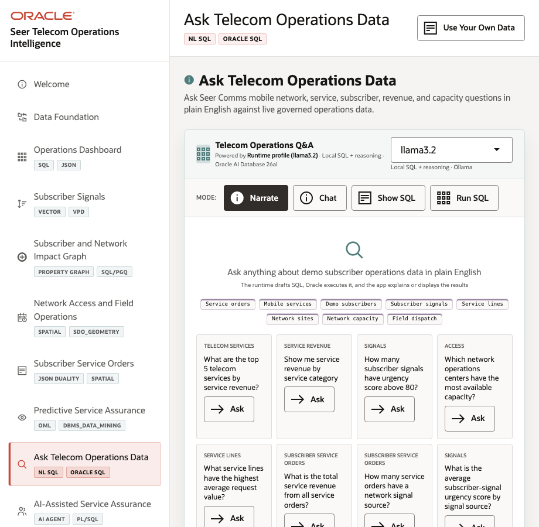
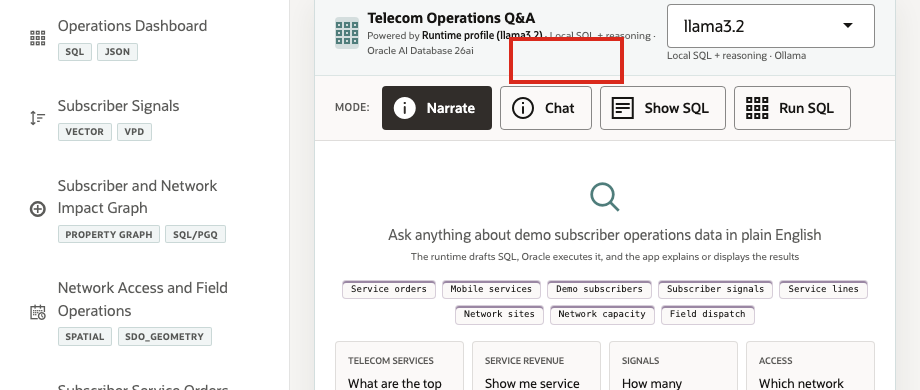
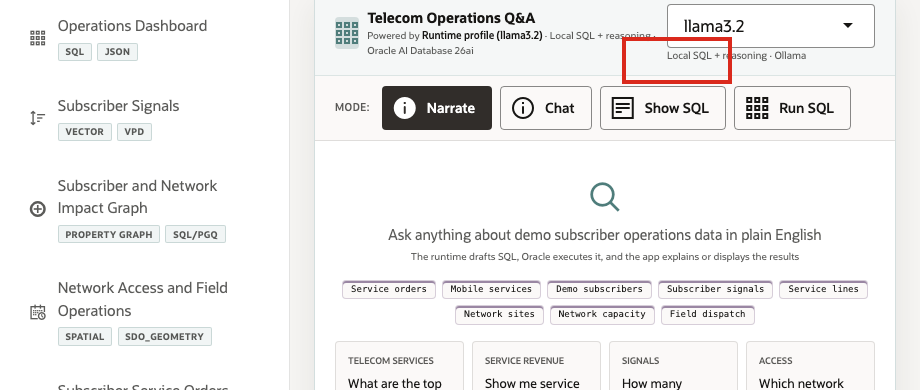

# Scene 9 Ask Telecom Operations Data

## Introduction

**Ask Telecom Operations Data** helps business users ask telecom questions in plain language while keeping the answer path visible. Users can inspect generated SQL, run it against governed Oracle data, and review returned rows, making self-service analytics faster and easier to trust.

Telecom teams struggle when the information needed for one service-assurance decision lives in separate OSS, BSS, care, NOC, field, and analytics tools. That separation slows action, increases reconciliation work, and makes it harder to trust the result.

Oracle AI Database helps address these challenges by keeping query execution grounded in the live telecom schema. In this LiveStack Demo, the app sends the business question and schema context to the local Ollama runtime, validates the generated SQL path, and uses Oracle AI Database 26ai as the execution authority.

The user can inspect generated SQL before execution, run the SQL to return rows, or use narrative modes when they want a summarized answer.

Estimated Time: **10 minutes**

### Objectives

In this scene, you will learn what telecom decision the page supports, what evidence the user should inspect, and what action the team may take next.

## Task 1: Review the Ask Telecom Operations Data workspace

Review the workspace to show how telecom users can ask questions in plain language while still keeping the query path visible and controlled.

1. Click **Ask Telecom Operations Data** in the sidebar.
2. Review the runtime profile in the top right of the chat card. The current demo uses the local **llama3.2** runtime through the **SC_LLAMA_PROFILE** profile.
3. Review the four modes: **Narrate**, **Chat**, **Show SQL**, and **Run SQL**.
4. Review the example question tiles.
5. Focus on a concrete question such as **What are the top 5 telecom services by service revenue?** or **How many subscriber signals have urgency score above 80?**

Use this page to show the balance between business access and technical governance: the user asks in plain English, but the system keeps SQL visible and Oracle as the trusted execution layer.

## Task 2: Inspect generated SQL

Inspect generated SQL to show that the answer is traceable. Even if the user does not read every line, the query can be reviewed instead of trusting a hidden AI response.

1. Click **Show SQL**.
2. Click **Ask** on **What are the top 5 telecom services by service revenue?**
3. Review the generated SQL.

The generated SQL joins telecom service and service-order data to answer a business question. This is the governance moment in the scene: the business user can inspect the query path before asking the database to return rows.

The value is not only convenience. A telecom analyst can get faster answers while still seeing the SQL and returned rows behind the result.

## Task 3: Run SQL and inspect returned data

Run SQL and inspect the returned data to connect a plain-English telecom question to live service-order rows, revenue patterns, subscriber signals, or capacity evidence.

1. Click **Clear** if the generated SQL result is still visible.
2. Click **Run SQL**.
3. Click **Ask** on the same service revenue question.
4. Review the returned table.

This is the data point to emphasize during the demo. The natural-language question surfaces a concrete telecom operations answer from live service-order data. A business user can discover which services contribute most to revenue without writing SQL, while the SQL and database result remain visible for trust.

## Task 4: Explain the governance pattern

Explain the governance pattern as speed with control: the user asks in plain language, the system shows or runs SQL, Oracle returns trusted data, and the answer remains reviewable.

1. The user asks a telecom operations question in plain English.
2. The app builds prompt and schema context for the selected runtime profile.
3. Ollama drafts SQL or a response plan.
4. Oracle AI Database executes the generated SQL against the live schema.
5. The UI returns either visible SQL, raw rows, or a narrated answer.

This pattern matters because communications providers want faster answers, but they also need governed access. **Ask Telecom Operations Data** shows how natural-language analytics can be useful without hiding the query path or replacing the database as the trusted execution layer.

**Note:** Ollama provides the local AI runtime used for reasoning, while Oracle remains the governed source for data access and execution.

You can move to the next scene.

## Credits & Build Notes
- **Author** - Oracle LiveLabs Team
- **Last Updated By/Date** - Oracle LiveLabs Team, 2026-05-28
