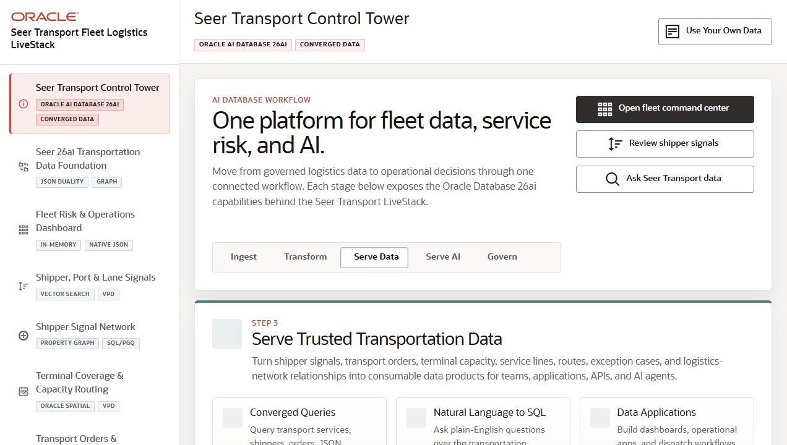

# Seer Transport Fleet Logistics LiveStack

## Introduction

This workshop is the runbook for the Seer Transport Fleet Logistics LiveStack. The demo shows how a transportation operator can use Oracle AI Database 26ai as one governed data platform for fleet operations, shipper signals, service demand, terminal routing, order exceptions, predictive analytics, natural language SQL, and agent-assisted operations.

Estimated Demo Time: 90 minutes

### Objectives

In this workshop, you will:
- Navigate each visible LiveStack scene from the left navigation rail.
- Inspect the business signal each screen exposes for a transportation operations team.
- Use visible controls such as filters, search fields, map layer switches, analytics tabs, and chat prompts.
- Connect each workflow to the Oracle Database capability shown in the right Oracle information panel.
- Use the download lab to run the portable `livestack-transportation.zip` bundle with Podman Compose.

### Prerequisites

This workshop assumes you have:
- Access to a running Seer Transport Fleet Logistics LiveStack in a browser.
- For the portable run lab, Podman or Docker-compatible Podman Compose installed locally.
- Enough local resources to run Oracle Database Free, ORDS, Ollama, and the application container.
- Basic familiarity with transportation operations terms such as shippers, terminals, lanes, orders, capacity, and exceptions.

## Workshop Flow

- Introduction: frame the transportation control tower story.
- Download and run the LiveStack locally.
- Scene 1: Seer Transport Control Tower.
- Scene 2: Seer 26ai Transportation Data Foundation.
- Scene 3: Fleet Risk and Operations Dashboard.
- Scene 4: Shipper, Port, and Lane Signals.
- Scene 5: Shipper Signal Network.
- Scene 6: Terminal Coverage and Capacity Routing.
- Scene 7: Transport Orders and Exception Cases.
- Scene 8: Predictive Logistics Risk and Capacity Analytics.
- Scene 9: Ask Seer Transport Data.
- Scene 10: Agent Console.
- Conclusion: connect the scene evidence to a stakeholder narrative.

## Learn More

- Oracle AI Database: https://www.oracle.com/database/ai-database/
- Oracle Database 26ai: https://www.oracle.com/database/26ai/
- Oracle Machine Learning: https://www.oracle.com/artificial-intelligence/database-machine-learning/
- Oracle Spatial: https://www.oracle.com/database/spatial/
- Oracle REST Data Services: https://www.oracle.com/database/technologies/appdev/rest.html

## Credits & Build Notes
- **Author** - LiveLabs Team
- **Last Updated By/Date** - LiveLabs Team, 2026-05-13
