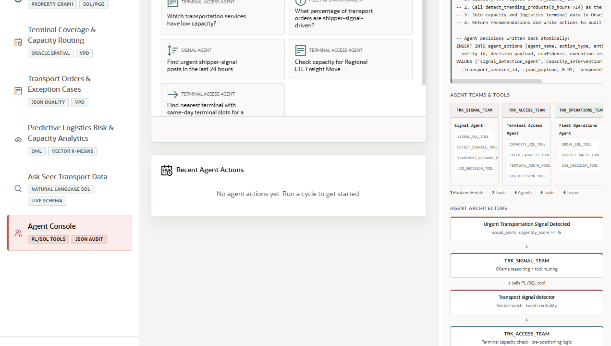

# Scene 10: Agent Console

## Introduction

This scene shows agent-assisted fleet operations. It brings together profiles, example prompts, chat, event history, action summaries, and auditable agent actions over the same transportation data foundation.

Estimated Time: 10 minutes

### Objectives

In this lab, you will:
- Review the active agent profile and action summary.
- Ask an agent question or run an example prompt.
- Inspect recent actions and event history.
- Explain why auditable agent workflows matter in transportation operations.

## Task 1: Review the agent workspace

1. Click **Agent Console** in the navigation rail.
2. Review the active profile selector and available example questions.
3. Inspect the action summary and recent action areas.
4. Review the right Oracle information panel for tool, audit, and workflow context.

Expected result:
- The user understands which agent profile is active and how the console records operational activity.

## Task 2: Run an agent interaction

1. Select a visible example question, or type a transportation operations question in the chat input.
2. Click the send or run button.
3. Review the agent response, tool activity, and any new action record.
4. Use **Clear** if you want to reset the chat area before the next question.

Expected result:
- The agent console returns an operations-oriented answer and maintains an audit trail of work performed.

## Task 3: Compare agent output with source scenes

1. If the agent mentions demand, capacity, orders, or signals, open the related scene from the navigation rail.
2. Compare the answer with dashboard KPIs, signal feed data, map capacity, order exceptions, or analytics tabs.
3. Return to the agent console.

Expected result:
- The user can explain that agents are using the LiveStack data foundation, not inventing an answer outside the operational system.

## Task 4: Why this matters?

Agent workflows are useful only when they are explainable, governed, and tied to operational context. This scene demonstrates how AI-assisted recommendations can sit beside visible data, SQL-backed tools, and auditable actions for transportation operations.

## Credits & Build Notes
- **Author** - LiveLabs Team
- **Last Updated By/Date** - LiveLabs Team, 2026-05-13
