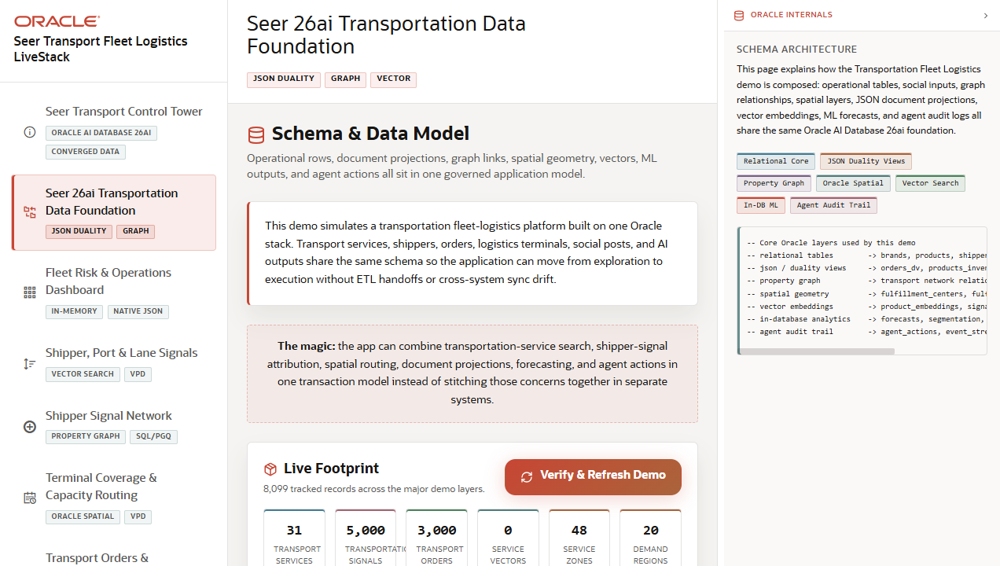

# Scene 2: Seer 26ai Transportation Data Foundation

## Introduction

This scene explains how the transportation demo data is organized. It shows operational rows, shipper signals, graph relationships, spatial layers, JSON document projections, vector embeddings, machine learning outputs, and agent audit logs as one governed Oracle AI Database foundation.

Estimated Time: 10 minutes

### Objectives

In this lab, you will:
- Inspect the live footprint counts for the major demo layers.
- Review the workload map and how the data connects.
- Use quick routes to jump from the model into downstream operator workflows.
- Explain why the same data model can serve dashboards, maps, orders, analytics, and agents.

## Task 1: Inspect the live footprint

1. Click **Seer 26ai Transportation Data Foundation** in the navigation rail.
2. Review the **Live Footprint** cards for transport services, transportation signals, transport orders, service vectors, service zones, and demand regions.
3. Click **Verify & Refresh Demo** if the button is available.
4. Watch the progress message and count cards update.

Expected result:
- The scene confirms that the demo uses real seeded transportation artifacts instead of static screen text.
- The user can describe the major data domains used by the rest of the demo.

## Task 2: Review the workload map

1. Scroll to **Workload Map**.
2. Inspect the capability groups for Core Fleet Operations, Transportation Signals, Graph Relationships, Spatial Terminal Access, JSON and Duality, and ML, Vector, Agents.
3. Scroll to **How The Data Connects** and review the flow from shipper signals through services, orders, spatial/vector/ML, and agents.

Expected result:
- The user can explain how each later scene reuses the same governed Oracle data foundation.

## Task 3: Use quick routes

1. Scroll to **Quick Routes**.
2. Click **Open terminal access map**.
3. Return to the data foundation scene and click **Open OML analytics**.
4. Return again and click **Open agent console**.

Expected result:
- The quick routes prove that the data foundation is the map for the rest of the demo, not a static architecture slide.

## Task 4: Why this matters?

Transportation data is often split across dispatch systems, order systems, social or partner signals, spreadsheets, geospatial services, and analytics platforms. This scene shows how Oracle AI Database 26ai can keep relational, JSON, graph, spatial, vector, ML, and agent audit workloads close to the same trusted model.

## Credits & Build Notes
- **Author** - LiveLabs Team
- **Last Updated By/Date** - LiveLabs Team, 2026-05-13
