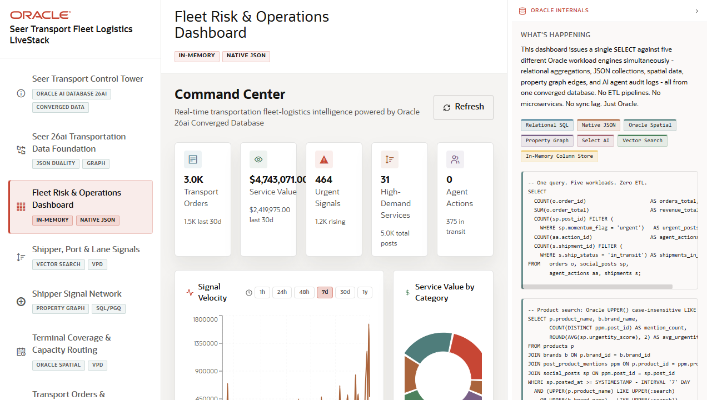

# Scene 3: Fleet Risk and Operations Dashboard

## Introduction

This scene is the fleet operations command center. It combines order counts, service value, urgent signals, high-demand services, agent actions, signal velocity, service value by category, and searchable high-demand transportation services.

Estimated Time: 10 minutes

### Objectives

In this lab, you will:
- Review the operational KPI cards.
- Compare signal velocity and service value charts.
- Search and filter high-demand services.
- Open a transport service detail modal and compare details with JSON duality data.

## Task 1: Inspect the command center KPIs

1. Click **Fleet Risk & Operations Dashboard** in the navigation rail.
2. Review the KPI cards for **Transport Orders**, **Service Value**, **Urgent Signals**, **High-Demand Services**, and **Agent Actions**.
3. Click **Refresh** to update the dashboard data.

Expected result:
- The user sees a current operating picture for order volume, service value, signal urgency, and agent activity.

## Task 2: Compare trend and value signals

1. In **Signal Velocity**, select at least two time windows such as **24h** and **7d**.
2. Review how the chart changes as the time window changes.
3. Inspect **Service Value by Category** to identify which service categories carry the largest value.

Expected result:
- The user can compare demand signals with the value at stake in transportation services.

## Task 3: Search high-demand services

1. In **High-Demand Services**, type a transportation service or program term into the search field.
2. Select a visible service line chip if one is available.
3. Click a row in the service table.
4. In the detail modal, switch between **Details** and **JSON Duality View**.

Expected result:
- The selected service opens a modal with capacity and signal context.
- The JSON duality tab shows how the same service and capacity data can be exposed as a nested document projection.

## Task 4: Why this matters?

The dashboard turns raw fleet, order, signal, and service data into an operating picture. A user can move from "what is happening" to "which service is affected" without exporting data or opening a second analytics system.

## Credits & Build Notes
- **Author** - LiveLabs Team
- **Last Updated By/Date** - LiveLabs Team, 2026-05-13
