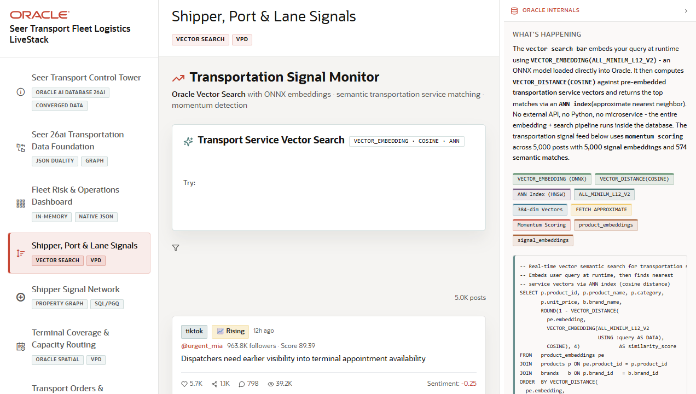

# Scene 4: Shipper, Port, and Lane Signals

## Introduction

This scene monitors transportation signals and uses in-database vector search to match plain language needs to transport services. It also shows filters for momentum, platform, signal source, and semantic post search.

Estimated Time: 10 minutes

### Objectives

In this lab, you will:
- Run transportation service vector search from the visible search panel.
- Use example queries to show semantic matching.
- Filter the signal feed by momentum, platform, and signal source.
- Explain how VPD and vector search support governed signal monitoring.

## Task 1: Run service vector search

1. Click **Shipper, Port & Lane Signals** in the navigation rail.
2. In **Transport Service Vector Search**, type `regional ltl freight capacity`.
3. Click **Search**.
4. Review the ranked services, similarity scores, service lines, categories, and prices.
5. Click **Clear** and then choose one of the example query buttons.

Expected result:
- The scene returns semantically related transportation services instead of only exact keyword matches.
- The user can point to similarity scores as the visible signal created by vector search.

## Task 2: Filter the signal feed

1. Use the **All Momentum** control and select **Urgent** or **Critical**.
2. Use **All Platforms** to narrow the feed to a specific source.
3. Use **All Signal Sources** if signal sources are available.
4. Type a phrase in **Search posts by embedding** and click **Go**.

Expected result:
- The signal list narrows to the selected operational context.
- Semantic post search shows matching posts with ranked match percentages when data is available.

## Task 3: Inspect the Oracle panel

1. Open or review the right Oracle information panel.
2. Inspect the SQL shown for `VECTOR_EMBEDDING`, `VECTOR_DISTANCE(COSINE)`, approximate nearest neighbor search, and VPD filtering.

Expected result:
- The user can explain that the vector and security logic is part of the Oracle-backed workflow, not a detached search service.

## Task 4: Why this matters?

Transportation teams need to respond to demand and disruption signals before they become service failures. Vector search lets operators describe a need in natural language, while row-level security keeps regional signal visibility governed.

## Credits & Build Notes
- **Author** - LiveLabs Team
- **Last Updated By/Date** - LiveLabs Team, 2026-05-13
