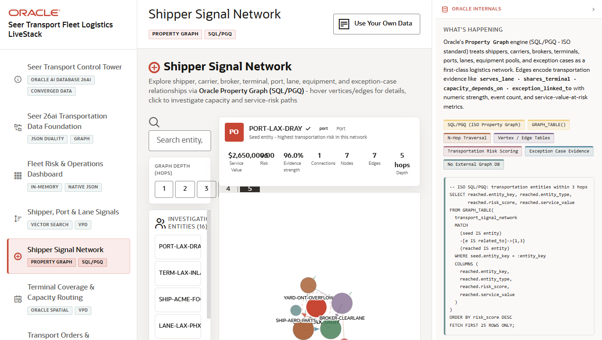

# Scene 5: Shipper Signal Network

## Introduction

This scene explores connected transportation entities using graph relationships. It helps the user move from a signal or service to the surrounding network of shippers, terminals, carriers, routes, exception cases, and related operational entities.

Estimated Time: 10 minutes

### Objectives

In this lab, you will:
- Search for a transportation entity, terminal, carrier, or case.
- Change graph depth to reveal more connected relationships.
- Open graph query examples and compare the SQL or graph logic behind the visible network.
- Explain why relationship analysis matters for disruption response.

## Task 1: Explore the graph

1. Click **Shipper Signal Network** in the navigation rail.
2. Use the search field with a visible entity, terminal, carrier, or case term.
3. Select a result or inspect the default graph view.
4. Change the graph depth control from the default depth to another available depth.

Expected result:
- The graph view changes as the selected entity or depth changes.
- The user can see that risk and demand signals are connected through more than one table.

## Task 2: Inspect query examples

1. Locate the graph query examples area.
2. Open an example query.
3. Review the shown query and, if available, run the example.
4. Return to the graph view.

Expected result:
- The user sees that the network is backed by graph-style traversal logic instead of a static diagram.

## Task 3: Compare graph context with dashboard context

1. Open the dashboard from the navigation rail.
2. Note a high-demand service or urgent signal.
3. Return to **Shipper Signal Network** and search for a related entity.

Expected result:
- The user can connect operational KPI pressure to the relationship network that may explain the pressure.

## Task 4: Why this matters?

Fleet exceptions are rarely isolated. A carrier delay, port signal, shipper cluster, or terminal constraint can propagate through a network. Graph analysis helps the operator find relationship patterns that are hard to see in flat tables.

## Credits & Build Notes
- **Author** - LiveLabs Team
- **Last Updated By/Date** - LiveLabs Team, 2026-05-13
