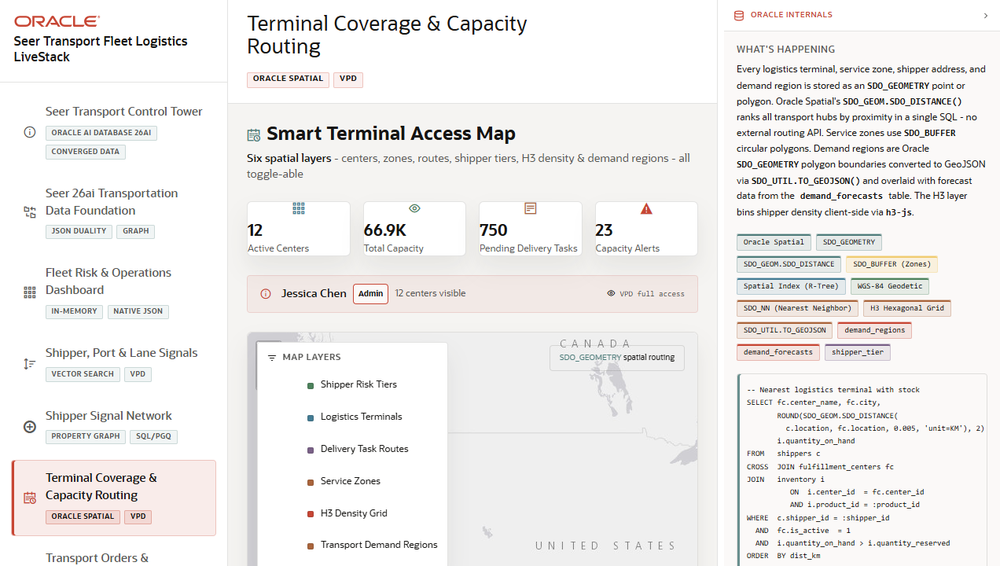

# Scene 6: Terminal Coverage and Capacity Routing

## Introduction

This scene shows smart terminal access and capacity routing on a spatial map. Operators can toggle terminals, delivery task routes, service zones, shipper risk tiers, H3 density, and transport demand regions.

Estimated Time: 10 minutes

### Objectives

In this lab, you will:
- Review terminal counts, total capacity, pending delivery tasks, and capacity alerts.
- Toggle spatial layers on the map.
- Inspect logistics terminal rows and capacity indicators.
- Explain how Oracle Spatial supports proximity, service zone, and demand-region analysis.

## Task 1: Open the terminal map

1. Click **Terminal Coverage & Capacity Routing** in the navigation rail.
2. Review the KPI cards for **Active Centers**, **Total Capacity**, **Pending Delivery Tasks**, and **Capacity Alerts**.
3. Inspect the VPD context banner to see which user context is active.

Expected result:
- The user sees the operational capacity context before interacting with the map.

## Task 2: Toggle map layers

1. Use **Map Layers** to turn on **Logistics Terminals**.
2. Turn on **Service Zones** and compare zone radii.
3. Turn on **Delivery Task Routes** to show routes.
4. Turn on **Shipper Risk Tiers**, **H3 Density Grid**, and **Transport Demand Regions**.
5. Hover over or click a visible map item to inspect details.

Expected result:
- The map changes as each spatial layer is enabled.
- The user can see terminals, routes, service zones, demand regions, and density overlays in one view.

## Task 3: Inspect terminal and alert tables

1. Scroll to **Logistics Terminals**.
2. Compare center, location, type, capacity, pending tasks, and load percentage.
3. If **Capacity Alerts** are present, review the affected service, center, stock, need, and social factor.

Expected result:
- The user can tie map context back to operational capacity rows and exception indicators.

## Task 4: Why this matters?

Dispatch and capacity decisions depend on geography. This scene shows how Oracle Spatial can support terminal proximity, service zones, demand regions, and route overlays without forcing the application to hand off spatial logic to a separate mapping database.

## Credits & Build Notes
- **Author** - LiveLabs Team
- **Last Updated By/Date** - LiveLabs Team, 2026-05-13
