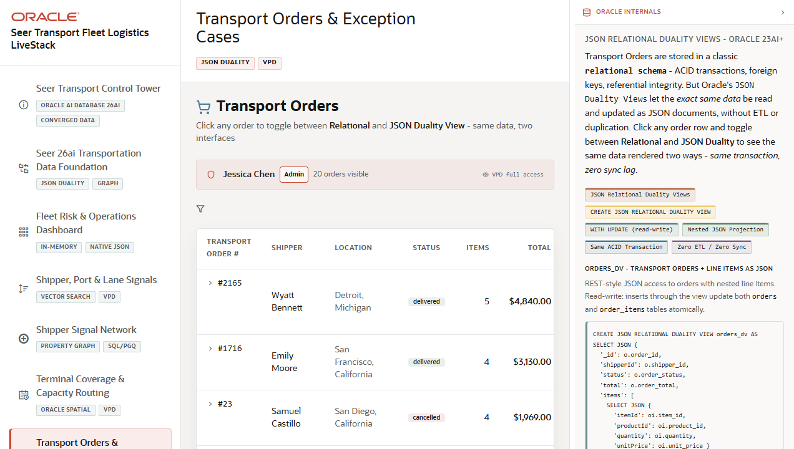

# Scene 7: Transport Orders and Exception Cases

## Introduction

This scene lets the user inspect transport orders, shipment status, route context, and JSON duality projections. It connects the operational order list to exception investigation and document-style application access.

Estimated Time: 10 minutes

### Objectives

In this lab, you will:
- Filter transport orders by status.
- Open an order detail view.
- Compare order details with JSON duality output.
- Explain how order operations can serve both relational workflows and document-style app needs.

## Task 1: Review the order list

1. Click **Transport Orders & Exception Cases** in the navigation rail.
2. Review the order KPI or summary cards at the top of the scene.
3. Use the status control to select a specific order status.
4. Use any visible refresh or clear control to return to the full list.

Expected result:
- The order list changes based on the selected operational status.
- The user can focus on the subset of transport orders that needs attention.

## Task 2: Open an order

1. Click a visible order row or order action button.
2. Review shipment progress, customer or shipper context, service lines, route data, and exception details.
3. Switch between the available order detail tabs, including JSON or duality views if shown.

Expected result:
- The order detail view exposes operational context and a document-style view of the same order.

## Task 3: Compare orders with other scenes

1. Note an order status, customer, route, or terminal from the order detail.
2. Open **Terminal Coverage & Capacity Routing** and compare the route or terminal context.
3. Open **Fleet Risk & Operations Dashboard** and compare the order pressure with the KPI summary.

Expected result:
- The user can explain how orders connect to terminal routing, service demand, and dashboard signals.

## Task 4: Why this matters?

Transportation operators need fast order context, but application teams often want document-style payloads. JSON duality lets the LiveStack show the same underlying order data through relational and document-shaped access patterns.

## Credits & Build Notes
- **Author** - LiveLabs Team
- **Last Updated By/Date** - LiveLabs Team, 2026-05-13
