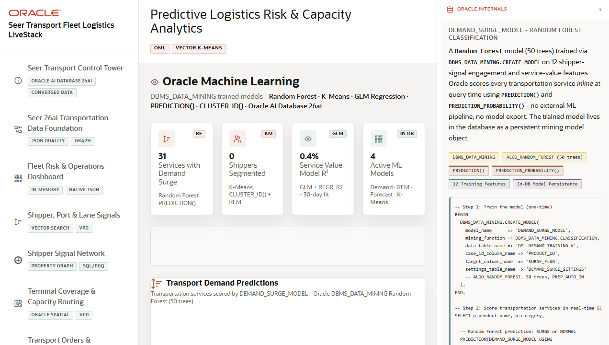

# Scene 8: Predictive Logistics Risk and Capacity Analytics

## Introduction

This scene demonstrates Oracle Machine Learning and analytics workflows for transportation demand, shipper segmentation, service value forecast, vector clustering, and capacity intelligence.

Estimated Time: 10 minutes

### Objectives

In this lab, you will:
- Navigate the OML analytics tabs.
- Compare demand surge, shipper segmentation, forecast, vector clustering, and capacity intelligence views.
- Use available controls to change windows, segment filters, or cluster settings.
- Explain how predictive signals help operators act before service risk becomes visible in orders.

## Task 1: Open analytics tabs

1. Click **Predictive Logistics Risk & Capacity Analytics** in the navigation rail.
2. Click **Demand Surge** and inspect demand prediction cards or charts.
3. Click **RFM Segments** and review shipper segmentation output.
4. Click **Forecast**, **Vector K-Means**, and **Capacity**.

Expected result:
- Each tab changes the analytics view and focuses on a different predictive transportation question.

## Task 2: Adjust an analytics control

1. In the demand view, change the demand window if a window control is visible.
2. In the segmentation view, click a segment filter if available.
3. In the vector clustering view, change the cluster count if the control is visible.
4. In the capacity view, refresh or review the recommended capacity intelligence.

Expected result:
- The analytics view responds to user controls, and the user can compare how the model output changes.

## Task 3: Link analytics back to operations

1. Note a high-risk demand, segment, forecast, or capacity signal.
2. Open the dashboard and compare the predictive finding to current KPIs.
3. Open the terminal map and compare the predictive signal to spatial capacity.

Expected result:
- The user can explain how predictive analytics informs dispatch, capacity planning, and exception prevention.

## Task 4: Why this matters?

Predictive analytics moves a transportation demo from reporting to foresight. When demand, segmentation, forecasts, vector clusters, and capacity intelligence sit near the operational data, users can act on model output without rebuilding the workflow in a separate analytics stack.

## Credits & Build Notes
- **Author** - LiveLabs Team
- **Last Updated By/Date** - LiveLabs Team, 2026-05-13
