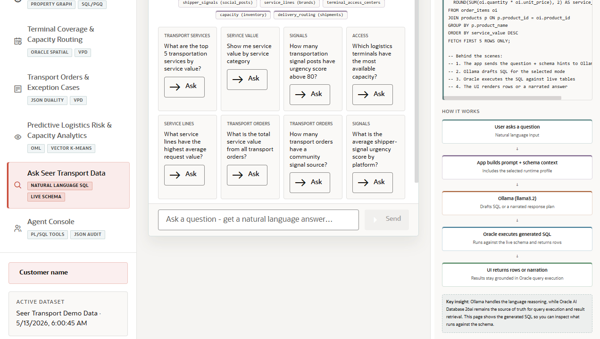

# Scene 9: Ask Seer Transport Data

## Introduction

This scene lets a user ask transportation questions in natural language and inspect generated SQL, executed results, or narrative responses depending on the selected mode.

Estimated Time: 8 minutes

### Objectives

In this lab, you will:
- Use the Ask Data chat interface.
- Switch between visible answer modes.
- Run example questions and inspect SQL or results.
- Explain how natural language SQL helps operations users explore governed data.

## Task 1: Ask a question

1. Click **Ask Seer Transport Data** in the navigation rail.
2. Review the mode controls near the chat interface.
3. Choose a visible example question.
4. Click the send or run button.
5. Review the response, generated SQL, and result area if shown.

Expected result:
- The scene translates an operations-style question into a governed data answer.

## Task 2: Switch modes

1. Select a mode that shows SQL, if available.
2. Run a question and inspect the SQL.
3. Select a conversational or narrative mode.
4. Run a second question and compare the response shape.

Expected result:
- The user sees the difference between explainable SQL generation, executed results, and narrative answers.

## Task 3: Connect natural language answers to other scenes

1. Ask about urgent signals, high-value services, capacity, or orders.
2. Open the dashboard, signal monitor, terminal map, or orders scene to compare the answer with visible app evidence.

Expected result:
- The user can treat Ask Data as a fast exploration path while still grounding answers in the visible operational scenes.

## Task 4: Why this matters?

Operations users do not always know the right table or SQL join. Natural language data access lets them ask about fleet risk, service demand, and capacity while still keeping the answer tied to governed Oracle data.

## Credits & Build Notes
- **Author** - LiveLabs Team
- **Last Updated By/Date** - LiveLabs Team, 2026-05-13
