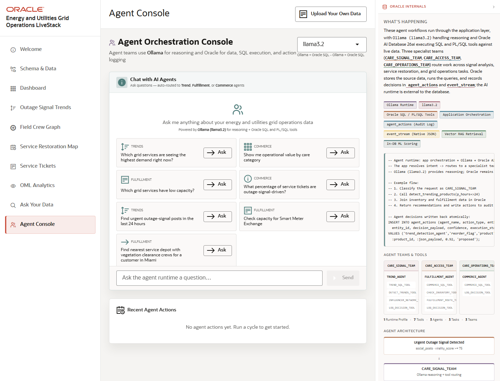

# Conclusion and Business Outcomes

## Introduction

This closing lab consolidates the LiveStack story: a utilities operator can move from signal awareness to data-model evidence, operational KPIs, semantic search, graph context, spatial restoration planning, ticket evidence, predictive analytics, natural-language questions, and agent-assisted actions.

Estimated Time: 10 minutes

### Objectives

In this lab, you will:
- Review the complete operator journey.
- Identify the Oracle AI Database capabilities demonstrated by each workflow.
- Turn the scene sequence into a concise customer-facing value narrative.

## Task 1: Review the final outcome

1. Open **Agent Console** or return to **Dashboard** for the final summary view.
2. Review which earlier scenes created the evidence for the final recommendation.
3. Summarize the operator path from outage signal to action trail.

Expected result:
- The audience can describe how the LiveStack turns utilities signals into operational decisions.
- The presenter can name the scenes that contributed evidence to the final workflow.

## Task 2: Connect scenes to business value

1. Review the workflow list in the introduction.
2. For each scene, identify the business question it answers.
3. Match that question to the Oracle-backed capability: relational, JSON, graph, vector, spatial, ML, Select AI, ORDS, or agent audit records.

Expected result:
- The demo is easy to retell as a customer conversation.
- The story emphasizes governed decision support rather than a collection of disconnected features.

## Task 3: Why this matters?

Energy and utilities teams need fast, explainable responses to volatile grid signals. This LiveStack shows how Oracle AI Database can support those workflows in one governed application: the data stays close to the transaction, the analytics, the AI evidence, and the operator action trail.

## Credits & Build Notes
- **Author** - Oracle LiveStack Team
- **Last Updated By/Date** - Oracle LiveStack Team, 2026-05-13
