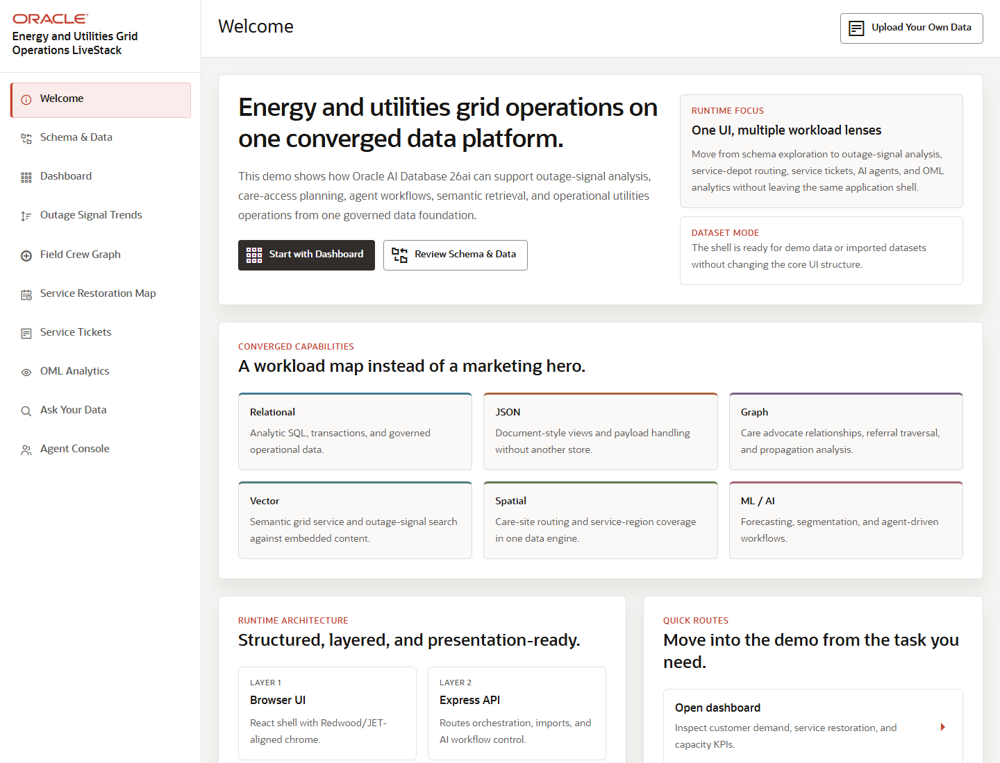

# Energy and Utilities Grid Operations LiveStack

## Introduction

This workshop is the runbook for the Energy and Utilities Grid Operations LiveStack. It walks a demo user through the actual application routes in the portable stack: orientation, schema, command center, outage signals, field crew graph, restoration map, service tickets, OML analytics, natural-language data access, and agent-assisted operations.

Estimated Demo Time: 90 minutes

### Objectives

In this workshop, you will:
- Operate the LiveStack from the same navigation used by the application.
- Explain what happens in each scene and what should visibly change.
- Connect each workflow to an Oracle AI Database capability.
- Use the download lab to run the portable stack with Podman Compose.

### Prerequisites

This workshop assumes you have:
- A browser session pointed at the running LiveStack application.
- Podman and Podman Compose available if you will run the local portable stack.
- Network access to pull the Oracle Database Free, ORDS, and Ollama container images.
- Enough local resources for the database, ORDS, Ollama, and app containers.

## Workshop Flow

- Scene 1: Welcome and Demo Flow.
- Scene 2: Schema and Data Model.
- Scene 3: Command Center Dashboard.
- Scene 4: Outage Signal Trends and Vector Search.
- Scene 5: Field Crew Graph.
- Scene 6: Service Restoration Map.
- Scene 7: Service Tickets and JSON Duality.
- Scene 8: OML Analytics.
- Scene 9: Ask Your Data.
- Scene 10: Agent Console and Operational Actions.
- Conclusion and business outcomes.
- Download the LiveStack and run the portable stack with Podman Compose.

## Learn More

- Oracle AI Database documentation: https://docs.oracle.com/en/database/oracle/oracle-database/
- Oracle Database Free container images: https://container-registry.oracle.com/
- Oracle REST Data Services documentation: https://docs.oracle.com/en/database/oracle/oracle-rest-data-services/
- Oracle Machine Learning documentation: https://docs.oracle.com/en/database/oracle/machine-learning/

## Credits & Build Notes
- **Author** - Oracle LiveStack Team
- **Last Updated By/Date** - Oracle LiveStack Team, 2026-05-13
- **Screenshot note** - Screenshots in this guide were captured from the local Vite frontend using the LiveStack source routes. Data-heavy panels may show empty states until the full Podman stack is running.
