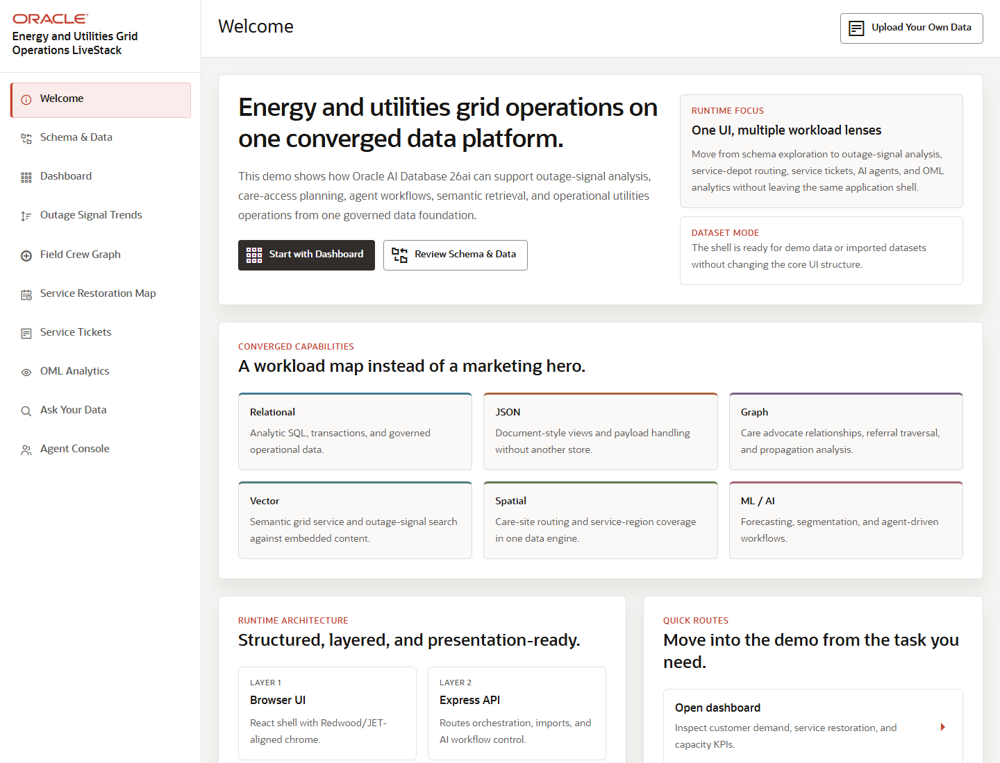

# Scene 1 Welcome and Demo Flow

## Introduction

This scene orients the presenter and audience to the Energy and Utilities Grid Operations LiveStack. The page frames the demo as one Oracle AI Database backed workflow for grid signals, service restoration, tickets, analytics, natural-language data access, and agent assistance.

Estimated Time: 8 minutes

### Objectives

In this lab, you will:
- Open the LiveStack home view and confirm the utilities story.
- Review the capability cards for relational, JSON, graph, vector, spatial, and ML or AI workloads.
- Use the quick-route buttons to decide where to start the operator walkthrough.

## Task 1: Open the welcome view

1. Open the running application in a browser.
2. Click **Welcome** in the sidebar if another view is active.
3. Review the headline, capability cards, and architecture flow before moving to the operator scenes.

Expected result:
- The home view shows the utilities LiveStack scope and the Oracle AI Database 26ai capability mix.
- The sidebar lists the operator workflows used by the rest of this guide.
## Task 2: Choose the first operator path

1. Click **Start with Dashboard** to begin with operational KPIs, or click **Review Schema & Data** to begin with architecture.
2. Return to **Welcome** and click **Ask your data** if the audience wants to start with natural-language access.
3. Explain that the same seeded utilities dataset drives all routes.

Expected result:
- The active page changes through the left navigation without leaving the LiveStack shell.
- The presenter can choose either business-first or architecture-first flow.

## Task 3: Why this matters?

The welcome view sets the customer narrative before the technical details appear. It makes the demo feel like one grid-operations story instead of isolated database features.

## Credits & Build Notes
- **Author** - Oracle LiveStack Team
- **Last Updated By/Date** - Oracle LiveStack Team, 2026-05-13
