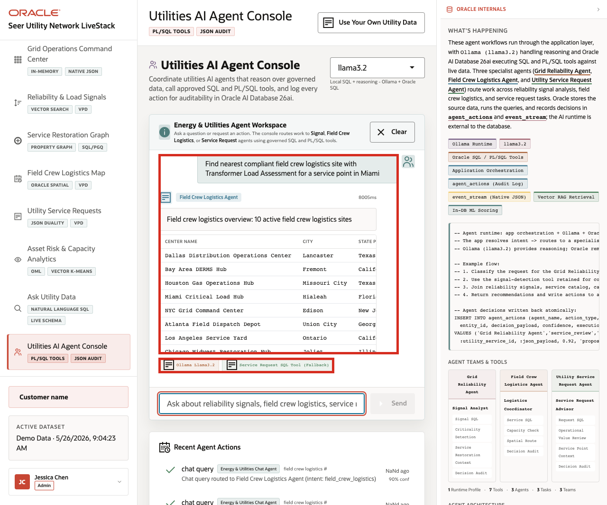
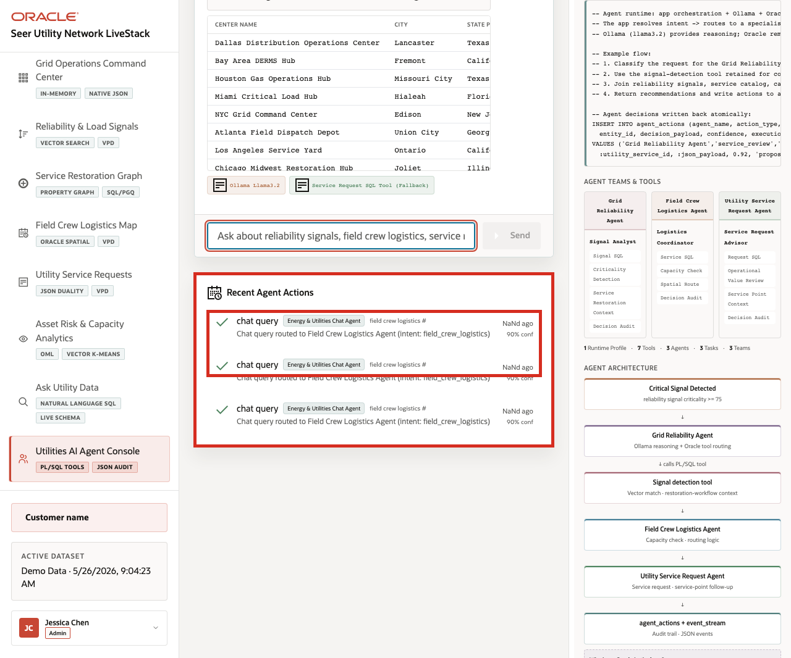

# Scene 10 Utilities AI Agent Console

## Introduction

A utility operations leader, grid operator, field service coordinator, customer operations manager, or AI platform owner uses this page to see how agentic assistance can support day-to-day utility decisions. This persona is not only interested in whether an AI agent can answer a question. They need to know which specialist path handled the request, which tools were used, what data was returned, and whether the action was recorded for later review.

This is difficult to implement when AI agents operate as black boxes outside the operational data platform. A utility team may get a recommendation about outage response, crew logistics, customer service, asset risk, or demand planning, but not the routing decision, SQL or PL/SQL tool path, confidence, or audit record behind it.

Oracle AI Database helps address these challenges by keeping the source data, SQL execution, PL/SQL tools, graph and spatial context, in-database analytics, and durable action logging connected to the same governed utility data foundation. In this LiveStack Demo, the app orchestrates the agent workflow, Ollama provides reasoning, and Oracle AI Database 26ai executes the governed data operations.

Estimated Time: 10 minutes

### Objectives

In this scene, you will:
- Review the **Utilities AI Agent Console** workspace and runtime profile.
- Review example questions for outage signals, field crew logistics, service requests, and capacity planning.
- Run a utility operations agent question.
- Inspect the agent response and returned operational context.
- Review agent action logging when action rows are available.
- Understand why observable agent behavior matters for enterprise utility workflows.

## Task 1: Review the agent console workspace

1. Click **Agent Console** in the sidebar.
2. Review the runtime profile selector. The captured hosted demo uses **llama3.2** through Ollama-backed reasoning.
3. Review the example questions in the agent workspace.
4. Review **Recent Agent Actions** below the workspace.
5. Focus on a logistics or outage-response question, such as a question about the nearest field crew logistics sites, critical outage signals, or demand-risk follow-up.

Use this opening view to explain the role of the page. The user is not looking at a generic chatbot. They are looking at an operational agent surface where utility questions are routed to specialist paths such as signal review, field crew logistics, service request follow-up, and capacity planning.

## Task 2: Run a utility operations agent question

1. Type or select an example question that asks the agent to find field crew or restoration support for a utility service area.
2. Click **Send**.
3. Review the agent response at the top of the chat output.
4. Review any returned table, site list, tool badge, runtime badge, or fallback status.

    

In the captured hosted app, the agent accepted a utility operations question and classified the request to the **Field Crew Logistics Agent** path. The response returned a field crew logistics overview with **10** active logistics sites. This is the data point to emphasize during the demo: the agent did more than answer text. It classified the operational intent, queried governed utility data, returned structured context, and exposed enough runtime information for an operator to understand the path.

If the hosted runtime is still warming up, the response can show tool timeout or fallback context. Treat that as an observability point, not just a demo issue: the operator can see whether the answer came from a complete tool path or from a fallback response.

## Task 3: Review the agent action audit trail

1. Scroll to **Recent Agent Actions**.
2. Review the newest action row when the action list is populated.
3. Confirm that the row captures the agent action type, operational intent, confidence, and related evidence.
4. Compare the visible action trail with the Oracle Internals diagram.

    

The governance point of the scene is that agent decisions should be observable after the conversation. Utility operators need action history for incident review, customer follow-up, regulatory response, and continuous improvement. The page shows how interactions can be represented as business actions, not only transient chat messages.

The value of Oracle AI Database is that the agent workflow stays connected to governed operational data. The AI runtime can reason and orchestrate, while Oracle remains responsible for data access, SQL and PL/SQL execution, graph and spatial context, in-database scoring, and durable audit records.

You can move to the next scene.

## Credits & Build Notes
- **Author** - Oracle LiveLabs Team
- **Last Updated By/Date** - Oracle LiveLabs Team, 2026-05-26
