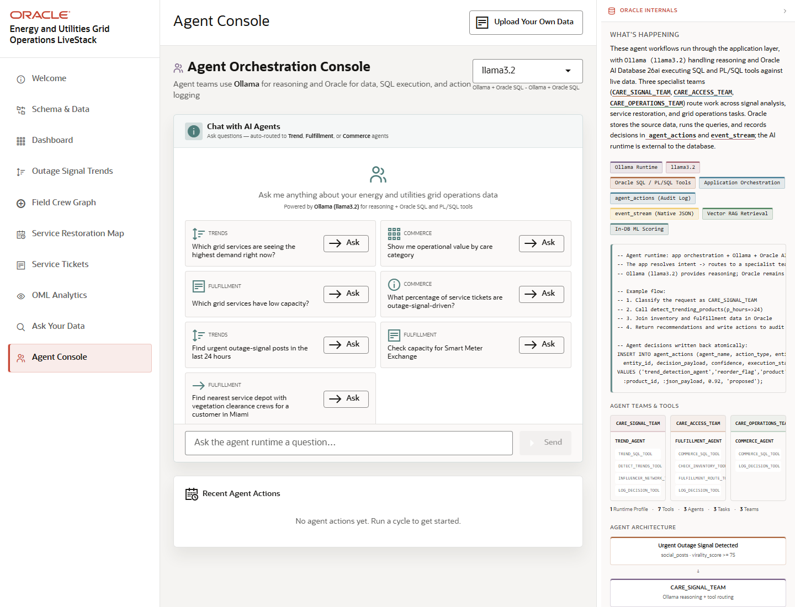

# Scene 10 Agent Console and Operational Actions

## Introduction

This scene demonstrates agent-assisted grid operations. It combines chat, runtime profile selection, trend detection, action logging, and JSON event audit records.

Estimated Time: 8 minutes

### Objectives

In this lab, you will:
- Open the Agent Console workflow.
- Chat with the AI agent runtime.
- Run or review agent actions and explain the audit trail.

## Task 1: Chat with the operations agents

1. Click **Agent Console** in the sidebar.
2. Review the selected runtime profile and the example questions.
3. Type a question such as `What outage signals need attention today?` and click **Send**.

Expected result:
- The chat panel sends the question to the agent route.
- With the full stack running, the response can use Oracle-backed tools and return an operator-oriented answer.
## Task 2: Review actions and auditability

1. Click the available trend-detection or run-cycle action if it is shown.
2. Review the recent action cards and event stream evidence.
3. Compare the visible action trail with the Oracle Internals diagram.

Expected result:
- Agent activity is visible as business actions, not just as chat text.
- The scene connects agent reasoning, tool routing, vector retrieval, in-database ML scoring, agent_actions, and event_stream records.

## Task 3: Why this matters?

The agent console is the closing operator story: AI can assist decisions, but the actions and evidence still land in a governed Oracle-backed workflow.

## Credits & Build Notes
- **Author** - Oracle LiveStack Team
- **Last Updated By/Date** - Oracle LiveStack Team, 2026-05-13
