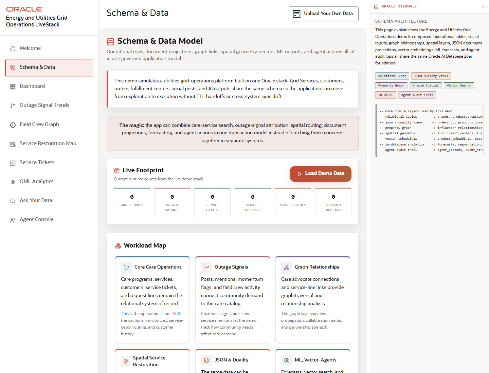

# Scene 2 Schema and Data Model

## Introduction

This scene explains how the utilities demo data is modeled across the converged Oracle database. It gives the presenter a clean bridge from business workflow to relational tables, JSON duality views, graph, vector, spatial, ML, and agent audit tables.

Estimated Time: 8 minutes

### Objectives

In this lab, you will:
- Open the schema and data page from the sidebar.
- Inspect the capability groups and flow cards.
- Connect each visible workload to a later operator scene.

## Task 1: Review the converged data model

1. Click **Schema & Data** in the sidebar.
2. Review the capability badges at the top of the page.
3. Inspect the model cards and note which database capability supports each operator workflow.

Expected result:
- The page shows the LiveStack as one data model, not a set of separate engines.
- The presenter can point from schema groups to the Dashboard, Outage Signal Trends, Field Crew Graph, Service Restoration Map, Service Tickets, OML Analytics, Ask Your Data, and Agent Console scenes.
## Task 2: Use the page as the architecture anchor

1. Open the Oracle Internals panel on the right if it is collapsed.
2. Review the SQL blocks and diagram boxes for the selected data model area.
3. Compare the business object names in the UI with the underlying tables and views.

Expected result:
- The audience sees how the UI is backed by real Oracle schema objects.
- The architecture explanation remains tied to the visible utilities workflows.

## Task 3: Why this matters?

The schema scene reduces hand-waving. It proves that grid operations, service tickets, customer signals, and AI workflows are grounded in a shared Oracle data layer.

## Credits & Build Notes
- **Author** - Oracle LiveStack Team
- **Last Updated By/Date** - Oracle LiveStack Team, 2026-05-13
