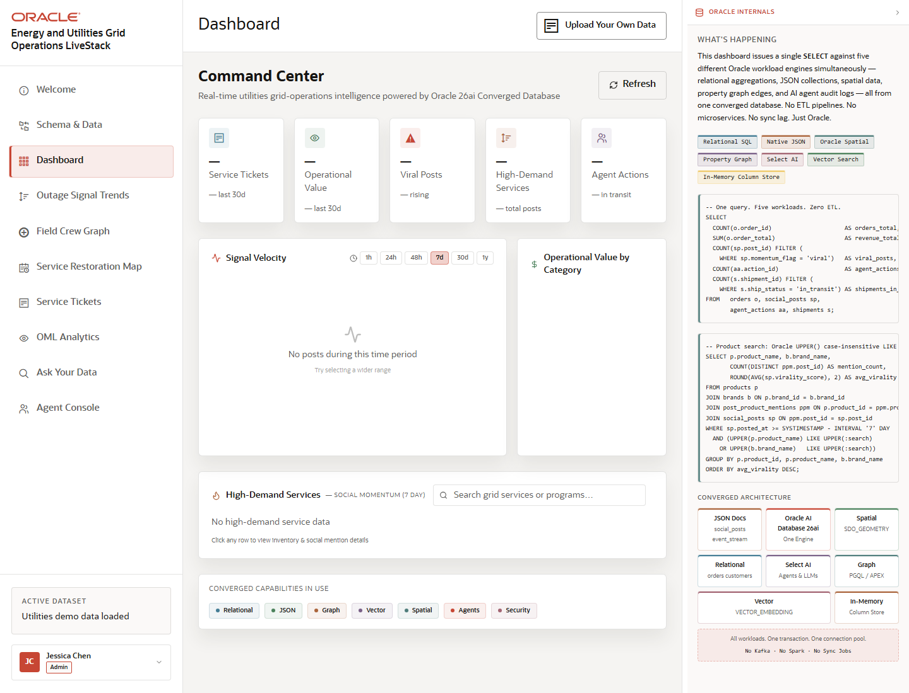

# Scene 3 Command Center Dashboard

## Introduction

This scene is the operator command center. It combines service ticket volume, operational value, viral outage signals, high-demand services, and agent actions into a single executive view.

Estimated Time: 8 minutes

### Objectives

In this lab, you will:
- Open the dashboard and read the KPI cards.
- Refresh the view and inspect signal velocity and high-demand services.
- Use the Oracle Internals panel to explain the combined SQL workloads.

## Task 1: Open the command center

1. Click **Dashboard** in the sidebar.
2. Review the KPI cards across the top of the page.
3. Inspect **Signal Velocity**, **Operational Value by Category**, and **High-Demand Services**.

Expected result:
- The command center gives a quick operational health readout.
- The right panel explains that the dashboard combines relational SQL, JSON, spatial, graph, Select AI, vector, and in-memory workloads.
## Task 2: Refresh and filter the operational view

1. Click **Refresh**.
2. Select a signal velocity window such as **7d** or **30d**.
3. Search the high-demand services list for a grid service or program term.

Expected result:
- The visible panels update or hold their current empty state if the backend is not connected.
- With the full stack running, the search narrows high-demand grid services and supports service-planning discussion.

## Task 3: Why this matters?

The dashboard lets a presenter start from business urgency. It shows how multiple Oracle workloads can answer one command-center question without moving data into separate systems.

## Credits & Build Notes
- **Author** - Oracle LiveStack Team
- **Last Updated By/Date** - Oracle LiveStack Team, 2026-05-13
