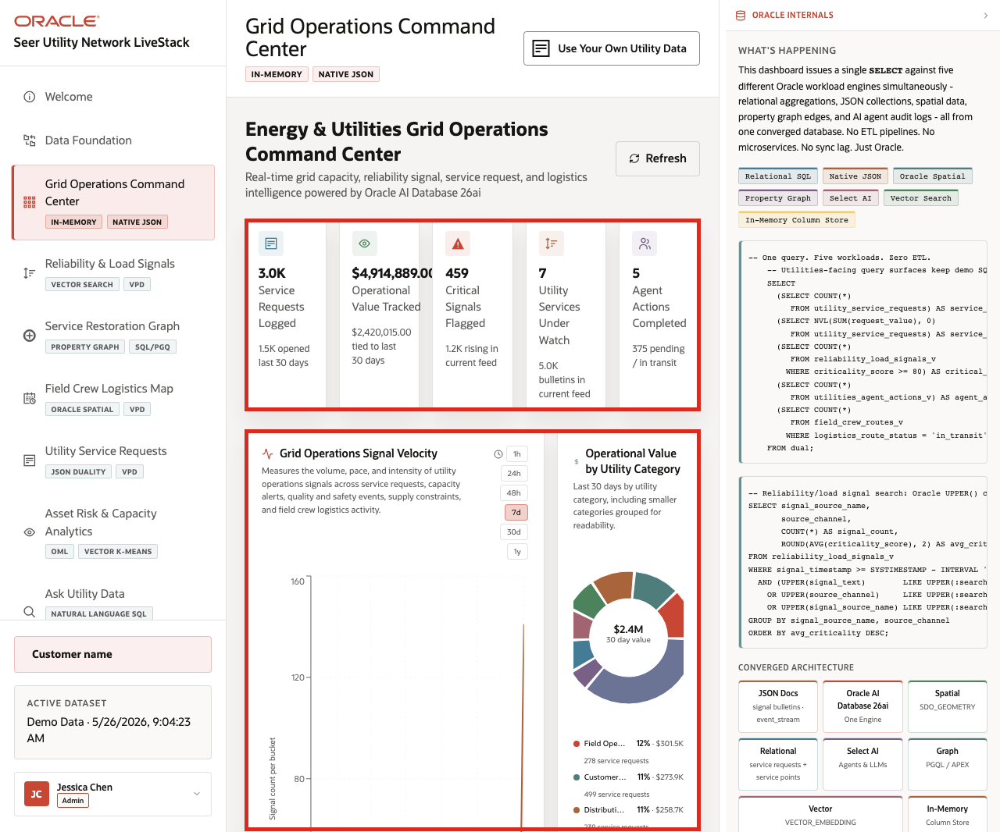
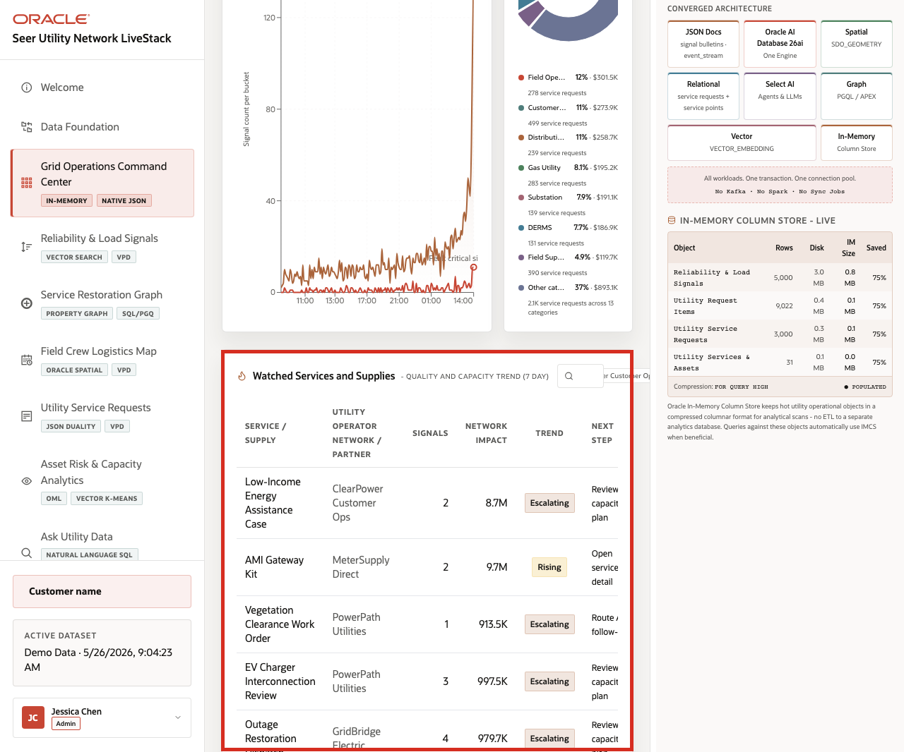

# Scene 3 Grid Operations Command Center

## Introduction

The Grid Operations Command Center is built for a utility operations leader, control center manager, reliability planner, customer operations lead, or field service coordinator who needs a daily operating view of service demand, operational value, critical signals, watched utility services, and AI-assisted actions. The goal is to see where the service territory is under pressure before the issue becomes a separate outage, customer escalation, or field crew bottleneck.

Dashboards like this are difficult to implement when customer accounts, service points, smart meter events, reliability bulletins, service requests, field crew capacity, and agent activity live in different systems. Teams often need copied extracts, separate BI models, and reconciliation logic before a dashboard can show a trustworthy view.

Oracle AI Database helps address that challenge by keeping operational, analytical, JSON, in-memory, and AI-ready data close to the same governed data foundation. In this scene, the dashboard brings together utility KPIs, signal velocity, operational value, and watched services without sending the user to another application.

Estimated Time: 10 minutes

### Objectives

In this scene, you will:
- Review the command center as a utility operations user.
- Interpret the KPI cards, grid operations signal velocity chart, operational value chart, and watched services table.
- Change the signal velocity time window.
- Search or filter watched utility services and supplies.
- Use the **Oracle Internals** sidebar to explain why this dashboard can stay connected to governed Oracle data.

## Task 1: Review the command center dashboard

1. Click **Grid Operations Command Center** in the sidebar.
2. Review the KPI cards across the top of the page.
3. Review **Grid Operations Signal Velocity**.
4. Review **Operational Value by Utility Category**.
5. Review **Watched Services and Supplies - Quality and Capacity Trend**.

    

6. Open or review the **Oracle Internals** sidebar on the right.

Use the opening view to frame the command center as a triage surface. The user can see service request volume, operational value, critical reliability signals, watched utility services, and AI activity in one place. In the captured hosted app, the dashboard shows service request volume, more than $4.9M in operational value tracked, 459 critical signals, seven watched utility services, and five completed agent actions.

## Task 2: Interpret signal velocity and operational value

1. Click a signal velocity time range such as **24h**, **48h**, **7d**, **30d**, or **1y**.
2. Review how the signal chart changes by time bucket.
3. Review the operational value chart by utility category.
4. Focus the conversation on utility categories such as advanced metering, distribution automation, reliability, field operations, gas utility, and critical load support.

    

This is the business story to emphasize: utility users need to know where value, volume, and risk are moving together. A category with high operational value and rising reliability signals may need a different response than a lower-value category with stable capacity.

## Task 3: Review watched services and supplies

1. Scroll to **Watched Services and Supplies**.
2. Use the watched services search box when rows are available.
3. Review the table columns for utility service, operator or partner, signal count, network impact, trend, and next step.

    

The watched services table turns the KPI story into a set of operating decisions. A utility leader can move from "critical signals are high" to the specific service, asset program, field partner, or customer operation that needs review.

You can move to the next scene.

## Credits & Build Notes
- **Author** - Oracle LiveLabs Team
- **Last Updated By/Date** - Oracle LiveLabs Team, 2026-05-26
