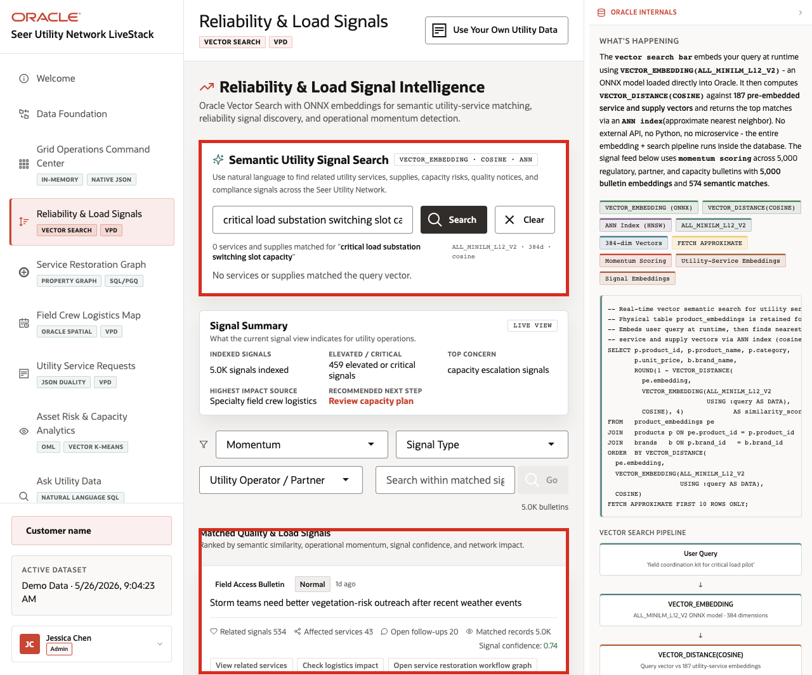

# Scene 4 Reliability and Load Signal Intelligence

## Introduction

A reliability engineer, load operations analyst, customer operations lead, or control center user uses this page to understand what utility signals are saying before the risk is obvious in service request volume alone. This persona is looking for patterns in capacity alerts, outage notes, smart meter anomalies, compliance updates, field access constraints, community signals, and utility-service mentions. The goal is to connect operational language to affected services quickly enough to act.

Semantic search is difficult to implement when signals, utility-service catalogs, embeddings, search indexes, and access policies live in separate systems. Utility teams often have to move operational text into external search services, synchronize vector indexes, and then rebuild access control outside the database.

Oracle AI Database helps address these challenges by keeping vector search close to the governed utility data. In this LiveStack Demo, the page uses natural-language search over service and signal embeddings, shows match evidence, and keeps the operating feed tied to database access policies.

Estimated Time: 10 minutes

### Objectives

In this scene, you will:
- Review the **Reliability & Load Signal Intelligence** workspace.
- Run or discuss a semantic search for a utility operations phrase.
- Inspect matched utility services, supplies, and signal evidence when results are available.
- Review the signal summary and matched quality and load signal cards.
- Understand why vector search and governed access matter for utility signal discovery.

## Task 1: Review the signal feed

1. Click **Reliability & Load Signals** in the sidebar.
2. Review **Semantic Utility Signal Search** at the top of the page.
3. Review the example query chips, including **critical load substation switching slot capacity**, **field access constraints for storm restoration**, **transformer sensor supply alternative**, and **smart meter voltage anomaly follow-up**.
4. Review the **Signal Summary** cards.
5. Review **Matched Quality & Load Signals** below the summary.

    

In the captured hosted app, the page reports **5.0K** indexed signal bulletins, **459** elevated or critical signals, capacity escalation as the top concern, and a matched signal feed with affected services, open follow-ups, and action labels. Use this as the bridge between raw operational text and governed utility intelligence.

## Task 2: Run semantic utility-service search

1. Click the **critical load substation switching slot capacity** example query chip, or enter that phrase in the search field.
2. Click **Search** when the search action is enabled.

    

3. Review the service and supply match count returned above the signal summary.
4. Review the matched signal cards below the filters.
5. Use examples such as transformer load assessment, smart meter exchange, field access constraint, and vegetation clearance to explain that this is semantic matching, not simple keyword matching.

The value of vector search is that a user can type the way an operator talks about a reliability issue and still find related services, supplies, and signals that use different vocabulary.

## Task 3: Interpret the signal cards

1. Scroll to **Matched Quality & Load Signals**.
2. Review signal type, criticality, source, network impact, match score, related signals, affected services, and open follow-ups when cards are populated.
3. Use action labels such as checking logistics impact, opening the restoration graph, or routing compliance follow-up to explain where the operator could go next.

    

The value of Oracle AI Database is that operational text can become searchable utility intelligence without leaving the governed data platform. Vector search helps users find related signals by meaning, while the Oracle-backed application still shows source, score, and operating context.

You can move to the next scene.

## Credits & Build Notes
- **Author** - Oracle LiveLabs Team
- **Last Updated By/Date** - Oracle LiveLabs Team, 2026-05-26
