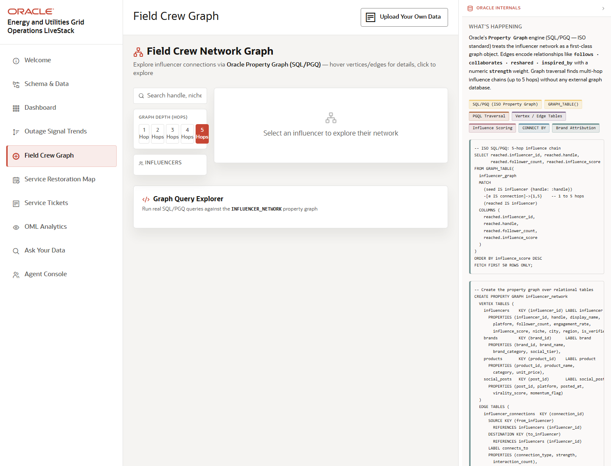

# Scene 5 Field Crew Graph

## Introduction

This scene shows relationship analysis for field crews, service advocates, and propagated grid signals. It uses graph concepts to explain why some signals travel faster or matter more operationally.

Estimated Time: 8 minutes

### Objectives

In this lab, you will:
- Open the graph workflow and inspect the network controls.
- Search or select a field crew or influencer node.
- Run example graph queries to explain propagation paths.

## Task 1: Inspect the graph network

1. Click **Field Crew Graph** in the sidebar.
2. Use the search box to find a handle, niche, or crew name when graph data is loaded.
3. Select a node and change the network depth to compare one-hop and multi-hop context.

Expected result:
- The graph view focuses on relationship context rather than only individual records.
- The selected network helps explain who can amplify or resolve an outage signal.
## Task 2: Run graph examples

1. Review the example graph query area.
2. Select an available example and click its run action.
3. Compare the result with the visible network and the SQL evidence panel.

Expected result:
- The audience sees graph traversal as an operator tool, not an abstract model.
- The Oracle Internals panel highlights SQL/PGQ, GRAPH_TABLE, PGQL traversal, and vertex or edge tables.

## Task 3: Why this matters?

Outage response depends on relationships: crews, regions, advocates, and signal paths. Graph analysis helps the operator understand influence and propagation while staying in the same database platform.

## Credits & Build Notes
- **Author** - Oracle LiveStack Team
- **Last Updated By/Date** - Oracle LiveStack Team, 2026-05-13
