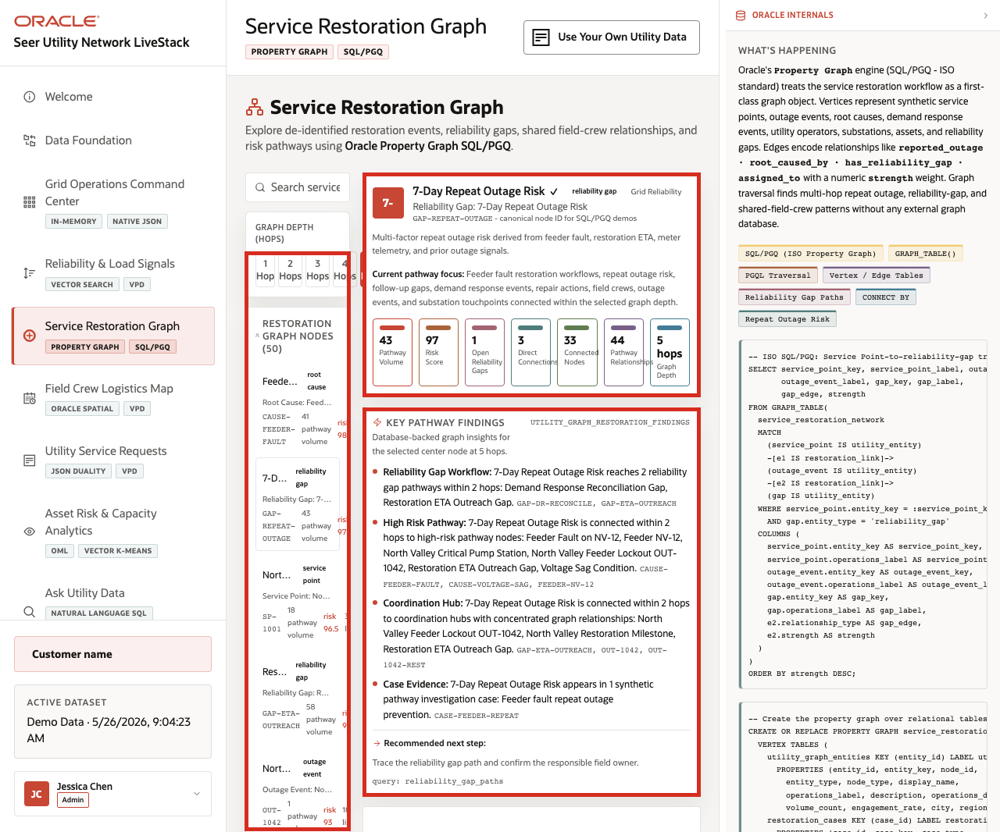
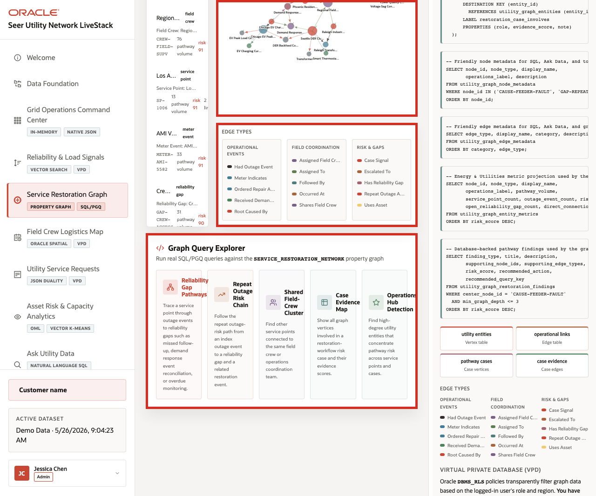

# Scene 5 Service Restoration Graph

## Introduction

A restoration manager, reliability engineer, asset operations analyst, or data architect uses this page to understand grid relationships that are hard to see in isolated rows. The persona needs to reason across service points, outage events, substations, feeders, meter events, field crews, demand response actions, reliability gaps, and root causes.

This is difficult when relationship analysis requires data movement into a separate graph database or offline notebook. Utility users may know there is a repeat outage risk, but they need to see how service points, assets, crews, root causes, and reliability gaps connect without losing governance.

Oracle AI Database helps address these challenges by supporting graph analysis over the operational utility schema. In this scene, the application exposes service restoration relationships while the sidebar explains the Oracle Property Graph and SQL/PGQ pattern behind the view.

Estimated Time: 10 minutes

### Objectives

In this scene, you will:
- Review the **Service Restoration Graph** workspace.
- Inspect graph depth controls and the restoration graph node list.
- Focus on concrete repeat-outage and reliability-gap nodes.
- Explain how graph relationships help identify connected restoration risk.
- Connect the user-facing graph to Oracle Property Graph and SQL/PGQ.

## Task 1: Review the graph workspace

1. Click **Service Restoration Graph** in the sidebar.
2. Review the graph depth controls: **1 Hop**, **2 Hops**, **3 Hops**, **4 Hops**, and **5 Hops**.
3. Review the search field for service point, outage event, asset, root cause, or field crew lookup.
4. Review **Restoration Graph Nodes**.
5. Open or review the **Oracle Internals** sidebar on the right.

    

In the captured demo dataset, the page shows **50** restoration graph nodes. Visible nodes include **Feeder Fault on NV-12**, **7-Day Repeat Outage Risk**, **North Valley Critical Pump Station**, **Restoration ETA Outreach Gap**, **North Valley Feeder Lockout OUT-1042**, **Feeder NV-12**, **Regional Field Supervisor Team**, and **AMI Voltage Event 5582**.

## Task 2: Explore a restoration-risk example

1. In the node list, locate **7-Day Repeat Outage Risk** or another high-risk restoration node.
2. Review the node type, identifier, pathway volume, risk score, and link count.
3. Compare it with nearby reliability-gap and asset nodes such as **7-Day Repeat Outage Risk**, **Feeder NV-12**, and **North Valley Feeder Lockout OUT-1042**.
4. Change the graph depth from **1 Hop** to **2 Hops** or **3 Hops** to explain how relationship scope changes.

    

Use this example to explain why graph context matters. A service point, feeder, substation, meter event, crew, and root cause are more informative together than as independent records. The graph view helps the operator see the restoration pathway as connected evidence.

## Task 3: Explain the Oracle graph pattern

1. Review the **Graph Query Explorer** area.
2. Review the Oracle Internals content that references property graph and SQL/PGQ.
3. Explain that the graph is an analysis view over governed utility data rather than a disconnected copy.

    

The value of Oracle AI Database is that utility teams can ask relationship-aware questions inside the same governed platform that stores the operational data. That reduces data movement and lets the graph story stay connected to the rest of the demo.

You can move to the next scene.

## Credits & Build Notes
- **Author** - Oracle LiveLabs Team
- **Last Updated By/Date** - Oracle LiveLabs Team, 2026-05-26
