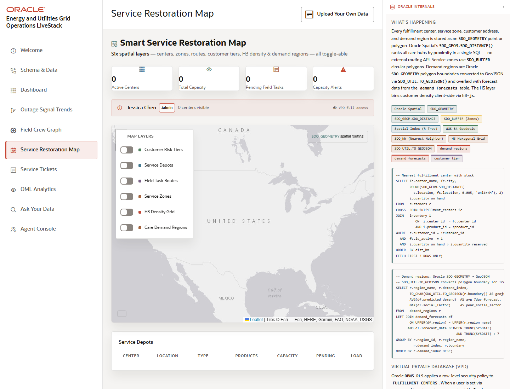

# Scene 6 Service Restoration Map

## Introduction

This scene uses spatial data to plan restoration and capacity routing. The map brings together service depots, service zones, customer risk tiers, demand regions, inventory alerts, and shipment status.

Estimated Time: 8 minutes

### Objectives

In this lab, you will:
- Open the restoration map workflow.
- Toggle spatial layers and compare service coverage.
- Use the map to explain where restoration capacity or routing pressure appears.

## Task 1: Review service coverage layers

1. Click **Service Restoration Map** in the sidebar.
2. Inspect the map and the layer controls.
3. Toggle service depots, service zones, customer tiers, H3 density, and demand regions when they are available.

Expected result:
- The map gives the operator a geospatial view of restoration coverage.
- The right panel explains Oracle Spatial, SDO_GEOMETRY, SDO_DISTANCE, SDO_BUFFER, spatial indexes, and H3 demand grids.
## Task 2: Use the map for routing discussion

1. Review **Service Depots** and demand-region panels.
2. Compare inventory or capacity alerts with the visible geography.
3. Explain which region should receive attention first and why.

Expected result:
- The operator can connect location, risk, and capacity into a routing decision.
- With the full stack running, spatial data and forecast joins supply the evidence behind the recommendation.

## Task 3: Why this matters?

Restoration is a location problem as much as a ticket problem. Spatial analysis gives the team a way to balance proximity, capacity, and customer risk.

## Credits & Build Notes
- **Author** - Oracle LiveStack Team
- **Last Updated By/Date** - Oracle LiveStack Team, 2026-05-13
