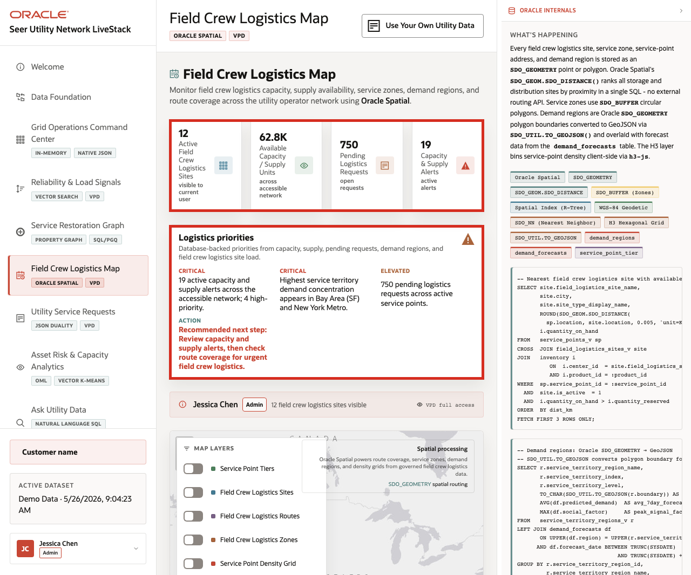
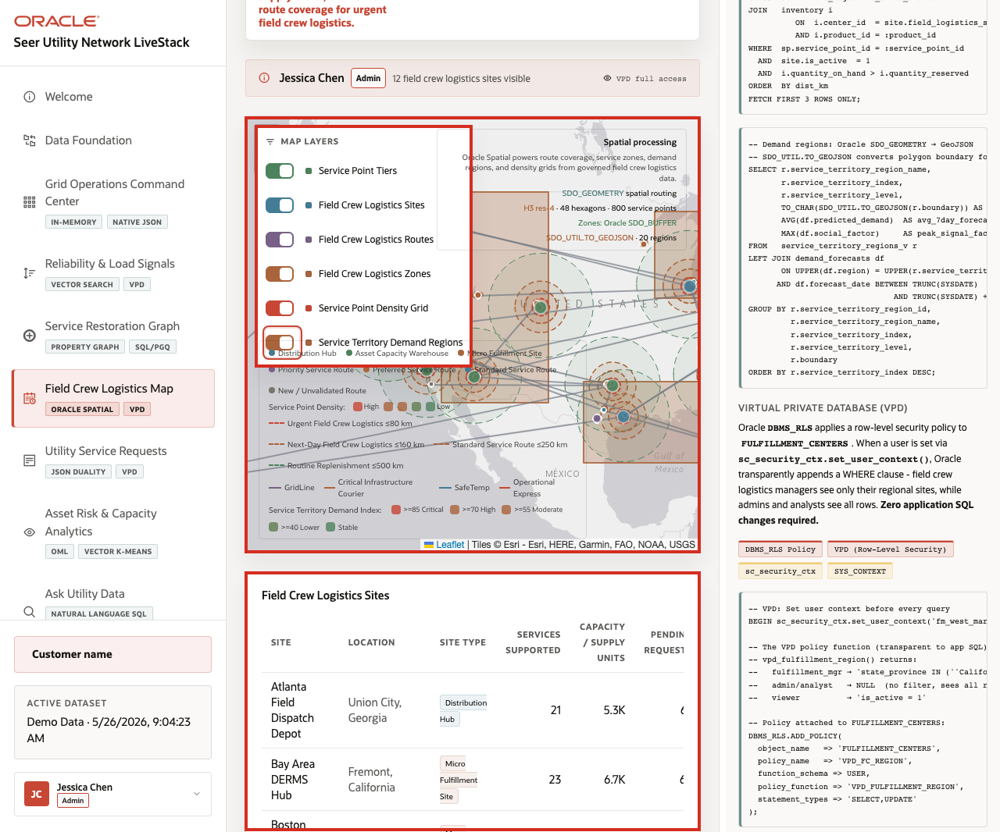

# Scene 6 Field Crew Logistics Map

## Introduction

A field crew logistics manager, outage response lead, distribution operations planner, or customer operations coordinator uses this page to understand where service demand, field crew capacity, supply availability, route coverage, and customer risk intersect. This persona needs a geographic operating view, not just a list of depots.

Location-aware utility decisions are difficult when service points, logistics sites, routes, service zones, density grids, and demand regions live outside the operational data platform. Teams may export to a GIS tool, but then lose the connection to current service requests, capacity levels, access controls, and operational status.

Oracle AI Database helps address these challenges by keeping spatial geometry and operational records together. In this scene, Oracle Spatial powers field crew logistics sites, routes, service zones, service territory demand regions, and proximity context in the same application that manages the rest of the utility data.

Estimated Time: 10 minutes

### Objectives

In this scene, you will:
- Review the **Field Crew Logistics Map** as a geographic operating view.
- Interpret the capacity, pending request, and alert cards.
- Toggle map layers for service points, logistics sites, routes, zones, density, and demand regions.
- Compare map evidence with the field crew logistics site table.
- Explain how Oracle Spatial supports location-aware utility decisions.

## Task 1: Review logistics priorities

1. Click **Field Crew Logistics Map** in the sidebar.
2. Review the stat cards across the top of the page.
3. Review **Logistics priorities** to the right of the cards.
4. Review the active user and VPD banner.

    

In the captured demo dataset, the page shows **12** active field crew logistics sites visible to the current user, about **62.8K** available capacity or supply units, **750** pending logistics requests, and **19** active capacity and supply alerts. The priority panel flags high-priority alerts, demand concentration in **Bay Area (SF)** and **New York Metro**, and a recommendation to review capacity and supply alerts before checking route coverage.

## Task 2: Toggle spatial layers

1. Review the map and its layer controls.
2. Toggle **Service Point Tiers**.
3. Toggle **Field Crew Logistics Sites**, **Field Crew Logistics Routes**, and **Field Crew Logistics Zones**.
4. Toggle **Service Point Density Grid** and **Service Territory Demand Regions**.
5. Review how the map changes as layers are added or removed.

    

The layer controls make the same map useful for different questions. A control center user may start with service territory demand regions and density. A field coordinator may focus on logistics sites and routes. A reliability user may compare service zones with capacity alerts.

## Task 3: Compare site data with the map

1. Scroll to the **Field Crew Logistics Sites** table.
2. Review columns for site location, site type, services supported, capacity or supply units, pending requests, alerts, current load, and status.
3. Focus on visible sites such as **Atlanta Field Dispatch Depot**, **Bay Area DERMS Hub**, **Boston Water Response Center**, **Chicago Midwest Restoration Hub**, and **Dallas Distribution Operations Center**.
4. Use the table to connect map markers to concrete operating records.

    

The value of Oracle AI Database is that location intelligence is not detached from the operational data. Oracle Spatial can support route coverage and proximity analysis while the application still shows capacity, requests, alerts, and VPD-aware access from the same data foundation.

You can move to the next scene.

## Credits & Build Notes
- **Author** - Oracle LiveLabs Team
- **Last Updated By/Date** - Oracle LiveLabs Team, 2026-05-26
