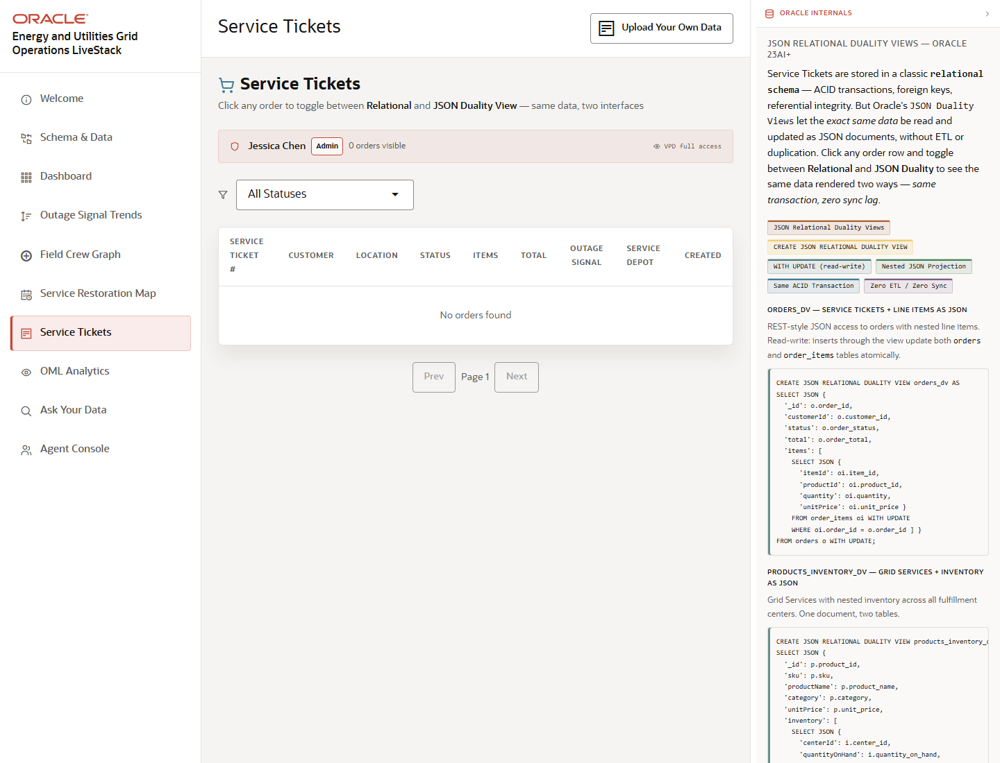

# Scene 7 Service Tickets and JSON Duality

## Introduction

This scene demonstrates service tickets as both relational transactions and JSON documents. It is the cleanest way to explain JSON relational duality views in an operational context.

Estimated Time: 8 minutes

### Objectives

In this lab, you will:
- Open the service-ticket workflow.
- Filter and page through ticket records.
- Inspect a ticket detail view and compare relational and JSON representations.

## Task 1: Review service tickets

1. Click **Service Tickets** in the sidebar.
2. Use the status filter to select a status such as pending, processing, shipped, or delivered when data is loaded.
3. Click **Next** or **Prev** to page through the ticket list.

Expected result:
- The list shows ticket status and supports routine operator triage.
- The page stays within the same user context used by the VPD controls.
## Task 2: Inspect JSON duality evidence

1. Open a ticket detail when records are available.
2. Switch between detail tabs such as summary, JSON document, or route information.
3. Click **Copy** on a JSON block if you want to show the document payload to the audience.

Expected result:
- The same business object can be discussed as normalized tables or as a JSON document.
- The Oracle Internals panel connects the UI to JSON Relational Duality Views with zero ETL or sync lag.

## Task 3: Why this matters?

JSON duality is powerful when it solves a familiar problem: operators need document-style payloads while the business still needs ACID relational integrity.

## Credits & Build Notes
- **Author** - Oracle LiveStack Team
- **Last Updated By/Date** - Oracle LiveStack Team, 2026-05-13
