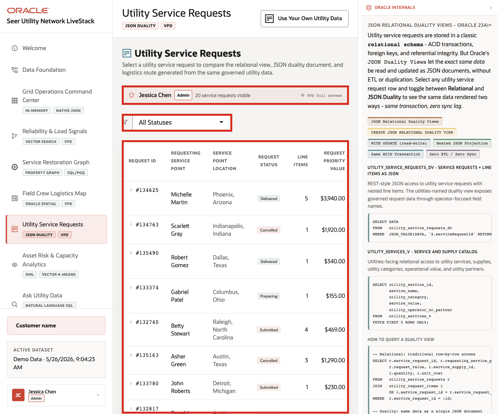
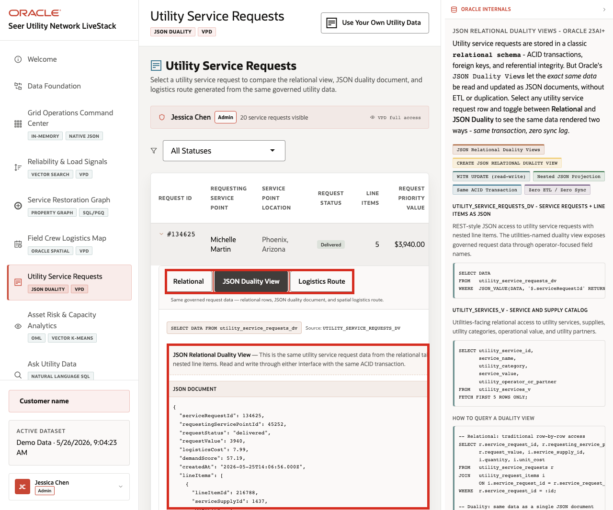

# Scene 7 Utility Service Requests

## Introduction

A service request operations manager, field logistics coordinator, customer support lead, or application architect uses this page to understand the same utility transaction from multiple angles. The persona needs a reliable operational list, relational line-item detail, API-friendly JSON document access, and spatial logistics route context.

This is difficult to implement when request headers, line items, service points, logistics sites, shipment state, and API payloads are handled in separate systems. Each copy creates synchronization risk and extra engineering work when the request model changes.

Oracle AI Database helps address these challenges by keeping the utility service request record in one governed platform while exposing it through the shape each workflow needs. Relational tables provide transactional detail. JSON Relational Duality Views expose the same request as a nested JSON document. Oracle Spatial adds logistics route and distance context.

Estimated Time: 10 minutes

### Objectives

In this scene, you will:
- Review the **Utility Service Requests** page and active request table.
- Inspect a specific request row.
- Open the same request as relational operational detail when the detail panel finishes loading.
- Compare that same request with the JSON document returned by the utility service request duality view.
- Review the logistics route and spatial context for the request.

## Task 1: Review the service request workspace

1. Click **Utility Service Requests** in the sidebar.
2. Review the active user banner. The current demo user is **Jessica Chen**, with **Admin** access and **20** visible service requests on the page.
3. Review the status filter.
4. Review the request table columns: request id, requesting service point, service point location, request status, line items, request priority value, reliability or load signal, field crew logistics site, and created time.
5. Focus on the first visible request in the table.

    

In the captured hosted app, the first visible request is **#134625** for **Michelle Martin** in **Phoenix, Arizona**. It is **Delivered**, has **5** line items, totals **$3,940.00**, and appears in the VPD-visible request list for the admin user. Use the visible first row as the data point for the rest of the scene.

## Task 2: Inspect the relational request detail

1. Click the first visible request row.
2. Confirm the **Relational** tab is selected.
3. Review requesting service point, service point location, request priority value, logistics cost, and line items when the detail panel loads.

    

Expected result: The relational view should show the normalized request header and line-item records. This view is useful for operations because the request header and item detail remain structured and easy to validate.

## Task 3: Compare the JSON Duality View

1. Click **JSON Duality View** in the expanded request panel.
2. Review the source label for the utility service request duality view.
3. Review the JSON document for the selected request.
4. Notice that the document should include request identifiers, service point identifiers, request status, request value, logistics cost, demand score, created timestamp, and nested line items.

    

This is the key point of the page. The JSON document is not a separate copy of the request. It is the same governed request data exposed through an Oracle JSON Relational Duality View. Application teams can use document-shaped access while operations teams continue to work with relational tables and SQL.

## Task 4: Review logistics route context

1. Click **Logistics Route** in the expanded request panel.
2. Review the field crew logistics site and service point.
3. Review distance, estimated transit, logistics cost, route status, and request progress.
4. Review the Oracle Spatial SQL example.

    

The value of Oracle AI Database is that the same request can support operations, API access, and logistics analysis without splitting the story across separate persistence layers.

You can move to the next scene.

## Credits & Build Notes
- **Author** - Oracle LiveLabs Team
- **Last Updated By/Date** - Oracle LiveLabs Team, 2026-05-26
