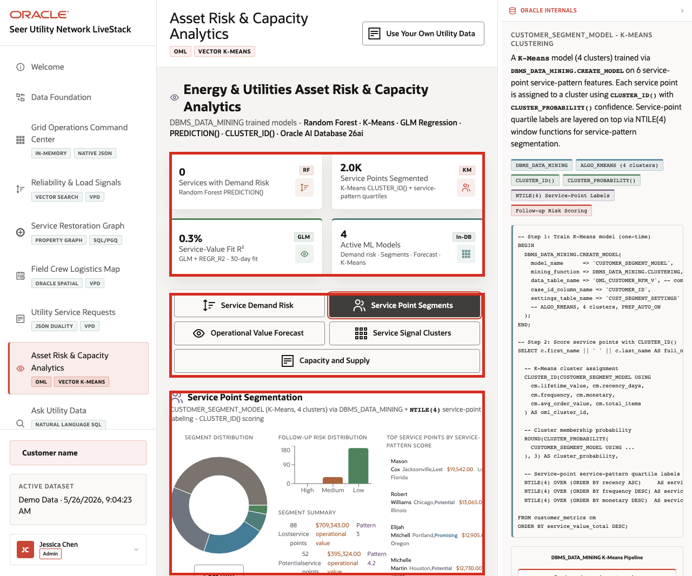
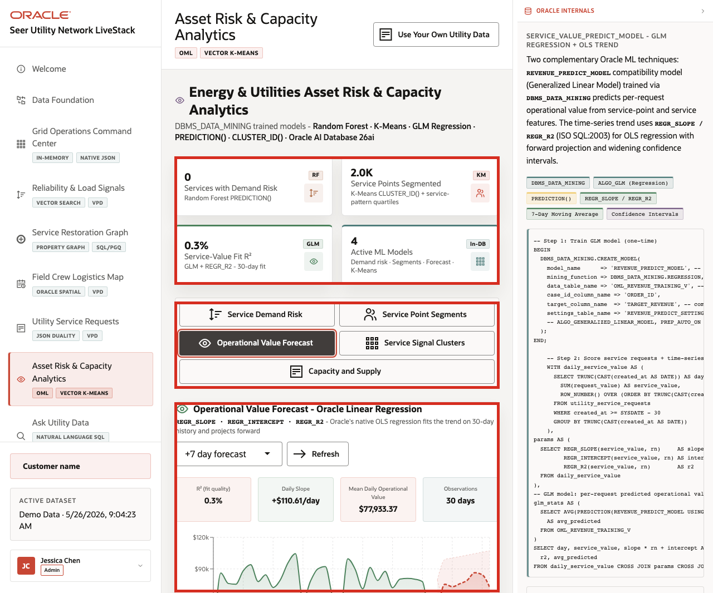
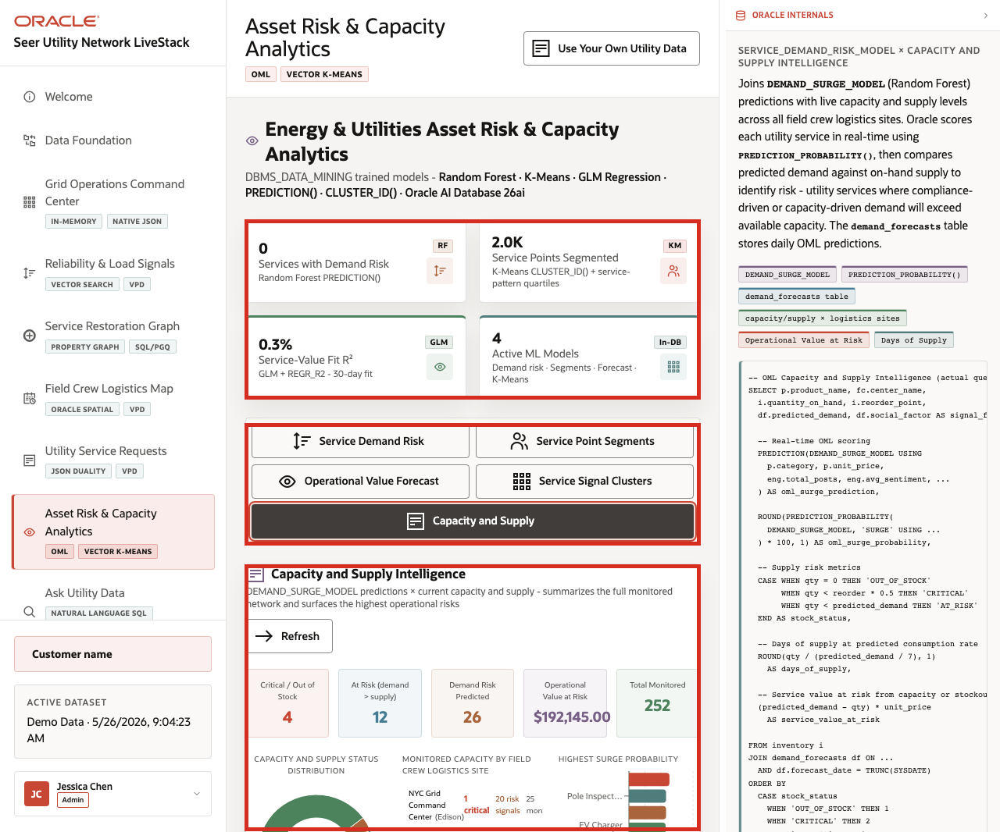

# Scene 8 Asset Risk and Capacity Analytics

## Introduction

A utility analytics manager, reliability planner, demand forecasting analyst, field operations lead, or data science stakeholder uses this page to understand which predictive signals should drive action. This persona needs to know which utility services have demand risk, how service points segment by operating pattern, whether operational value is trending, which services cluster semantically, and where capacity or supply risk needs attention.

This is difficult when predictive work is split across notebooks, exported CSV files, BI extracts, external ML services, and separate operational systems. Utility teams can lose trust in predictions when model features are stale, scoring jobs run away from live data, or the explanation behind a forecast is disconnected from the service request and capacity records that business users rely on.

Oracle AI Database helps address these challenges by keeping machine learning close to governed utility data. Oracle Machine Learning models and SQL analytics can run from the same connected data foundation that powers the rest of the LiveStack Demo.

Estimated Time: 12 minutes

### Objectives

In this scene, you will:
- Review the **Asset Risk & Capacity Analytics** workspace, KPI cards, and analytics tabs.
- Inspect **Service Demand Risk** predictions.
- Review **Service Point Segments**.
- Interpret the **Operational Value Forecast**.
- Explore **Service Signal Clusters**.
- Review **Capacity and Supply** intelligence and risk indicators.

## Task 1: Inspect Service Demand Risk

1. Click **Asset Risk & Capacity Analytics** in the sidebar.
2. Review the KPI cards at the top of the page: **Services with Demand Risk**, **Service Points Segmented**, **Service-Value Fit R2**, and **Active ML Models**.
3. Review the analytics tabs: **Service Demand Risk**, **Service Point Segments**, **Operational Value Forecast**, **Service Signal Clusters**, and **Capacity and Supply**.
4. Confirm that **Service Demand Risk** is selected.
5. Review the scoring window, **Refresh** control, and prediction output when the model returns rows.

    

In the captured demo dataset, the analytics page shows **2.0K** service points segmented, a **0.3%** service-value fit R2, and **4** active ML models. The Service Demand Risk tab surfaces a ranked prediction output with services such as outage restoration dispatch, leak detection field visits, pole inspection tickets, and EV charger interconnection reviews.

## Task 2: Review Service Point Segments

1. Click **Service Point Segments**.
2. Review the segmentation model note for K-Means and service-pattern quartiles.
3. Review the segment distribution and highest-scoring service points when the output is populated.

    

This is useful for utility operations teams because segmentation becomes operational: the team can move from a model result to the service points that need follow-up, targeted outreach, maintenance planning, demand response, or billing support.

## Task 3: Interpret Operational Value Forecast

1. Click **Operational Value Forecast**.
2. Review the forecast horizon selector and **Refresh** control.
3. Review the model quality cards and forecast chart.
4. Explain that weak model fit is also evidence: a planner should know when a trend is directional rather than strong.

    

This page helps a user connect business value and operational volume to a governed forecast path. The model output is near the service and request data it uses, not in a disconnected notebook.

## Task 4: Explore Service Signal Clusters

1. Click **Service Signal Clusters**.
2. Review the **K =** controls.
3. Review the cluster count, services clustered, embedding dimensions, and distance metric when clustering completes.
4. Review a cluster card and its related services.

    

Use this tab to explain how vector similarity can group utility services and supplies by meaning. For example, smart meter exchange, transformer load assessment, vegetation clearance, and field access signals may cluster by operational similarity even when they use different text.

## Task 5: Review Capacity and Supply

1. Click **Capacity and Supply**.
2. Review the summary cards.
3. Review the capacity and supply status distribution.
4. Review monitored capacity by field crew logistics site.
5. Scan the highest surge probability chart for services or supplies that need attention.

    

In the captured demo dataset, the tab shows **4** critical or out-of-stock items, **12** at-risk items where demand exceeds supply, **26** demand-risk predictions, about **$192,145.00** operational value at risk, and **252** monitored records. This turns model output into an operating view: the user can see which sites and services need attention before a capacity issue affects field response or customer operations.

You can move to the next scene.

## Credits & Build Notes
- **Author** - Oracle LiveLabs Team
- **Last Updated By/Date** - Oracle LiveLabs Team, 2026-05-26
