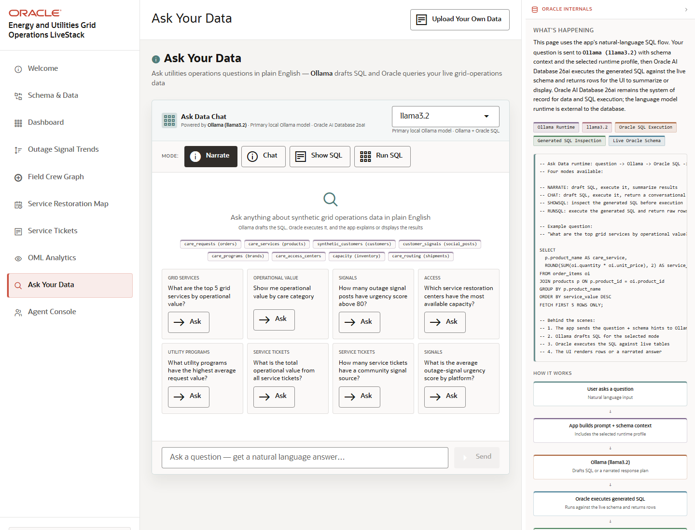

# Scene 9 Ask Your Data

## Introduction

This scene demonstrates natural-language access to the live schema. Operators can ask business questions, inspect generated SQL, run SQL, or receive a narrated answer depending on the selected mode.

Estimated Time: 8 minutes

### Objectives

In this lab, you will:
- Open the Ask Your Data workflow.
- Select a runtime profile and response mode.
- Submit a question and inspect the generated SQL or grounded response.

## Task 1: Ask a governed data question

1. Click **Ask Your Data** in the sidebar.
2. Choose a runtime profile if more than one profile is available.
3. Select **Show SQL**, **Run SQL**, **Chat**, or **Narrate**.
4. Type a question such as `Which regions have the highest restoration risk?` and click **Send**.

Expected result:
- The page sends the question through the selected profile and mode.
- With the full stack running, the response stays grounded in generated SQL and live Oracle query execution.
## Task 2: Inspect generated evidence

1. Review the generated SQL or result table.
2. Click **Ask** on one of the example questions to repeat the flow quickly.
3. Use **Clear** to reset the conversation before the next audience question.

Expected result:
- The audience sees a governed natural-language path to the utilities dataset.
- The Oracle Internals panel explains prompt construction, schema context, LLM response, SQL execution, and returned results.

## Task 3: Why this matters?

Ask Your Data makes the demo interactive. It lets the presenter turn stakeholder questions into database-grounded answers while still exposing the SQL evidence path.

## Credits & Build Notes
- **Author** - Oracle LiveStack Team
- **Last Updated By/Date** - Oracle LiveStack Team, 2026-05-13
