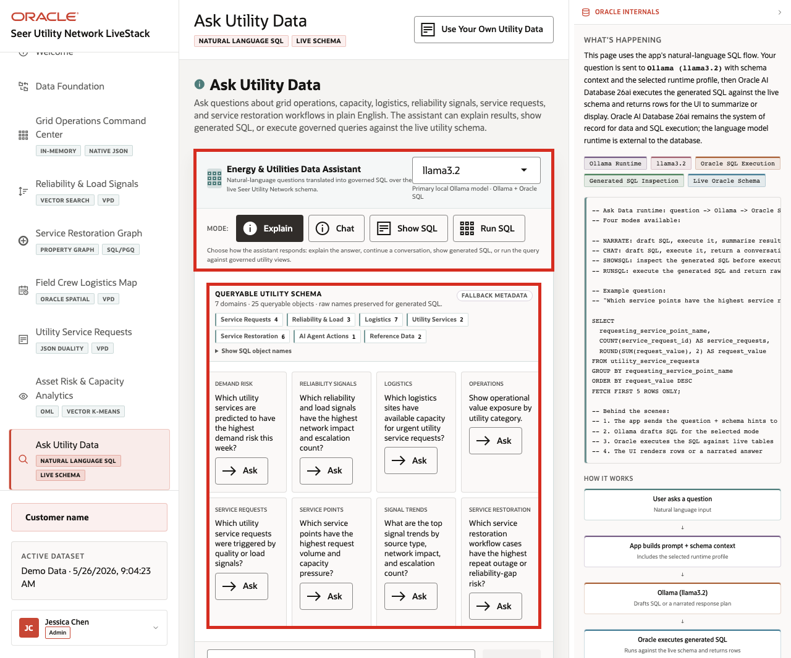
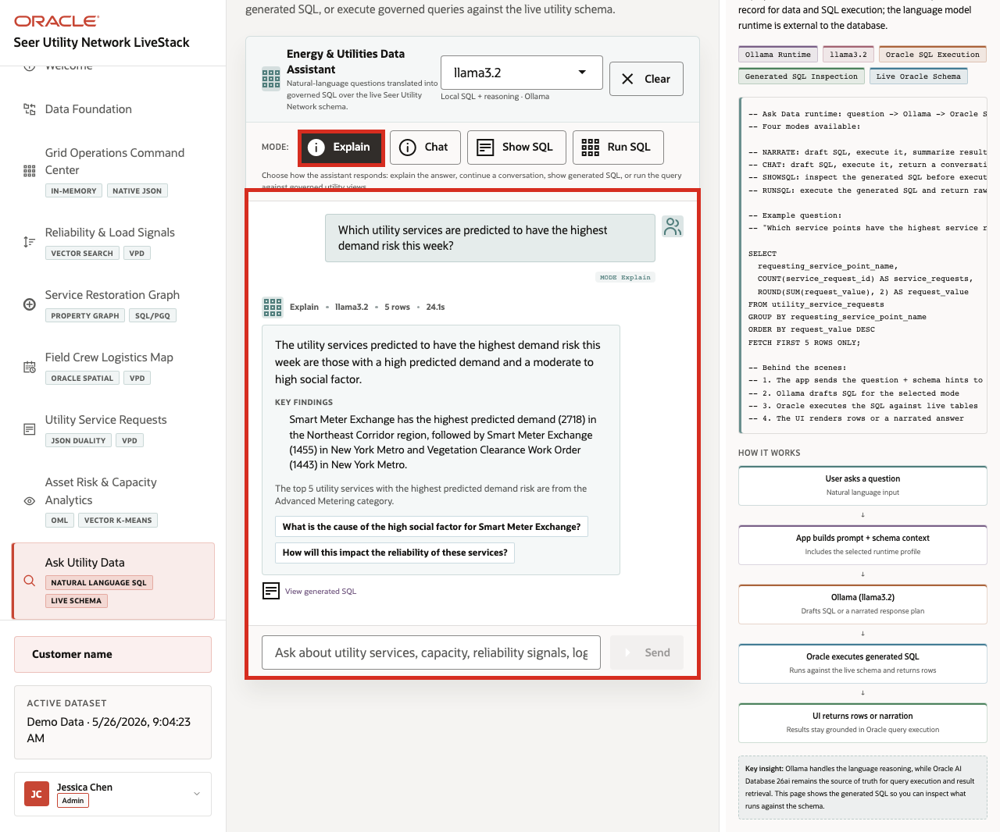
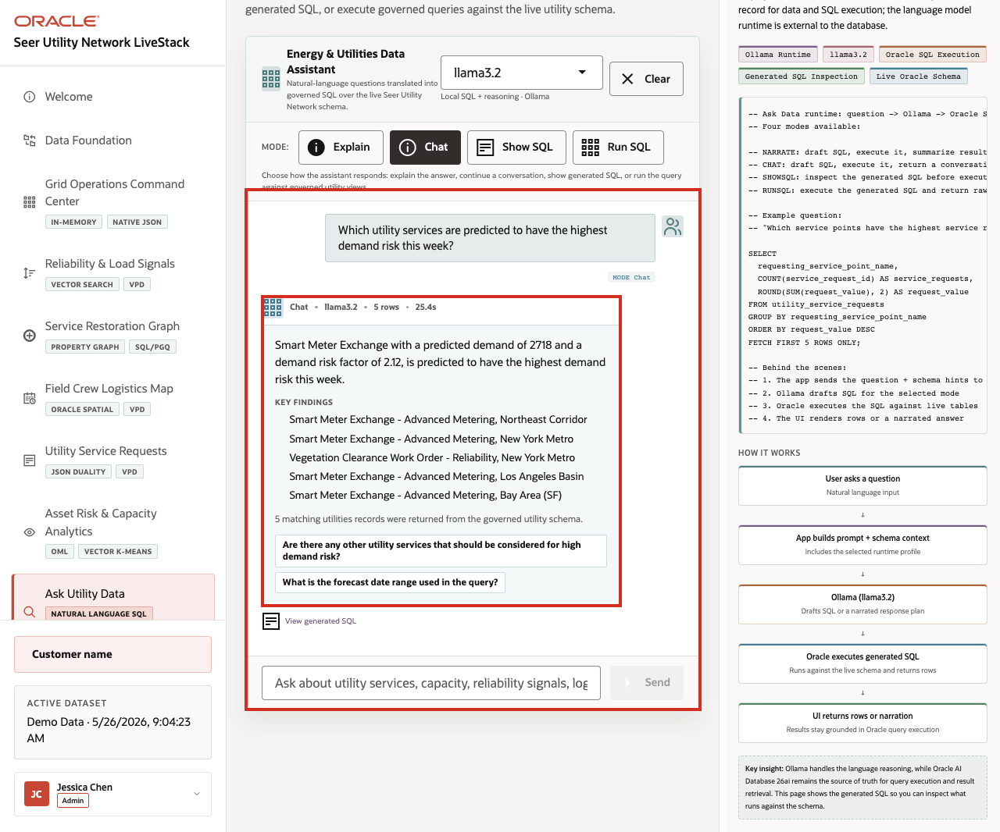
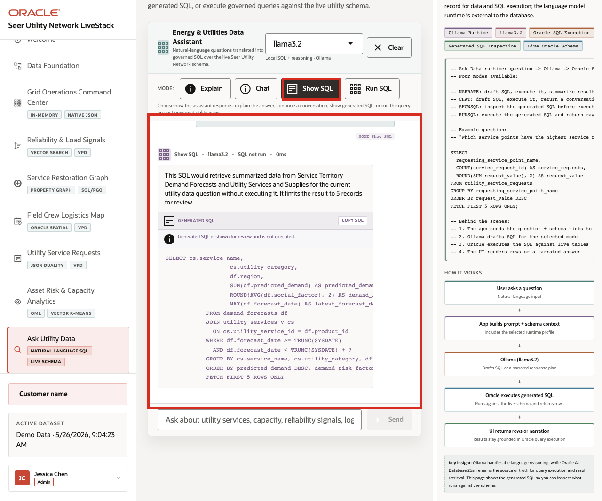
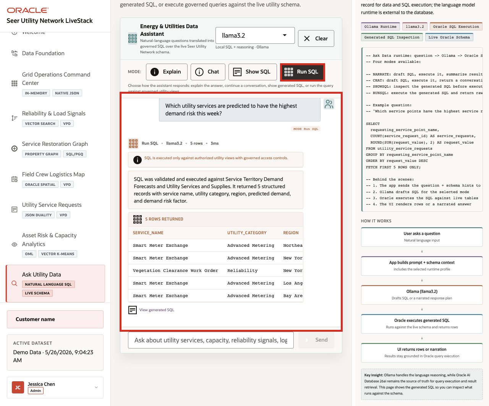

# Scene 9 Ask Utility Data

## Introduction

A utility business analyst, operations leader, reliability planner, customer operations lead, or data steward uses this page when they need an answer before a custom report can be built. The persona may understand the question clearly but not know the exact schema, joins, filters, or SQL required to answer it.

Natural-language data access can create governance risk if the language model generates invalid SQL, references the wrong tables, hides the query path, or exposes more data than the user should see. Utility teams need self-service analytics, but data teams still need traceability, read-only execution, and a clear source of truth.

Oracle AI Database helps address these challenges by keeping query execution grounded in the live utility schema. In this LiveStack Demo, the app sends the question and schema context to the local Ollama runtime, validates the generated SQL path, and uses Oracle AI Database 26ai as the execution authority.

Estimated Time: 10 minutes

### Objectives

In this scene, you will:
- Review the **Ask Utility Data** workspace, runtime profile, and modes.
- Compare **Explain**, **Chat**, **Show SQL**, and **Run SQL** against the same utility question.
- Use **Explain** to return a plain-English answer without foregrounding SQL.
- Use **Chat** to return a conversational answer with follow-up prompts.
- Use **Show SQL** to inspect generated SQL before execution.
- Use **Run SQL** to return live rows from Oracle AI Database.
- Explore a demand-risk question grounded in demand forecasts and utility services.
- Understand how natural-language analytics can remain transparent and database-governed.

## Task 1: Review the assistant workspace

1. Click **Ask Utility Data** in the sidebar.
2. Review the runtime profile in the top right of the assistant card. The captured demo uses **llama3.2** through the local Ollama runtime.
3. Review the queryable schema summary. The page shows **7** domains and **25** queryable objects.
4. Review the available modes: **Explain**, **Chat**, **Show SQL**, and **Run SQL**.
5. Review the example questions.

    

Use this opening view to explain that the assistant is not a generic chatbot. It is a governed utility data assistant that uses schema metadata and Oracle-backed query execution.

## Task 2: Use Explain mode for a narrated answer

1. Click **Explain**.
2. Click **Ask** on the **Demand Risk** question: **Which utility services are predicted to have the highest demand risk this week?**

    

Expected result: The assistant returns a narrated answer and key findings without making the generated SQL the main artifact. In the captured hosted app, the response identified **Smart Meter Exchange** as the top utility service by predicted demand, with **2,718** predicted demand and a **2.12** demand risk factor for the **Northeast Corridor**.

Use this mode when the user wants a business-readable answer first. The system still uses governed SQL behind the scenes, but the presentation is optimized for a utility analyst, reliability planner, customer operations lead, or field coordinator.

## Task 3: Use Chat mode for a conversational answer

1. Click **Clear** if the Explain result is still visible.
2. Click **Chat**.
3. Click **Ask** on the same **Demand Risk** question.

    

Expected result: The assistant returns a conversational response and follow-up prompts. In the captured hosted app, Chat mode returned **5** matching utility records and listed **Smart Meter Exchange** and **Vegetation Clearance Work Order** across regions that need attention.

Use this mode when the user is exploring the data interactively. Chat mode keeps the answer grounded in the live utility schema, but it is shaped for follow-up questions such as breaking the result down by service point or region.

## Task 4: Use Show SQL mode to inspect the query path

1. Click **Clear** if the Chat result is still visible.
2. Click **Show SQL**.
3. Click **Ask** on the same **Demand Risk** question.
4. Review the generated SQL.

    

Expected result: The generated SQL joins `demand_forecasts` with `utility_services_v`, groups by service, utility category, and region, orders by predicted demand and demand risk factor, and limits the result with `FETCH FIRST 5 ROWS ONLY`. This is the governance moment in the scene: the user can inspect the query path before asking the database to return rows.

## Task 5: Use Run SQL mode to inspect returned rows

1. Click **Clear** if the generated SQL result is still visible.
2. Click **Run SQL**.
3. Click **Ask** on the same **Demand Risk** question.
4. Review the returned table.

    

Expected result: In the captured hosted app, the question returned **5** rows. The top row was **Smart Meter Exchange** in **Advanced Metering** for the **Northeast Corridor**, with **2,718** predicted demand and a **2.12** demand risk factor. The remaining rows included Smart Meter Exchange for **New York Metro**, **Los Angeles Basin**, and **Bay Area (SF)**, plus **Vegetation Clearance Work Order** for **New York Metro**.

Use the four completed mode examples to explain the governance pattern behind the page:

1. The user asks a utility question in plain English.
2. The app builds prompt and schema context for the selected runtime profile.
3. Ollama drafts SQL or a response plan.
4. Oracle AI Database executes authorized SQL against the live schema.
5. The UI returns visible SQL, rows, or a narrated answer depending on the selected mode.

This pattern matters because utility users want faster answers, but they also need governed access. Ask Utility Data shows how natural-language analytics can support self-service exploration without hiding the query path or replacing the database as the trusted execution layer.

You can move to the next scene.

## Credits & Build Notes
- **Author** - Oracle LiveLabs Team
- **Last Updated By/Date** - Oracle LiveLabs Team, 2026-05-26
