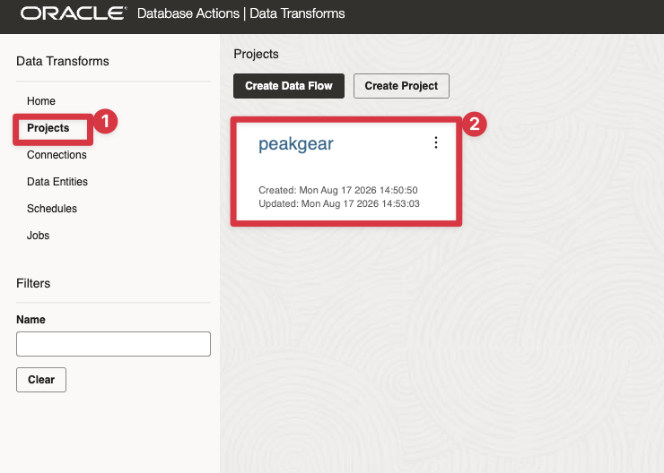
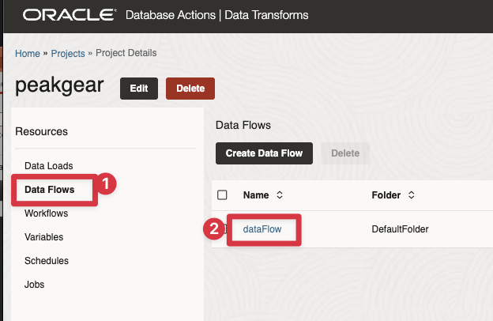
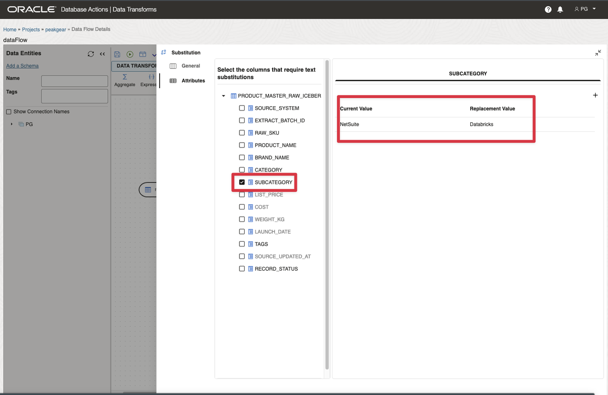
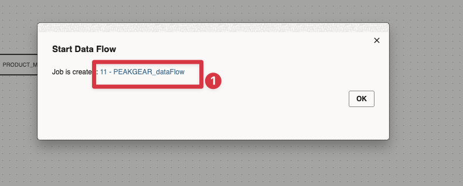
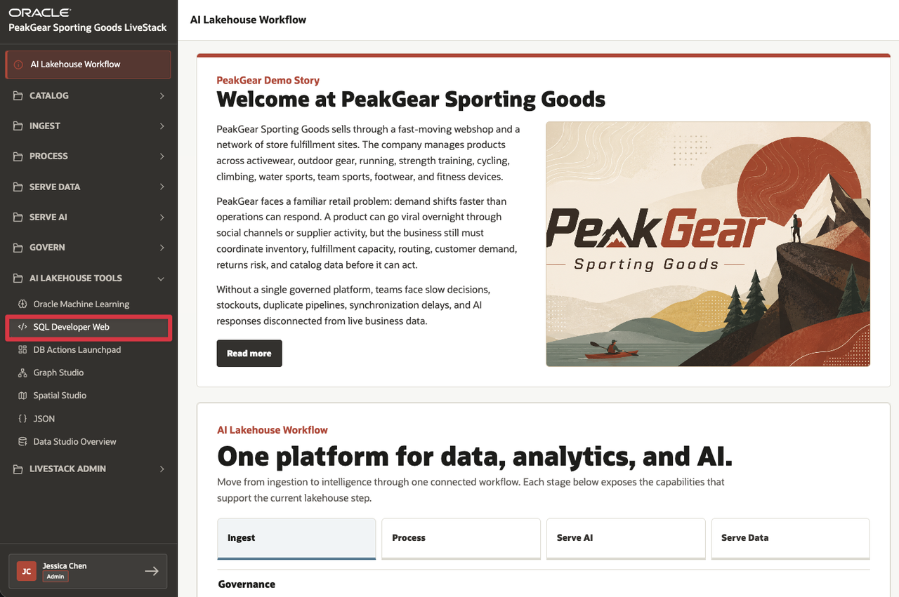
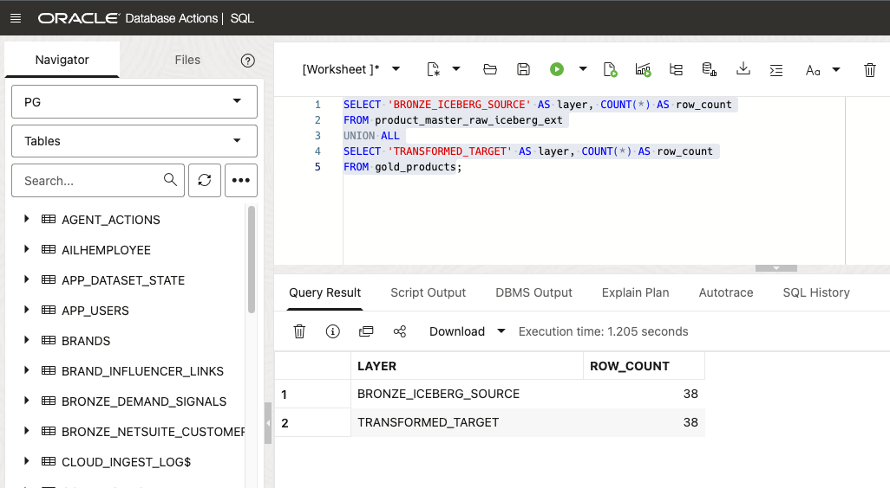

# Scene 6 Transform Iceberg Data

## Introduction

**PeakGear** stores its raw product master data as an **Apache Iceberg** table managed by an external Iceberg Catalog Server. This is the **Bronze** layer: the original source data remains in the Iceberg table, governed by its catalog, and is available to the lakehouse without first copying or ingesting it into another processing store.

This scene shows that Iceberg tables are not only external data that PeakGear can query. **Oracle Data Transforms** can use the Iceberg-backed Bronze data directly in a transformation pipeline. A preconfigured data flow reads the product master source, applies a simple business transformation, and writes the result to a new transformed table. The original Bronze data remains unchanged.

**Key message:** Transform Iceberg Data Where It Lives.

Estimated Time: **10 minutes**

### Objectives

In this scene, you will:

- Open the **Data Processing & Pipelines** demo from the **Process** menu.
- Open Oracle Data Transforms and sign in with the displayed PG credentials.
- Open the preconfigured `peakgear` project and its `dataFlow`.
- Inspect the Iceberg-backed Bronze source and the `SUBCATEGORY` transformation.
- Execute the flow and confirm that it writes to `GOLD_PRODUCTS` while leaving Bronze unchanged.


## Task 1: Open and sign in to Data Transforms

Perform the following set of steps to open **Data Transforms**:

1. Click **Open Data Transforms**.
2. Copy the displayed PG username and password from the **Login information** panel.
3. Enter those credentials and click **Connect**.
4. Keep the LiveStack tab open so that you can return to the demo page if needed.

## Task 2: Open the preconfigured PeakGear flow

The environment provisions the project and flow for this demo. You do not need to create a project, connection, source, target, or mapping.

1. From the Data Transforms home page, open **Projects**.
2. Open the project named `peakgear`.



3. In the project resources, open **Data Flows**.
4. Open the flow named `dataFlow`.




If the project or flow is not visible yet, wait briefly and refresh the page. The first-boot provisioning service creates these objects after the Data Transforms service and the Iceberg catalog are ready.

## Task 3: Inspect the Iceberg Bronze source and transformed target

The flow canvas shows the two data entities already connected:

| Flow element                     | Purpose                                                            |
| ----------------------------------| --------------------------------------------------------------------|
| `PRODUCT_MASTER_RAW_ICEBERG_EXT` | The Iceberg-backed Bronze product master source.                   |
| `Substitution`                   | The expression step that applies the demonstration transformation. |
| `GOLD_PRODUCTS`                  | The new transformed output table.                                  |


1. Select `PRODUCT_MASTER_RAW_ICEBERG_EXT` on the canvas.
2. This the Bronze product data exposed through the Iceberg Catalog Server. The flow uses this source directly; it does not first create a second Bronze copy for the transformation.
3. Select `GOLD_PRODUCTS`.
4. Explain that this is a separate target table. The original Iceberg-backed Bronze source remains untouched.

## Task 4: Inspect the transformation

1. Select the **Substitution** expression between the source and target.
2. Open the mapping for the `SUBCATEGORY` attribute.
3. Confirm the preconfigured rule:

    ```text
    NetSuite → Databricks
    ```



This deliberately small transformation makes the point easy to see: the pipeline can apply business logic to data that originates in an externally managed Iceberg table and produce a new result without modifying the Bronze source.

> Our source data is stored externally as an Iceberg table and exposed through the Iceberg Catalog Server. We use that table as our Bronze layer. This flow reads the Iceberg-backed data, applies a simple transformation to the subcategory, and writes the result to a new table. We can incorporate Iceberg-managed data directly into our transformation workflow instead of moving the source somewhere else first.

## Task 5: Run the preconfigured data flow

Perform the following set of steps to execute the transformation:

1. Click **Save** if Data Transforms shows unsaved changes.
2. Click **Validate** and confirm that the flow is valid.
3. Click **Start**.


4. Open **Jobs** in the project resources.

 

5. Confirm that the `dataFlow` job finishes successfully.


The target uses an append integration pattern. For a clean, repeatable demonstration, run the flow once in a freshly provisioned environment. Do not repeatedly start the flow merely to refresh the same result, because each successful execution can add another set of target rows.

## Bonus Task: Verify the transformed output

Open a SQL Worksheet using the PG schema and run the following queries. You can find the link to SQL Developer Web in the AI Lakehouse tools section: 
>Username and password are the same as for the Data Transforms demo!




First, compare the Bronze source and transformed target row counts:

```sql
SELECT 'BRONZE_ICEBERG_SOURCE' AS layer, COUNT(*) AS row_count
FROM product_master_raw_iceberg_ext
UNION ALL
SELECT 'TRANSFORMED_TARGET' AS layer, COUNT(*) AS row_count
FROM gold_products;
```

 


Then inspect the transformed subcategory values:

```sql
SELECT subcategory, COUNT(*) AS row_count
FROM gold_products
GROUP BY subcategory
ORDER BY subcategory;
```

To make the business rule visible, compare the source and target values:

```sql
SELECT raw_sku, subcategory
FROM product_master_raw_iceberg_ext
WHERE subcategory = 'NetSuite'
FETCH FIRST 10 ROWS ONLY;

SELECT raw_sku, subcategory
FROM gold_products
WHERE subcategory = 'Databricks'
FETCH FIRST 10 ROWS ONLY;
```

The exact number of rows can vary if the flow has been run previously. Focus on the pattern: Bronze remains an Iceberg-backed source, while the transformed result appears in `GOLD_PRODUCTS` with the substitution applied.

## Conclusion: Business Outcome

PeakGear can treat externally managed Iceberg tables as active participants in its data engineering workflows, not as isolated data that must be copied before it can be transformed.

The Iceberg Catalog Server provides the governed Bronze table definition. Data Transforms reads that source, applies a repeatable business rule, and writes a new transformed table while preserving the original Bronze data. This short flow demonstrates a practical lakehouse pattern: retain the source where it is governed, transform it through the pipeline, and make the resulting data product available for downstream analytics, applications, and AI.

You can move to the next scene.

## Acknowledgements

* **Author** - Kevin Lazarz August 2026
* **Contributor** - Eugenio Galiano
* **Last Updated By/Date** - Kevin Lazarz  August 2026
